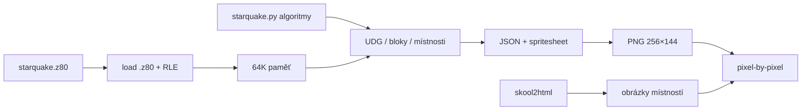

# starquake-extract

Extrakce grafiky, definic bloků a mapy místností ze snapshotu ZX Spectra hry *Starquake*. Výstup je strojově čitelný vstup pro webový engine; tento repozitář engine neobsahuje.

Referenční disassembly (včetně `starquake.z80` a `starquake.py`) je v `reference/` — klon [Ritchie333/starquake](https://github.com/Ritchie333/starquake). Dekódování je sémantický přenos `StarquakeHtmlWriter` z `reference/src/starquake.py`, ne vlastní odvození.



## Požadavky

- Python 3.10+
- `pillow`
- Pro ověření: `skoolkit` 9+

```powershell
pip install -e ".[verify]"
```

## Extrakce (jeden příkaz)

```powershell
python -m starquake_extract extract --out out
```

Vytvoří:

| soubor | obsah |
|---|---|
| `out/graphics.png` | jednobarevný spritesheet dlaždic |
| `out/graphics.json` | metadata každého grafického prvku pozadí |
| `out/blocks.json` | 256 definic bloků (2×2 podbloky) |
| `out/block_attrs.json` | atributy bloků po překladové tabulce |
| `out/rooms.json` | 512 místností včetně atributové mřížky 32×18 a příznaku `solid` |
| `out/sprites.png` / `sprites.json` | 35 spritů 2×2 z `$9088` (předměty / extra objekty `$AA30`) |
| `out/actors.png` / `actors.json` | GRAFIX/BLOB snímky (postava, vznášedlo, vetřelci) |
| `out/items.json` | 45 záznamů `$94E8` po prvním vstupu (souřadnice předpočítané, sebrání a extra objekty zůstávají stavové) |

Formát souborů: [`spec/FORMAT.md`](spec/FORMAT.md). Celá pohyblivá vrstva není statická mapa 512 místností, počáteční polohy předmětů v `$94E8` ale ano — rozbor `$AA30`: [`spec/AA30.md`](spec/AA30.md).

## Render místností

Z extrahovaných dat, bez opětovného čtení snapshotu:

```powershell
python -m starquake_extract render --out out --room 0
python -m starquake_extract render --out out --all
```

Každá místnost je `out/rooms/room_<id>.png` o rozměrech 256×144.

## Ověření proti SkoolKitu

```powershell
python -m starquake_extract verify --out out
```

Spustí bezhlavý emulátor Z80: trampolína zavolá `$A647` (smazání hrací plochy) a `$A80A` (sestavení místnosti). ROM násobení `$30A9` je hooknuté v Pythonu. Porovná se bitmapa i **celé** atributové bajty (včetně bitů 7 a 6) proti exportu. Neshody se vypíšou jako seznam buněk; práh je nula.

Kritérium není shoda se SkoolKitem. HtmlWriter maskuje `$3F` a zahazuje bit 6 (pevnost). Odchylka od starého renderu je oprava podle `$EAD3`.

Kritérium je **přesná shoda** (0 odlišných pixelů). Případné neshody se vypíšou seznamem `room id` a počtem / podílem odlišných bodů — práh se nesnižuje.

Celý řetězec najednou:

```powershell
python -m starquake_extract all --out out
```

## Hra (TypeScript)

Zdroj je `game/src` (strict `tsc`). Jeden příkaz:

```powershell
npm --prefix game install
npm test
```

Sestaví `viewer/bundle.js` a `viewer/dump.js`, spustí typovou kontrolu a unit testy pohybu. Python `pytest tests/test_viewer.py` dál porovnává rastr proti PNG.

Konstanty pohybu: [`spec/MOVEMENT.md`](spec/MOVEMENT.md).

## Prohlížeč mapy

Statická stránka v `viewer/` (GitHub Pages skládá kopii do `docs/`). Čte JSON z `out/` vedle `index.html` (`out/rooms.json`, lokálně i `/viewer/out/`). Ne PNG. Vnitřní plátno je 256×144, zvětšení je celočíselné přes CSS (`image-rendering: pixelated`), jeden `putImageData` na snímek.

```powershell
npm start
```

Otevře http://127.0.0.1:8000/viewer/ (TypeScript server v `game/src/server.ts`, port `--port` nebo `PORT`). Po loadu splash (klik/klávesa odemkne zvuk). Q/A/O/P (nebo schéma z menu 2–5 / redefine) pohybují BLOBem (nahoru sběr / nástup na pad, dolů plošinka), mezerník střílí (na padu `$CA15`). ESC pauza: konec / save / load (`localStorage`). O/P na teleportu otevře zadání 5písmenného kódu. PageUp/PageDown mění místnost. `#168` otevře místnost 168 až po splash. Panel ukáže `$DD22`, pad a jméno teleportu. `?dev=0` skryje vývojářský panel.

GitHub Pages: `docs/` je commitnutý viewer (`index.html`, `bundle.js`, MP3, `out/*.json`). Sestavení:

```powershell
npm --prefix game run build
npm --prefix game run pages
```

Workflow na `master` to samé udělá, zapíše `docs/` do větve a nasadí https://maly.github.io/starquake/.

Porovnání rastru proti `out/rooms/room_<id>.png` a měření času je v `tests/test_viewer.py` (`node viewer/dump.js`). Na tomto stroji vyšel průměr **0,30 ms** na místnost (řádově 3000 snímků/s), což je pod 20 ms potřebnými pro 50 Hz.

## Testy

```powershell
pip install -e ".[dev]"
python -m pytest
```

Testy mimo jiné:

- načtení `.z80` bajtově shodné se `skoolkit.snapshot.get_snapshot`
- `resolve_attr` pro speciály 0 a `$36` podle `$EAD3`
- složení 512 místností proti bezhlavému Z80 (`$A647`+`$A80A`)
- exportovaná atributová mřížka 18×32 proti dekoderu
- sprity `$9088` a GRAFIX snímky proti obrazové paměti po `$DB24` / `$DB3B`
- rastr prohlížeče mapy (`viewer/render.js`) proti `out/rooms/*.png`
