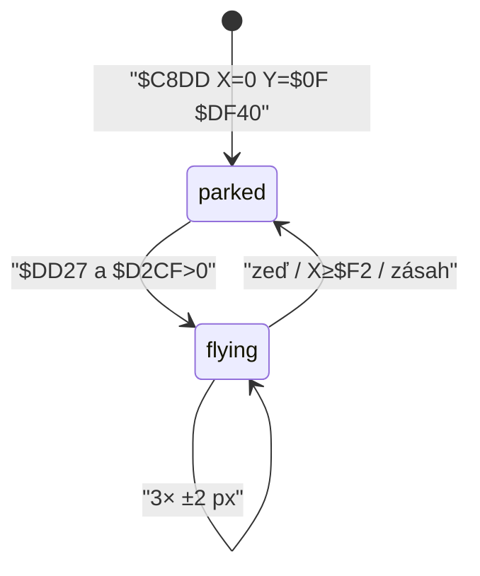
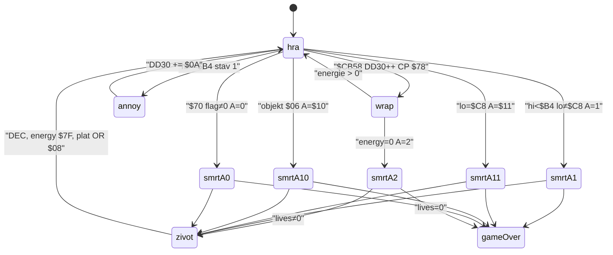

# Pohyb BLOBu

Hodnoty jsou z rutiny `$C5BD` (ovládání a chůze) a z kolizních sond `$D2F0` / `$D2F4`. Smyčka hry visí na `HALT` v `$D9C8` / `$A5DC`, tedy **50 Hz**.

Souřadnice v paměti: `$DD1D` = X (pixely zleva), `$DD1E` = Y **odspodu obrazovky** (kreslení na `$BF − Y`). Hrací plocha začíná na pixelu 48; playY = `143 − gameY`.

## Odvodené konstanty

| veličina | hodnota | adresa |
|---|---|---|
| vodorovná rychlost | 2 px / tick | `$C645 ADD A,$02` / `$C68D SUB $02` na `$DD1D` |
| pád (tabulka 16 kroků `$DD29`) | 1,0,1,0,1,2,1,2,1,2,2,3,2,3,3,4 px | `$C751`, aplikace `$C747 SUB (HL)` na `$DD1E` |
| max. pád | 4 px / tick | poslední bajt `$C760` |
| perioda animace | 3 ticky | `$C64C CP $03` na `$DD28` |
| snímky chůze | 4 sady × `$C0` | `$C674 CP $04` na `$DD25` |
| krok vpravo | `blobwr1` → `blobsr1` → `blobwr2` → `blobsr2` (frame 0) | `$C67C HL=$E074` + `$DD25*$C0` |
| krok vlevo | `blobwl1` → `blobsl1` → `blobwl2` → `blobsl2` (frame 0) | `$C6C3 HL=$E374` + `$DD25*$C0` |
| stání / dojezd | `$E674` (`blobxr`) | `$C666` — engine drží poslední pose, když není směr |
| zelené pole `$64` | `$DD22=1`, +2 px / tick nahoru | `$C71C` / `$C761` / `$C76D ADD A,$02` |
| vznášedlo | `$DD22=2`, ±2 px / osu | `$C967` / `$CEAD` |
| práh výstupu vpravo | X ∈ `$F0`..`$F3` | `$C8FC SUB $F0 / CP $04` |
| vstup zleva | X = 0 | `$C906 LD (HL),$00` |
| práh výstupu vlevo | X + 2 < 4 | `$C90E ADD A,$02 / CP $04` |
| vstup zprava | X = `$F0` | `$C918 LD (HL),$F0` |
| výstup dolů | Y < `$0E` (na padu Y < `$16`) | `$C921` / `$CB3F` → Y=`$8F`, místnost +16 |
| výstup nahoru | Y ≥ `$90` | `$C92C` → Y=`$0F` (padu `$17`) místnost −16 |
| zarovnání Y po přechodu | `(Y+1) ∧ $F8 − 1` | `$C93D` |
| start X, Y | `$88`, `$3F` | `$6468 LD HL,$3F88` |
| kreslení | XOR 3 bajty/scanline, inkoust `AND $F8 / OR ink` pokud není bit 5 | `$DF70`, `$D8B1` |
| pevnost (export / overlay) | bit 6 a ne `$64` | `$D280`, `$C7DF` |
| start energie | `$7F` | `$6343` + `$D425`; snapshot `g$D2CD` byl `$17` (do nuly ~13 s) |
| start plošinky / palba (snapshot) | `$30`, `$7E` | `g$D2CE` / `g$D2CF` |
| nová hra plošinky / palba | `$32`, `$7F` | `$6343` + `$D425` |
| `$DD30` start | 0 | `$6452`; snapshot `$51` |
| životy | 4 | `$6343` offset `$0E` → `$D2CC` |
| stavba plošinky | Down samotné (`$DD23 == $04`) | `$C79F CP $04` |
| zámek opakování | `$DD2C` = 1 do uvolnění Down | `$C7B9` / `$C856` |
| cena | 2 z `$D2CE` | `$C848 A=1, C=2` → `$D41F` / `$D4E9` |
| max. současně | 12 slotů po 4 bajtech | `$C807 LD B,$0C`, tabulka `$DBBB` |
| sloupec | `(X+4) ∧ $F8 ≫ 3`, dvě buňky | `$C819`, `$DB88 INC C` |
| řádek (celá obrazovka) | `($D6 − Y) ∧ $F8 ≫ 3` | `$C827` |
| grafika | 4 vrstvy × 2 buňky, XOR | `$DC55` + L×`$10`, `$DB88` |
| atribut | `RES 6` (ponechá paper/ink) | `$DBA6` při A∨`$80` |
| životnost | `($DAC0 ∧ 3) + 5` návštěv `$DBEC` | `$C833` |
| zánik | `$DBEC` sloupne XOR, `SET 6` | `$DC3C A=$40` |
| odchod z místnosti | sloty na nulu, terén z exportu | `$A4B1` po `$A426` / `$A7FC` |
| tabulka entit | 6 × 32 B od `$DD18` (0 = Blob) | `$DF70` kreslí 6, `$A01B` 1..`$9C43` |
| vetřelci na místnost | 4 sloty `$DD38`–`$DD98` | `$9FEF` B=4..1, `RRCA×3` |
| grafika GRAFIX | `$B208` + n×`$C0` | `$9DF9` |
| smrtící / obtěžující | hi bajt grafiky `< $B4` / `≥ $B4` | `$A327 CP $B4` |
| smrtící následek | `JP $C350` (smrt) | `$A305` |
| obtěžující následek | `$DD30 += $0A` | `$A345` |
| periodický úbytek energie | `$DD30` wrap `$78` → energie −1 (ROM `C=$04`) | `$CB58` / `$D41F A=0` |
| hitbox | \|dx\| < `$0E`, \|dy\| < `$0B` | `$A305` |
| rychlost | 2 px (typ 3 umí 1) | `$A2A5` / `$9E90` |
| podkroky | 4× za tick | `$A043 LD A,$04` |
| hrany | X `<3`/`≥$EE`, Y `<$12`/`≥$8D` | `$A0E4`–`$A15D` |
| terén vetřelce | `$D2F0` / `$D2F4`, attr `< $40` | `$A0FD` / `$A16F` |
| kreslení | XOR `$DF70`, ink `$D8B1` (ne bit 6) | `$D9CB` / `$D9CE` |
| engine kreslení | per-pixel overlay, bez clash `$D8B1` | `stampGrafix` |
| parkování před objevením | X=0 Y=`$0F` grafika `$DF40`; nekreslit když X∨Y `< $10` | `$9E83`, `$D8B1 CP $10` |
| pointer sady | `$B208+n×$C0`; `alien5` ve skoolu až `$B750` | `$9DF9` vs `#GRAFIX` |
| cache mezi místnostmi | 21 B × 4 ve `$959C` (jen předchozí) | `$9C78` |

## Kolizní sondy

`$D2F7` spočte atributovou adresu buňky v `(X≫3, ($BF−Y)≫3)` — levý horní roh 24×16 GRAFIX.

**Podlaha (`$D2F4`, jen když `(Y+1) ∧ 7 = 0`):** dvě buňky dolů od originu (`ADD HL,$20` dvakrát). Při `X ∧ 7 = 0` dvě sloupce, jinak tři (`$D3A2`). Bit 2 = podlaha. Engine takhle hledá `supportY`.

**Stěny (`$D2F0`, jen když `X ∧ 7 = 0`):** sloupec vlevo (`DEC HL`) a o dva vpravo (`INC HL` dvakrát, origin+2, ne origin+3). Bit 1 / bit 0.

Vodorovná neprůchodnost v engine **není** 24×16 AABB. Prochází se inkoustové pixely aktuálního GRAFIX (`blobInkPixels`) a buňka s `attr < $40` blokuje jen tam, kde je bit kresby. Pixel mimo 256×144 **není** stěna — jinak by sloupec 32 (X=`$F0`, 24px sprite) zakázal pravý výstup z místnosti.

**Průchozí / neprůchozí pro BLOBa je `$D2F0` / `$D2F4`:** `CP $40` / `JR C` — blokuje, když `attr < $40` (bit 6 **není** nastavený). Prázdná výplň hrací plochy je `$47` (bit 6, průchozí). Dlaždice `$07` / `$03` jsou podlaha a stěny.

To je **opak** pole `solid` v exportu (`$D280`: bit 6 nastavený, překryv v panelu). Překryv dál ukazuje export; chůze bere `$D2F0`.

Bez `actors.json` (jednotkové testy) maska padá na plný 24×16 box, pořád se OOB nepočítá jako zeď.

## Plošinky

`$C79F` staví po stisku **jen Down** (`$DD23 == $04`). Není to hop: `$C79F CP $04` je větev stavby, jetpack je `$C76D`. Zásoba je `$D2CE` (druhý bajt od `$D2CD`). `$D41F` je trampolína na `$D4E9`; stavba volá `A=1, C=2`. Při nule se nestaví (`$C7B2 CP $00 / JP Z`).

Umístění: dvě buňky pod BLOBem, sloupec `(X+$04)≫3`, řádek play-area `((($D6−Y) ∧ $F8)≫3) − 6`. Bitmapa se **XORuje** (čtyři vrstvy `$DC55`). Atribut se **nepřepisuje**: `$DBA6` udělá `RES 6` na stávající buňce (`$47` → `$07`). Chůze bere `$D2F0` (`attr < $40`), proto na plošinku lze stoupnout. Overlay `$D280` (bit 6 nastavený) ji naopak neoznačí.

`$64` (`AND $7F`) stavbu zruší (`$C800`). Mimo 32×18 se buňka nezapisuje. Latch `$DD2C` brání opakování, dokud Down držíš. Volný slot musí být v 12 pozicích `$DBBB`.

Odstranění je **časovač**, ne klávesa. `$DBEC` (každý tick jedna z 12) snižuje byte3; pod 4 začne sloupávat XOR vrstvy a nakonec `SET 6`. Zásoba se nevrací.

Při odchodu z místnosti `$C8F4` vrací `A=$00`, `$A523` skočí na `$A426`: `$A7FC` znovu vykreslí místnost z dat a `$A4B1` vynuluje `$DBBB` (`LD B,$31`). Postavené plošinky **nejsou** perzistentní — platí jen pro aktuální místnost, dokud nevyprší nebo dokud Blob neodejde. Návrat obnoví export.

## Nepřátelé

`$D9C8` volá `$DF70` (XOR 6 GRAFIX slotů od `$DD18`) a `$D8B1` (inkoust `AND $F8 / OR ink`, buňka s bit 5 se přeskočí). **Bit 6 se nemění** — vetřelec neupravuje pevnost terénu. Kolize postavy dál čte živou atributovou mřížku bez kresby entit.

Pohyb je `$A01B` (komentář „Move the nasties“). Jednou `$DAC6`, pak sloty `$9C43`..1, každý **4 podkroky** (`$A01A`). Slot 0 je Blob; vetřelci začínají na `$DD38`. Y=0 = neaktivní (`$A03D`).

Spawn `$9C47` po vstupu do místnosti (`$A520`). Čtyři sloty, grafika `$B208+n×$C0`. Home `$9EE2`: po `RRCA` `$DAC0` buď vodorovná hrana Y=`$11`/`$8D` (`$DAC1` bit 0) a X=`SUB $17 ADD $1B`, nebo svislá hrana X=`$02`/`$EE` (`$DAC1` RLCA) a Y=`SUB $09 ADD $0F`. Prázdné 2×2 (`attr ∧ $60 == $40`); mimo 32×18 **není** vzduch. Stav 0: čeká na časovač, pak 16 kroků `corepieces1` (`$B148`) na `home` (`IX+$0A/$0B`), potom stav 1 a živá sada. Typ AI `IX+$19` (0 bounce, 1–2 náhodný směr, 3 náhodná rychlost, 4 chase, 5 mix, 6 bez svislé sondy). Terén: totéž `$D2F0`/`$D2F4` (`attr < $40`) — **neprocházejí zdí**.

Kontakt `$A305` jen ve stavu 1. Smrtící sady `badalien*` mají high bajt `< $B4` → `$C350` (okamžitá smrt, ne −N energie). `alien*` `≥ $B4` přičtou `$0A` k `$DD30` **jednou za 50 Hz tick** (ROM až 4× za `$A01B`); `$CB58` každý tick `$DD30++` a při `$78` bere 1 energii (ROM `C=$04`). Doba nezranitelnosti **není**.

Mezi místnostmi: `$9C78` prohodí 21 bajtů × 4 se `$959C`. Návrat do **ihned předchozí** místnosti obnoví cache; třetí místnost ji zahodí a spawne znovu. Stav se **nehromadí** (vždy ≤ 4). Nejsou vázaní na 512 místností napevno.

## Střelba

`$C85A` (větev `$C5BD` po stavbě plošinky). Slot **5** tabulky `$DD18` (`$DDB8`, 32 B). `$DF70` ho kreslí stejně jako vetřelce; engine používá `stampGrafix` (bez clash `$D8B1`).

### Životní cyklus střely

| veličina | hodnota | adresa |
|---|---|---|
| počet současně | 1 (`$DD2A≠0` blokuje další) | `$C85A` / `$C88E` |
| podkroky | 3 × 2 px | `$C8A8 LD B,$03` |
| rychlost | 6 px / tick, jen vodorovně | `$C8C7 SUB $02` / `$C8CB ADD A,$02` |
| směr | `$DD2B`: 1 vpravo, jinak vlevo | `$C622` z `$DD23∧$03`; `$C8C0 CP $01` |
| grafika vpravo | `$E8B4` (`blobfire` snímek 0) | `$C891` |
| grafika vlevo | `$E974` (`blobfire` + `$C0`) | `$C898` |
| start XY | kopie `$DD1D`/`$DD1E` (nesleduje postavu) | `$C89E` |
| zeď | `$D2F0` když `X∧7=0`, `A ∧ $DD2A` | `$C8B6` |
| konec dráhy | `X ≥ $F2` (unsigned; vlevo wrap `$FE`) | `$C8D0 CP $F2` |
| park | X=0 Y=`$0F` ptr `$DF40`, `$DD2A=0` | `$C8DD` |
| odchod z místnosti | `$C947 CALL $C8DD` | `$C8F4` |
| palebná síla | −1 za výstřel, 0 = nelze | `$C869` / `$C884 A=2 C=1` `$D41F` |
| účinek zásahu | firepower **nemění** damage | `$A054` nečte `$D2CF` |
| doplnění | extra `$15` +`$20`, `$16` +`$3C`; strop `$7F` | `$CCBC` / `$D469` |
| zásah vetřelce | \|dx\|<`$0E` \|dy\|<`$0E` | `$A054` |
| následek | stav 2, grafika `$BEC8`, ink 7, park střely | `$A078` / `$C546` |
| odolnost | žádná (1 zásah) | `$A084 LD (IX+$15),$02` |
| zanechá | skóre `$A2E7` (hi−`$AE`)×2; ne předmět | `$A2E7` |
| klávesa | bit 4 `$C55A` (P / Kempston fire) | `$C5D5` |

Vznášedlo střílí `$CA15` (níže). Blob `$C85A` na palubě neběží.

## Zelené zdvižné pole (`$64`, `$DD22=1`)

Atribut `$64` je zelená výplň (paper 6, ink 4). Overlay `$D280` ho bere jako **nepevný**; chůze `$D2F0` (`attr < $40`) taky — `$64` bit 6 má, není zeď. Stavba `$C800` na něm končí. `solid` v exportu se nemění.

`$C625`: 0 chůze, **1** zdviž `$C761`, 2 vznášedlo `$C967`. `$C76D +2` patří **jen** větvi 1, ne padu.

Po vodorovné chůzi, jen když `$DD22=0` a Blob **není** na `$D2CA` (`$C6D6` exact XY stanice `$0C` → `RES 3,$DD23`, `JP $C85A`, pád i `$C71C` se přeskočí):

| podmínka | hodnota | adresa |
|---|---|---|
| X | `(X−8) ∧ $1F = 0` | `$C708` |
| Y | Y ≡ 0 (mod 3) | `$C70F` |
| buňka | origin GRAFIX +1 sl., +1 ř. **přesně** `$64` | `$C71C` |

Zásah: `$DD22=1` a **v tom samém ticku** `$C761`. Vzdviž: žádná chůze, žádný `FALL_TABLE`. `$D2F4` bit 3 (strop) → Y beze změny, jinak game-Y += 2. Pak `$D2F0`: `(A ∧ 3)==3` flag drží, jinak `$DD22=0` a `$DD28=2`. `$D2F0` při `(Y+1) ∧ 7 ≠ 0` sondá **tři** atributové řady (`$D330`), ne dvě — otvor `$44` (místnost 249 řady 4–5) proto výtah nepustí, dokud sprite není celý v otvoru. Bez Left/Right se `$C71C` chytí znovu a jízda pokračuje výš. Dál palba `$C85A` a východ `$C8F4`. Flag se při odchodu **nemaže** (`$C94A A=0`). Plošinka z této větve se nestaví.

Póza ROM `$BF88` (Arrow) v `actors.json` není (extract končí u `stars` `$BEC8`). Engine drží poslední walk frame.

Objekt `$0E` (stroj, který staví plošinky) **není** toto pole a je mimo rozsah.

## Vznášedlo (`$0C`, `$DD22=2`)

Stanice je objekt `$0C` z high nibble `$C0` v `$9740` (`$A90F` → `$AA02`). Nakreslené atributy `$C0` **neobsahují** — engine skládá XY z `rooms.json` + `blocks.json` + `block_attrs.json` raw. `$D2CA` je **poslední** stanice v místnosti (ne nula, pokud `$0C` je).

| veličina | hodnota | adresa |
|---|---|---|
| GRAFIX | `$AFC8`, ink 7, slot 4 | `$9F67` |
| pad Y | blob Y − 8 | `$C952` |
| `nastyCount` | 3 (slot 4 není vetřelec) | `$9F72` |
| nástup | exact XY + bit 3 `$DD24` (Up v posledním nenulovém vstupu) | `$CEAD` |
| výstup | totéž XY, bit 3 = 0 | `$CEBE` |
| let | ±2 px / osu, dual `$D2F0`/`$D2F4` Blob i Y−8 | `$C967` |
| pad X | kopie po svislém kroku, o 1 tick pozadu | `$C94D` pak `$C9BA` |
| palba | slot 5, 8 px, bounce XOR, park po 2 zdech / X≥`$F2` / Y<`$0F` / Y≥`$91` | `$CA15` |
| grafika palby | `hfirepower` `$B088`… | `$CB2B` |
| východ dolů | Y < `$16` → Y=`$8F`, místnost +16 | `$CB3F` |
| východ nahoru | Y ≥ `$90` → Y=`$17`, místnost −16 | `$CB50` |

`$DD24` se aktualizuje jen při nenulovém `$DD23` (`$C61B`); puštění kláves ho nemaže. Nástup/výstup parkuje střelu (`$C8DD`). `$A305` dál bere sedadlo Blob XY. `$DD22` východ neresetuje; `$9F57` položí pad na Blob i bez stanice.

## Teleporty (`$0D`)

15 padů, tabulka `$D036` (jméno 5 ASCII + word místnosti). High nibble `$D0` → typ `$0D`. Detekce **přesná** shoda XY a `$DD23 ∧ $03` (Left\|Right). Up samotné je sběr `$94E8`.

| jméno | místnost |
|---|---|
| VEROX | 40 |
| RAMIX | 31 |
| TULSA | 66 |
| ASOIC | 150 |
| DELTA | 162 |
| QUAKE | 213 |
| ALGOL | 289 |
| EXIAL | 343 |
| KYZIA | 380 |
| ULTRA | 433 |
| IRAGE | 457 |
| OKTUP | 461 |
| SONIQ | 470 |
| AMIGA | 499 |
| AMAHA | 506 |

Žádný příznak „objeveno“. UI enginu je `prompt` / `alert`, ne Spectrum overlay. Platný kód (`$D2C4=$04`): načíst cílovou místnost, spawn na jejím `$0D` XY, `$9C47` vetřelci. Neplatný (`$D2C4=$03`): `CODE NOT RECOGNISED`, zůstat, smazat plošinky, **bez** respawnu vetřelců, bez trestu energie.

ROM `$A426` **nevolá** `$C8DD`. Engine parkuje střelu při každém `enterRoom` (včetně teleportu) — zdokumentovaný rozdíl.

## Předměty

Interakce `$CB8A` (seznam `$96FC`) → `$CC5A` / `$CE82` / `$D09F`. Blízkost: \|dx\|<`$0F` \|dy\|<`$0F` v souřadnicích `$DD1D`/`$DD1E`. Pixel z buňky: X=`col≪3`, Y=`($18−row)≪3 − 1` (`$AA02`).

`$94E8` typ v seznamu = `$14+index` (`$AB80 LD A,$41 / SUB D`). Sebrání **jen Up samo** (`$DD23==$08`, první tick `$DD31=1`). `$D16B` zapíše byte1=`$01` (řádek < 6 → `$AB40` nekreslí). XOR-smazání attr `$47`. Sprite+ink do inventáře `$D2D2` (4× `{sprite, attr}`). Trvá po odchodu; engine drží `world.collected`. **`$D09F` / `$94E8` nemění `$D2CC`–`$D2CF`** (energie / plošinky / palba / životy). Refill je jen extra `$CC9A`.

Extra 2×2 (`$AAB6`): bit `$A350`, 20× `$DAC6`, `$DAC0≥$55`, ne když `$96CA==1` (jeden marker). Sprite `$11`–`$19`, typ `$01`, **automaticky** AABB. Sebrání `$CC9A` + `$A801` maže bit. Markery `$96CB` bere `$A90F` z raw nibble `$90` v `$9740` (jako `$C0`/`$D0`/`$60`) — **nakreslený** attr `$90` v exportu není (0 buněk). Engine skládá XY z `rooms.json` + `blocks.json` + `block_attrs.json` raw. Start `#8` má 2 markery, seed+20 dá extra `$17` na (13,19). Rozbor: [`notes/item-effects.md`](notes/item-effects.md).

### `$D09F` typy (A z `$96FC`)

| A (typ) | podmínka | účinek | stav enginu |
|---|---|---|---|
| `$00` | exact XY + L\|R | security door `$CBDC` | implementováno |
| `$01` | sem po `$CC5A` nejde | extra `$CC9A` (níže) | implementováno |
| `$06` | sem po `$CE77` nejde | rostlina `$C350` A=`$10` | implementováno jinde |
| `$0B` | AABB + tool `$10` | dlaždice `$B0` / clear `$95F0` | implementováno |
| `$0C` | `$CE82` | pad `$CEAD` | implementováno jinde |
| `$0D` | `$CE82` | teleport `$CEC4` | implementováno jinde |
| `$0E` | `$DD29==$10` a stejné Y, jinak `$D1A6` | stroj na plošinky; **ne** refill `$D2CE` | mimo rozsah |
| `$0F` | `$DD23 ∧ $03 ≠ 0`, jinak `$D1A6` | místnost ±1 (`A=$05` RET) | implementováno |
| `$02`–`$05`, `$0A`, `$10`–`$13` | `CP $14` C | no-op `$D1A6` | no-op |
| `$14`+ | `$DD31==$01`, jinak `$D1A6` | inventář `$D1CA`, byte1=`$01` | implementováno |
| 1. tick Up bez `$14+` | `$D1B3` | vsune prázdný slot `00 00` | mimo rozsah |

### Extra `$11`–`$19` (`$CC9A` / `$CCBC` od `$D2CC`)

`$CC9A CP $17 / CALL Z,$CCCC` **před** `SUB $11`. ADD wrapne 8bit, pak `$D425` ořeže jen E/P/F na `$7F`. Životy `$D2CC` **nemají** strop.

| sprite | offset | přičte | kam |
|---|---|---|---|
| `$11` | 1 | `$20` | energie `$D2CD` |
| `$12` | 1 | `$60` | energie |
| `$13` | 1 | `$40` | energie |
| `$14` | 2 | `$32` | plošinky `$D2CE` |
| `$15` | 3 | `$20` | palba `$D2CF` |
| `$16` | 3 | `$3C` | palba |
| `$17` | `$CCCC` | viz níže | ne tabulkové `$00,$00` |
| `$18` | 0 (`$CCCA`) | `$01` (`$CCCB`) | životy `$D2CC` +1 (přetečení tabulky); `$7F`→`$80`, `$FF`→`0` |
| `$19` | — | — | Cheops `$CCF1` (ne `$CC9A`): Up, 2ciferný kód, výměna 1–5 |

`$CCCC` (lives=0 → `A=$18` → lives +1). Lives≠0: smyčka B=3 od energie/plošinek/palby, A start `$FF`; při `A≥(HL)` zapíše `E=2×(3−B)` a A←`(HL)`; `A=E+$12` → `$12` / `$14` / `$16`. Leftover E z ticku nerozhoduje.

Meze: E/P/F strop `$7F` (`$D469`); dolní mez 0 jen `$D4E9` (ne tato cesta). Životy bez stropu (`$D425` B=3 od `$D2CF`).

### Cheops `$CCF1` (extra `$19`)

AABB extra `$19` + `$DD23` bit 3 (Up). `$CC9A` se nevolá; extra se hned nemaže. Overlay `$A412` + `CHEOPS PYRAMID` / `CHEOPS KEY CODE`, SFX `$0B`. Minihra `$D5FD` A=`$02` BC=`$0F0D` — **2** cifry stejným `$D616` jako dveře (`$D2C6=$7B78`). `$0F` wildcard všech, `$0E` jedné. Fail: ACCESS CODE INVALID, `$CC4B` Y-snap `$D2C4=$03`, extra zůstane (`$A350` beze změny). OK: ACCESS AUTHORISED, pak výměna.

Výměna (`$CD32`–`$CDF0`): první inventární sprite `<$09` nebo `≥$1A` (přeskoč `$09`–`$19` a nuly); jinak poslední neprázdný. Čtyři nabídky z `$D2DE` s bitem 7 (`AND $3F`), index `($DAC0 % 9)+1`; pátá = odevzdaný sprite. Klávesy 1–5 (`$D5C8`). Zápis jen sprite (`$CDEC`), attr beze změny. SFX `$10`, HUD `$D425`, `$A801` maže extra, `$CC4B`.

Digit-sprite animace `$D78B` / házení `$D679` jako u dveří engine nekreslí (text + 2×2 UDG nabídek).

Rozbor: [`notes/item-effects.md`](notes/item-effects.md) § 9.

### `$94E8` sprite (inventář, ne přímý refill)

| sprite | význam | stav |
|---|---|---|
| `$0F` | klíč kódu (`$D693`) | inventář; dveře wildcard všech cifer |
| `$10` | nástroj `$B0` (`$CE8C`) | inventář; `$CE96` flag + `$A807`/`$AB9F` 3 mezery (col `(X≫3∧$FC)∨1`) |
| `$00`–`$0E`, `$1A`+ | sběratelné do `$D2D2` | inventář (staty beze změny); jádrové ID v `$D2DE` |
| `$FF` | prázdný záznam | ignorovat |

Typy objektů **mimo** `$94E8`: `$0C` vznášedlo, `$0D` teleport, `$00` security door, `$0B` socket `$B0`, rostlina `$06`, `$0F` vodorovný přechod (room±1). Není: `$0E` stroj na plošinky.

## Security doors (`$00`)

Raw `$9740` `$01`–`$0F` (hi nibble 0) → typ `$00` v `$96FC`. **Není** nibble `$80` (to je `$9F05` pevný spawn). Subs `$25`/`$26` (raw `$04`/`$06`). Exact XY + Left\|Right: otevře se, když inventář drží **tři digit-sprity** kódu (multiset, `$D693`) **nebo** univerzální `$0F` (případně jedno `$0E`). **Bez promptu** — požadované sprity ukáže panel vieweru. Seed kódu `$D2C6=$7B78` ⊕ room.lo ⊕ `BC=$110B` → 3× `$09`–`$0D`. Úspěch: X ±`$30` (bit0 Right), Y snap, `$D2C4=$03`, reload bez respawnu vetřelců. Žádný persistentní „opened“. Zeď = `$D2F0` `attr<$40`. Místnosti: 176, 187, 200, 210, 265, 352, 362, 429. Rozbor: [`notes/security-doors.md`](notes/security-doors.md).

## Tajné průchody (`$0F`)

Nibble `$F0` v `$9740` (`raw=$F5` podbloky 43/44) → typ `$0F` v `$96FC`. Vypadá jako slepá chodba: zeď `$05`/`$03` zůstává, hotspot je `$47` ve výklenku. Exact XY + Left\|Right (`$D11B`). Bit0 Right → `$D2C8++`, jinak `--`. Zvuk `$04`. `A=$05` → `$A52A` / `$A426`. `$A4DF` v nové místnosti najde typ `$0F` a snapne XY. Vetřelci se spawnují (`$A51C` skip jen při `$03`). Chybný směr do místnosti bez `$0F` nechá XY (ROM by četl odpad za `$96FC`). 22 místností, 11 párů: 41↔42, 51↔52, 61↔62, 121↔122, 154↔155, 157↔158, 192↔193, 194↔195, 236↔237, 241↔242, 361↔362. Příklad `#61` (200, `$57`) Right → `#62` (40, `$57`).

## Jádro (`$C7`) / `$C6` / `$B0`

| veličina | hodnota | adresa |
|---|---|---|
| místnost jádra | `$C7` (199); `$AA30` RET | `$AA3B` |
| soused | `$C6` maže `$959C` před swapem | `$9C5C` |
| požadované prvky | `$D2DE` 9× (bit7 = nedoručeno); snapshot init | `$6399` |
| zbývá / páry | `$D2E7=9`, `$D2E8=0…5` | `$A729` / `$A7B2` |
| výhra | `$D2E8==5` po 9 doručeních | `$A7C9` |
| doručení | inventář vs `$D2DE`, +10000, eject `($F0,$27)` `$C6` | `$A6C1` |
| nápověda 3×3 | `$A78D` BC=`$0C0D`; pending ink `$02`+blink `$C506`, done ink `$07` | `$C4AB` |
| strážci | `$D2E8` × `$B208` na (80,111),(168,47),(80,47),(168,111); AI 0 dir `$05` | `$9F78` / `$9FC0` |
| neaktivní slot | X=0 Y=**0** ptr `$DF40` (ne Y=`$0F` — to spouští appear) | `$9FD3` |
| scéna | `$A7D5` skryje Blob; `$A757` B=`$C8` ticků; eject `($F0,$27)` `$C6` | `$A6C1` |
| socket `$B0` | typ `$0B`; tool `$10` clear flag `$95F0` | `$CE96` |

Každý vstup do `$C7` = scéna (panel + koule), pak **vždy** `$C6` (i bez doručení). `$C6` maže cache `$959C` před swapy. Rozbor: [`notes/core.md`](notes/core.md).

## Skóre / konec hry

| událost | body | adresa |
|---|---|---|
| kill | `(hi−$AE)×2` tens | `$A2E7` / `$D422` |
| first-visit | +250; bit `$A390` | `$A47E` |
| doručení jádra | +10000 | `$A6EA` |
| konec (výhra i lives=0) | +1000 (scramble low digits **přeskočen**) | `$64A0` |

`EndResult`: SCORE (`$D413`), ADVENTURE `(visited×50)≫8`, TIME frames/50 → MM.SS, CORES `9−$D2E7`, `victory`. UI = HTML overlay, ne Spectrum bitmap. Hi-score `$64FA` se **nezapisuje**. Rozbor: [`notes/endgame-score.md`](notes/endgame-score.md).

## Pořadí ticku (engine)

ROM `$A523`: `$C5BD` (chůze/zdviž/pad → palba → východ `$C8F4` nebo `$CB58` drain + `$CB8A`) → `$A530` nula → `$9635` → `$A01B`. Engine:

1. chůze **nebo** zdviž **nebo** pad
2. plošinky `$C79F` jen při chůzi mimo stanici `$D2CA` + `tickBridges`
3. palba Blob `$C85A` / pad `$CA15`
4. úbytek energie `$CB58`
5. sběr extra / `$94E8`
6. objekty `$06` / `$00` / `$0B` / `$0C` / `$0D` / `$0F` (door/teleport/passage skip zbytku)
7. `energy==0` → `applyDeath(A=2)`; smrt / game over končí tick
8. puls `$70` + AABB
9. vetřelci `$A01B` (kontakt může `applyDeath`)
10. východ z místnosti (park střely v `enterRoom`; doručení `$A6C1` při vstupu do `$C7`)

Platný teleport / `$0F` v kroku 6 hned volá `$A426` a zbytek ticku se přeskočí. Drain je před vetřelci, takže obtěžující bump `$0A` v tomtéž ticku neprojde wrap `$78`.

## Dočasné hodnoty

| veličina | dočasně | důvod |
|---|---|---|
| skok | odmapovaný | V `$C5BD` není hop. Up je sběr (`$D09F`) / nástup na pad. `$TEMP_JUMP_*` zůstává v kódu, žádná klávesa ho nespouští. |

## Otevřené otázky

1. **Skok při chůzi.** Impulz v `$C5BD` chybí. Down staví plošinku (`$C79F`); `$C76D` je zdviž `$64`, ne hop. Dočasný hop je odmapovaný (Up = sběr / nástup na pad).
2. **Překryv `solid` vs chůze.** Overlay = `$D280` (bit 6). Blob = `$D2F0` (`attr < $40`). Plošinka po `RES 6` je pro chůzi pevná a v overlay ne. `$64` je v overlay i chůzi nepevná.
3. **Přesný posun `$DF70` při `X∧7 ≠ 0`.** XOR po pixelech v `blitGrafix` posun emuluje; atributový merge `$D8B1` bere obsazené buňky po XOR.
4. **Přesný `$DAC6` po `$A80A`.** Live spawn v enginu seeduje `$7530+id×12`, bez celého řetězce `$DAC6` při kreslení bloků. Krok za krokem proti emulátoru proto bere výchozí sloty z `$9C47` (test `test_enemies.py`).
5. **Zvuk.** `$D7C0` + `$A57B` v `game/src/audio/`. Zbývá `$6600` / digit-roll.
6. **Animace 4 GRAFIX snímků** u vetřelce i padu — live ptr frame 0; kresba `ptr+(frames/2)%4×$30` na `X − 2×frame` (snímky 1–3 jsou předshift `+2/+4/+6` pro `X∧7`, ne posun entity).
7. **Extra spawn `$AAB6` po `$A80A`.** Markery jsou raw nibble `$90` (`$96CB`), ne nakreslený attr. Engine seed `$7530+id×12` + 20× `$DAC6`, ne celý řetězec při kreslení bloků. Typ/účinek z `$CCBC` platí; souřadnice se s live hrou můžou rozcházet.
8. **Přeplněný inventář `$D1CA`** (drop zpět do `$94E8`) a Cheops UI — mimo rozsah. Extra `$17`/`$18` jsou v enginu (`$CCCC` / přetečení `$CCBC`).
9. **1. tick Up bez `$14+`.** ROM vsune prázdný slot `00 00`; engine ne. Mimo rozsah.
10. **Póza Arrow `$BF88` ve zdviži** — není v extractu; engine nechá poslední walk frame.
11. **Objekt `$0E`** (stroj na plošinky) — mimo rozsah; není zelené pole `$64`.
12. **`$A426` vs `$C8DD`.** ROM po teleportu střelu neparkuje; engine parkuje v `enterRoom`.
13. **Engine `skip64` vs `$A132`** (řada Y+1, skip jen Y, exact `$64`) — ponecháno.
14. **Opakovaný overlay** při drženém Left/Right po příletu na pad / dveře. Viewer má latch do uvolnění.
15. **`$E4` (flash + `$64`).** `$C71C` bere jen přesné `$64`; v exportu 0 výskytů.
16. **`$64A0` scramble spodních tří cifer.** Engine dělá jen +1000; scramble přeskočen (viz endgame-score.md).
17. **Digit `$0E` wildcard** — engine podporuje 1×; Spectrum minihra UI (XOR anim) ne.
18. **Účel osmi `$B0` socketů** mimo clear flagu — NEVÍM (neovlivní výhru).
19. **Perioda `$70` vs live `$DAC0` při `$A80A`.** Engine bere `dac0` po spawn vetřelců, ne řetězec `$DAC6` při kreslení bloků.
20. **Místnost 362** — jeden door hotspot (broken pair?).

## Energie / smrt / terén `$06` / `$70` / smrtící vetřelci

`$C350 JR $C35E`. Engine `applyDeath(A)` spustí animaci: 45 snímků ink XOR `$05` (`$C377 B=$2D`), čtyři `$BEC8` obláčky 80 snímků (`$C43F B=$50`, `$A01B`), 50 HALT (`$C451 B=$32`), teprve pak respawn. `$D7C0`: vždy `$13`, navíc `$0F` když `(A∧7)==2`. Blikání ROM jen u A∧7=2; engine bliká u všech smrtí, ať je to vidět.

| veličina | hodnota | adresa |
|---|---|---|
| wrap `$DD30` | `$78` → energie −1, min 0 (ROM −4) | `$CB58` / `$D41F A=0` |
| obtěžující bump | `$DD30 += $0A` (ne `$D2CD`) | `$A345` |
| hitbox Blob–vetřelec | \|dx\| < `$0E`, \|dy\| < `$0B` | `$A316` / `$A321` |
| smrtící / obtěžující | hi živého ptr `< $B4` / `≥ $B4` | `$A327` |
| A do `$C350` | 2 nula; 1 vetřelec; `$11` lo=`$C8`; `$10` `$06`; 0 puls `$70` | `$A535` / `$A33B` / `$A33F` / `$CE7D` / `$A568` |
| `$D2C4` | A ≥ `$10` → 1 | `$C363` |
| game over | lives==0, bez DEC | `$C3E1` / `$C461` |
| DEC života | `$D2CC--` | `$C462` |
| energie po smrti | `$FF` pak strop `$7F` | `$C465` / `$D425` |
| plošinky po smrti | `∨ $08` | `$C466` |
| palba / inventář / `$DD30` | beze změny | `$C35E` je nezapisuje |
| grafika | `blobwr1` `$E074` | `$C46B` |
| D2C4=0 XY | místo smrti, X `∧ $F8`, Y `(Y+1) ∧ $F8 − 1` | `$A426` / `$A4FF` |
| D2C4=1 XY / `$DD22` | checkpoint `$D2DC` / `$D2C5` (vstup do místnosti) | `$A501` / `$A50A` |
| AABB `$06` | \|d\| < `$0F`, bez klávesy | `$CBBB` / `$CE77` |
| nibble `$60` / `$70` / `$80` | `$9740` → `$06` / `$9635` / `$9F05` | `$A963` / `$A968` / `$A991` |
| puls AABB | \|dx\| < `$0E`, Y ∈ `[comp−$16, comp]`, `comp=($1A−row)<<3−2` | `$A530` |
| puls timer | perioda `($DAC0 ∧ $0C)+8`, XOR flag, start 0; `$A66C` 1 ze 4 slotů / tick (`$9634`) | `$A66C` / `$A986` |
| `$9F05` | ptr `$B2C8`, stav 1, AI 6, dir 1, `period \|= 8` | `$9F27`…`$9F42` |
| perioda náhodného spawnu | `(nibble % 5)+4` = 4…8 | `$9E30 SUB $05` / `ADD $09` |
| typ C náhodného spawnu | `$DAC1` `SUB $0F`/`ADD $11` → 2…16 (`$B388`+) | `$9DE6` |
| AI nibble | 0…4 | `$9E58 SUB $05` / `ADD $05` |
| AI 5 | dir=0; RRCA carry → stání; A < `$46` chase, jinak think AI 3, `IX+$19` zůstane 5 | `$A285` |
| AI 6 think | `AND $03`, fall-through `$A2A5 RET` abort `$A01B` | `$A296` |
| tabulka směrů `$A2B9` | `$08,$09,$01,$05,$04,$06,$02,$0A` | `$A2B9` |

Checkpoint: `enterRoom` / `spawnBlob` / východ / teleport uloží Blob XY (game) + `$DD22` do `world.entry`. `$06` a `$11` po smrti vrací na vstup do místnosti. Nula energie a běžný vetřelec zarovnají místo smrti a pad (`$DD22`) nechají.

Nedořešené v této sekci: `$C7` při respawnu; statistika AI 5 carry/chase. ROM bliká jen A∧7=2. Puls `$DB88`: viz [`pulse-spark.md`](notes/pulse-spark.md) — persist XOR L5 + `$A6BD`, ne replace L6/L7.

## Zvuk `$D7C0`

Beeper `$D7C0`: typ v `A`, offset `A×5` do tabulky 5bajtových záznamů `$D839` (H0, H1, L, X, F). 24 indexů `0`…`$17`. Engine syntetizuje stejnou smyčku do PCM (44100 Hz) a hraje přes Web Audio; 50 Hz tick se neblokuje. Fronta `world.sfx`. Index `$17` (L=0) se nehraje.

**F:** bity 0–4 = vnější kola (`0` ⇒ 256); bit 6 modulace L zbývajícím A'; bit 5 znaménko (`−` / `+`); bit 7 `D := ((D≫1)−H)∧$3F`. `D = (H ∧ B) XOR X`. Počet `OUT` na H = ⌊H/L⌋+1. Perioda continue: **112+45D** T (bit7=0) nebo **134+45D** T (bit7=1), CPU 3,5 MHz. Výstup obdélník, toggle XOR `$10`.

| A | H0 H1 L X F | událost |
|---|---|---|
| `$00` | `3F 30 01 00 81` | extra `$18` život |
| `$01` | `00 7F FE 00 01` | extra energie `$11`–`$13` |
| `$02` | `C5 C4 03 01 C1` | extra plošinky `$14` |
| `$03` | `01 7F 7F 01 41` | extra palba `$15`/`$16`; díl jádra `$A715` |
| `$04` | `01 14 FF 01 41` | místnost ±1 `$0F` |
| `$05` | `28 22 01 7F FF` | v tabulce, žádný CALL |
| `$06` | `32 38 FE 05 C3` | v tabulce, žádný CALL |
| `$07` | `F0 F1 28 01 DE` | teleport overlay |
| `$08` | `1E 00 01 01 C3` | dveře start; socket `$0B` |
| `$09` | `8C 80 01 7F C3` | teleport OK |
| `$0A` | `00 22 01 7F DF` | dveře minihra OK |
| `$0B` | `22 00 28 7F DF` | Cheops overlay `$CD17` |
| `$0C` | `20 00 14 00 81` | sběr `$94E8` |
| `$0D` | `C8 C9 FE 05 03` | (nepoužito in-game) |
| `$0E` | `00 0A FE 0F 07` | (nepoužito in-game) |
| `$0F` | `00 03 04 17 FF` | fail dveře/teleport; smrt energie |
| `$10` | `1E 00 07 00 41` | teleport OK (před `$09`) |
| `$11` | `14 0A FE 00 6A` | znak teleportu; výhra `$A7BF` |
| `$12` | `40 00 FF 01 81` | kill střelou |
| `$13` | `FF FE FF FF C1` | každá smrt |
| `$14` | `0A 01 FF 00 01` | krok / ceremony (`dac0∧1=0`) |
| `$15` | `04 00 FF 14 01` | krok / ceremony (`dac0∧1=1`) |
| `$16` | `07 0A FF 00 01` | v tabulce, žádný CALL |
| `$17` | `00 00 00 00 00` | hang, nehrát |

### In-game hooky

| engine | A |
|---|---|
| `applyWalk` wrap `ANIM_PERIOD`, jen `$DD22=0` | `$14`/`$15` XOR `$C6FF` |
| `applyDeath` vždy | `$13` |
| `applyDeath` `(A∧7)==2` | navíc `$0F` |
| `hitByBullet` | `$12` |
| `collectTableItem` unshift | `$0C` |
| `applyExtra` (ne Cheops `$19`) | 1. B páru `$CCBC` |
| `beginCheopsUi` | `$0B` |
| `tickCheopsUi` intro→result | `$0F` (`$D5FD` OK/fail) |
| `feedCheopsKey` 1–5 | `$10` |
| `beginDoorUi` | `$08` |
| `tickDoorUi` intro→result OK | `$0A` pak `$0F` |
| `tickDoorUi` intro→result fail | `$0F` |
| `beginTeleportUi` | `$07` |
| `feedTeleportKey` přijatý znak | `$11` |
| `finishTeleportInput` OK | `$10` pak `$09` |
| `finishTeleportInput` fail | `$0F` |
| `applyPassage` | `$04` |
| `tryClearSocket` true | `$08` |
| `matchCoreDeliveries` za díl | `$03` |
| `beginCoreCeremony` | `$14`/`$15` z `dac0∧1` |
| výhra `corePairs==5` | `$11` jednou |

Pozadí = `viewer/bgm.mp3` (smyčka, vlastní gain). Melodie `$6600` se nehraje.

Kanál `$A41B`/`$A41C` → `$A57B` (tabulka `$A607`): palba, pád, plošinka, spawn, oblaka, ambient. A41B přeruší živý hlas; A41C čeká na A41D=0. Jeden 20 ms burst / 50 Hz tick (`world.buzz`). Palba se nespustí, dokud živý increment je `$F7` (`$C87B`).

| jev | zápis | A |
|---|---|---|
| palba Blob / pad | `$A41B` | `$05` (`$C87F`, `$CA3B`) |
| začátek pádu | `$A41B` | `$06` (`$C733`) |
| dopad (floor, `fallIndex≠0`) | `$A41B` | `$07` (`$C798`) |
| stavba plošinky | `$A41B` | `$08` (`$C84F`) |
| oblaka smrti | `$A41B` | `$09` (`$C43A`) |
| objevení vetřelce (appear `$B148`) | `$A41C` | `($DAC0∧3)+1` = 1…4 (`$A1CC`) |
| kill (navíc k `$D7C0` `$12`) | `$A41C` | `$0B` (`$A2FF`) |
| ambient, když oba hlasy ticho a `$DAC0<$04` | `$A41C` | `($DAC1∧3)+$0C` = `$0C`…`$0F` (`$A5CA`) |

**Nedořešené:** přesný T-state inner loop `$A5C1` (engine 23+35E); `$6600` melodie (skip); digit-roll `$D679`; IM1 jitter.
