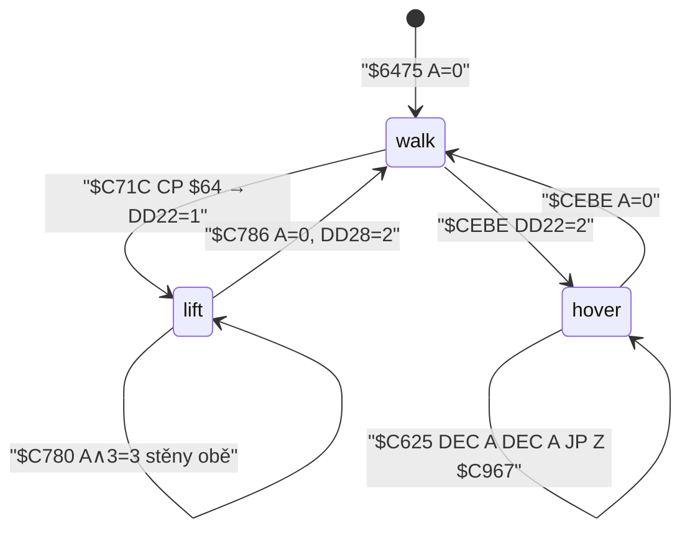

# Atribut `$64` — zelené zdvižné pole

Prostředí je **zelené zdvižné pole** (svislý updraft / antigravitační šachta), ne voda, ne pás a ne objekt `$0E` „výtah“. Skool ho nepojmenovává. `$DD22` je v komentáři „Jetpac flag“ jen pro hodnoty 0 a 2 (`$14428`); hodnotu **1** zapisuje výhradně `$C71C` po `CP $64`.

Ověřeno disassemblací `$C5BD` / `$C71C` / `$C761` a headless krokem `$C625` v místnostech 82 a 422 (snapshot `reference/src/starquake.z80`).

Souřadnice jako v [`MOVEMENT.md`](../MOVEMENT.md): `$DD1D` = X, `$DD1E` = Y odspodu, kreslení `$BF − Y`. Smyčka 50 Hz.

## 1. Co `$64` je

Spectrum atribut `$64` = `0110 0100`:

| pole | bity | hodnota |
|---|---|---|
| flash | 7 | 0 |
| paper | 6–4 | 6 = žlutá |
| bright | 3 | 0 (ne BRIGHT) |
| ink | 2–0 | 4 = zelená |

Bitmapa buněk s tímto atributem je `$FF` × 8 (`out/graphics.json`, podbloky 0–6, buňky `(1,1) (2,1) (1,2) (2,2)`). Celá 8×8 je inkoust, paper není vidět → **plný zelený čtverec**.

Skool: žádný název. Grafika pózy ve zdviži je `Arrow` na `$BF88` (`$C775`). Mezi plnými `$64` leží dekorativní šipky nahoru s atributem `$60` (řádek 0 podbloku 0, `row_attrs[0..2] = $04,$60,$60`).

`$E4` (flash + `$64`) v exportu 512 místností **není**. `$C71C` bere jen přesné `$64` (bez `AND $7F`).

## 2. Kde se vyskytuje

74 místností, 1380 buněk, vždy přesné `$64`. Nikdy sloupce 0–4 / 7–8 / 11–12 / 15–16 / 19–20 / 23–24 / 27–31 a nikdy řádky 0 / 3 / 6 / 9 / 12 / 15 (ty mezery jsou `$60`).

Typický vzor: **dvojice sloupců** `(4k+1, 4k+2)` a **dvojice řádků** s mezerou každé třetí. Dva tvary:

| tvar | příklad | popis |
|---|---|---|
| krátká podložka 2×2 | místnost **82** (`out/rooms/room_82.png`) | `$64` na `(9,10) (10,10) (9,11) (10,11)`, nad tím `$03` „víko“, po stranách `$44` |
| svislá šachta | místnost **422** (`out/rooms/room_422.png`) | sloupce 9–10, řádky 1–2, 4–5, 7–8, 10–11, 13–14, 16–17; stěny `$04` ve sloupcích 8 a 11 |

Další fixture (alespoň 8 buněk): 162, 169, 175, 177, 181, 188, 189, 198, 203–206, 209, 210, 219. Plné sloupce: 412, 420, 422.

Bloky, které `$64` kreslí (podbloky 0–6 mají ty 2×2 `$FF`/`$64`):

| blok | výskyt | poznámka |
|---|---|---|
| `$51` (81) | 192 buněk | šachta, podbloky `[20, 0, 20, 0]` |
| `$5B` (91) | 184 | šachta |
| `$52` (82) | 128 | šachta |
| `$4D` (77) | 120 | |
| `$4C` (76) | 96 | |
| `$36` (54) | 48 | krátká podložka (místnost 82) |

Export `solid` (`$D280`) má `$64` jako **nepevnou**. To je správně a **nemente**.

## 3. `$C71C` — vstup do pole

Po vodorovné chůzi, jen když `$DD22 ≠ 1` a `≠ 2` (`$C625`).

```
$C700 CALL $D2F4          ; sonda podlahy/stropu, A do C
$C704 LD HL,($DD1D)       ; L=X, H=Y
$C708 SUB $08 / AND $1F   ; musí (X−8) ∧ $1F = 0
$C70F SUB $03 / JR NC     ; Y mod 3
$C713 CP $FD              ; zbytek 0, protože 0−3 = $FD
$C717 LD HL,($D3BF)       ; origin GRAFIX z $D2F7
$C71A INC HL
$C71B ADD HL,DE           ; DE=$0020 z $D2F4
$C71C LD A,(HL)
$C71D CP $64              ; přesný bajt
$C721 LD A,$01
$C723 LD ($DD22),A
$C726 JR $C761
```

Vzorek je **jedna buňka**: o 1 sloupec vpravo a o 1 řádek dolů od levého horního rohu 24×16 GRAFIX (origin z `$D3BF`, `$D318`). Není to 2×2 a není to buňka pod nohama (`$D2F4` sestupuje o **dvě** řady, `$C71C` o jednu).

Zarovnání X `(X−8) ∧ $1F = 0` je X ∈ `{8, 40, 72, 104, 136, 168, 200, 232}` = origin ve sloupci `4k+1`. To sedí na dvojice `$64` ve `(4k+1, 4k+2)`: vzorek je **pravá** buňka páru.

Zarovnání Y: Y ≡ 0 (mod 3). Při pádu (`$C747`) se Y mění o 0–4 px; jakmile Y projde násobek 3 a buňka je `$64`, pole chytí.

`$C6D6` porovná XY s `$D2CA`. Při shodě skočí na `$C85A` a `$C71C` se neprovede. `$A83D` při kreslení místnosti `$D2CA` vynuluje — tedy přeskočí se jen na `(0,0)`, ne „když se nehýbeš“.

### `$DD22` — zápis a čtení

| hodnota | význam | kdo zapisuje |
|---|---|---|
| 0 | běžná chůze / pád | `$6475` start; `$C786` konec zdviže; `$CEBE` výstup z `$0C` |
| **1** | zelené zdvižné pole | **jen** `$C723` |
| 2 | vznášedlo (Jetpac) | `$CEBE` z objektu `$0C` (`BIT 3,($DD24)` → 2, jinak 0) |

Čtení: `$C625` větev pohybu; `$9F57 CP $02` (grafika vznášedla ve slotu 4); `$C3B6 CP $02` (smrt); `$A513` uloží do `$D2C5` při změně místnosti. Obnova `$A50A` jen když `$D2C4 = 1`. `$C8F4` vrací `A=0` (`$C94A`), `$A52A` tedy `$D2C4 ← 0` — **flag se při odchodu z místnosti nesmaže** a dál žije v `$DD22`.



## 4. Pohyb, když je `$DD22 = 1`

`$C625`: `DEC A / JP Z,$C761`. Přeskočí se chůze `$C645`/`$C68D` i pád `$C747`.

| veličina | hodnota | adresa |
|---|---|---|
| svisle | **+2 px / tick** (Y nahoru, Y je odspodu) | `$C76D ADD A,$02` |
| vodorovně | 0 (větev chůze se neprovádí) | `$C625 JP $C761` |
| gravitace | vypnutá | `$C751` se nevolá |
| strop | `BIT 3` výsledku `$D2F4` → bez `+2` | `$C769` |
| vstup | Left/Right se nečte; `RES 3,($DD23)` maže Up | `$C761` |
| pózа | `$BF88` (`Arrow`) | `$C775` |
| pádový index | `$DD29` se **nemění** | `$C761` ho nesahe |

Porovnání s ostatními svislými větvemi:

| režim | ΔY / tick | adresa |
|---|---|---|
| chůze | 0 | `$C645` jen X ±2 |
| pád | 1,0,1,0,1,2,1,2,1,2,2,3,2,3,3,4 | `$C751` / `$C747 SUB (HL)` |
| zdviž `$64` | **+2 konstantně** | `$C76D` |
| vznášedlo `$0C` | ±2 podle vstupu, 8 směrů | `$C98D ADD A,$02` / `$C993 SUB $02` |

`$C76D` **není** klávesnicový jetpack. Up je sběr (`$D09F`, `$DD23==$08`). „Jetpack“ ve skoolu je `$DD22=2` / `$C967`.

Vstup Left/Right v **prvním** ticku, kdy `$DD22` ještě bylo 0, chůze doběhne (`$C630`–`$C6D6`) a teprve pak `$C71C` skočí na `$C761`. V šachtě `$D2F0` vrací `A=3` (obě stěny), takže `BIT 0/1,C` krok zablokuje (`$C63E` / `$C686`). Další ticky už chůzi nezkouší.

## 5. Mez a konec pole

Pokračování **nesleduje** `$64`. Jakmile je `$DD22=1`, `$C625` jde rovnou na `$C761`. Konec:

1. `$C77B CALL $D2F0` / `AND $03` / `CP $03`. Obě stěny (bit 0 i 1, `attr < $40` vlevo od originu a o dva sloupce vpravo) → flag **zůstane**, `JP $C85A`. Jinak `$C786` flag **smaže**, `$DD28 ← 2`, `JP $C85A`.
2. Strop (`$C769 BIT 3`) jen zastaví `+2`, flag podle bodu 1.
3. Odchod z místnosti `$C8F4`: po `$C85A` vždy. Výstup nahoru `Y ≥ $90` → `Y=$0F`, místnost −16 (`$C92C`). Šachta proto může přenést Bloba do místnosti nad. **Není** to první ne-`$64` buňka.

Mezery `$60` v šachtě (šipky) mají bit 6, `$D2F0` je nebere jako zeď a `$C71C` je nespustí — ale při `$DD22=1` se `$64` znovu nekontroluje, takže zdviž mezery přeletí.

Headless `$C625` v 422, X=`$48` Y=`$51`: `$D2F0 A=3`, Y += 2 každý tick, `$DD22` zůstane 1, grafika `$BF88`. V 82 na podložce: chycení na Y≡0 (mod 3), pak zarážka o strop `$05` (`BIT 3`), flag drží, dokud jsou stěny `$03`.

## 6. Není to výtah `$0E`

| | `$64` pole | objekt `$0E` | vznášedlo `$0C` |
|---|---|---|---|
| spoušť | atribut buňky `$C71C` | seznam `$96FC`, typ `$0E` | typ `$0C` |
| handler | `$C761` | `$D09F` | `$CEAD` → `$DD22=2` |
| pohyb | nucené +2 nahoru | žádný; staví plošinky do `$DBBB` (`OR $40`, život 2, `$DB88`) | `$C967` 8 směrů |
| podmínka | zarovnání X/Y + `$64` | `$DD29==$10` a Y = Y objektu | `BIT 3,($DD24)` |

`$C71C` na `$0E` neskáče. `$0E` je samostatný stroj (pád na něj položí dvě 2×2 plošiny). Plný rozbor `$0E` je mimo rozsah.

## 7. Vedlejší větve (jen ty, které `$C71C` / `$DD22` opravdu berou)

**Plošinky `$C79F`.** Stavba z `$C761` **není** — `$C761` končí na `$C85A`, `$C79F` se nevolá. Samotná stavba `$C7FE AND $7F / CP $64 / JR Z,$C85A` (`$C800`) buňku `$64` i `$E4` odmítne. To už engine má (`isSpecial64`).

**Střelba `$C85A`.** Po zdviži běží. `$C71C` palbu nevětví.

**Vznášedlo.** `$C625`: `$DD22=2` → `$C967`, `$C71C` se nevolá. Priorita má hoverpad.

**Vetřelci `$A01B`.** Po vodorovném podkroku, jen když `(X ∨ (Y+1)) ∧ 7 = 0` (`$A12C`):

```
$A132 CALL $9C4C      ; $9FFC: attr adresa z X a Y+1 ($BF−(Y+1))
$A135 LD A,$64
$A13A CP (HL)         ; origin
$A13D INC HL / CP     ; +1 sloupec
$A141 ADD HL,DE / CP  ; +1 řádek
$A145 DEC HL / CP     ; 2×2
$A13B JR Z,$A199      ; přeskočí svislý podkrok
```

Porovnání je **přesné `$64`**, ne `AND $7F`. `$9FFC` bere `Y+1`, 2×2 je o **jednu řadu výš** než origin GRAFIX. `$A199` přeskočí jen zbytek podkroku (svisle); X už je zapsané (`$A124`). Engine `skip64` v `entities.ts` bere `(attr ∧ $7F)==$64` a vrací se **před** X — přibližné, ne bit-exact.

`$A2D5 CP $64` je perioda AI (`IX+$17`), ne atribut.

**Kreslení `$D8B1`.** Žádný `CP $64`. Přeskočí buňku s bitem 5 (`AND $20 / JR NZ`, `$D8F1`). `$64` bit 5 má, takže se inkoust neslučuje a buňka zůstane `$64` — stejné pravidlo jako u každého yellow/red paperu.

## 8. `$D280` overlay vs `$D2F0` zeď — neměnit

| rutiny | pravidlo | `$64` |
|---|---|---|
| `$D280` overlay / export `solid` | bit 6 **a** bajt ≠ `$64` | nepevná |
| `$C7DF` stavba | bit 6, výjimka `(attr ∧ $7F)==$64` | stavba zakázaná |
| `$D2F0` / `$D2F4` chůze | `CP $40 / JR C` → zeď když `attr < $40` | bit 6 set → **není zeď** |

`$64` je tedy průchozí pro Bloba i vetřelce a zároveň výjimka overlay. Prázdná výplň `$47` je taky průchozí (bit 6). Dlaždice `$07`/`$03`/`$04` jsou podlaha a stěny. Engine `blocksBlob` / `isSolid` tohle už dělá.

## Odvodené konstanty

| veličina | hodnota | adresa |
|---|---|---|
| atribut pole | `$64` přesně | `$C71D CP $64` |
| flag | `$DD22 = 1` | `$C723` |
| vzorek | origin+1 sloupec, origin+1 řada | `$C71A INC HL / ADD HL,DE` |
| X | `(X−8) ∧ $1F = 0` | `$C708` |
| Y | Y ≡ 0 (mod 3) | `$C70F` / `$C713 CP $FD` |
| zdvih | +2 px / tick | `$C76D` |
| držení flagu | `$D2F0` ∧ `$03` = `$03` | `$C77E` |
| strop | `$D2F4` bit 3 | `$C769` |
| pózа | `$BF88` Arrow | `$C775` |
| reset flagu | `$DD22=0`, `$DD28=2` | `$C786` / `$C789` |
| výstup místností | Y ≥ `$90` jako vždy | `$C92C` po `$C85A` |
| stavba plošinky | zakázaná na `$64` | `$C800` |
| vetřelec | 2×2 exact `$64` → skip Y | `$A132` |
| overlay | bit 6 ∧ ≠ `$64` | `$D280` |

## Nevyřešené

1. Pixel-přesný vzhled `$60` šipek versus `$64` výplň v enginu (jen kresba, ne fyzika).
2. `$E4` za běhu (flash): `$C71C` ho nespustí; v exportu 0 výskytů. UNVERIFIED, zda ho nějaká runtime rutiny umí vytvořit.
3. Přenos `$DD22=1` přes `$C8F4` do sousední místnosti: kód flag nemaže (`$C94A A=0`, `$A50A` se nevolá). Kroková sonda zastavovala na `$C85A`, takže přechod místnosti **neproběhl v emulátoru** — tvrzení je z adres, ne z naměřeného Y v další místnosti.
4. Engine `skip64` vs `$A132` (řada Y+1, skip jen Y, exact `$64`) — záměrně ponecháno jako poznámka, bez změny kódu.

## Poznámky k `physics.ts` tick

Pořadí jako `$C5BD` / `$C625`:

1. Vzorkovat `$DD22` **před** chůzí a **před** pádem.
2. Je-li 1: neaplikovat `WALK_PX` ani `FALL_TABLE`. Pokud `$D2F4` bit 3 (strop), Y neměnit; jinak game-Y += 2 (play-Y −= 2). Póza `Arrow` / `$BF88`. Pak `$D2F0`: obě stěny → flag nechat; jinak flag = 0 a `walkTick = 2`. Dál `$C85A` palba a `$C8F4` odchod.
3. Je-li 2: vznášedlo `$C967` (mimo tento úkol).
4. Je-li 0: chůze ±2 (`$C645`), potom — ne předtím — test `$C71C` (X, Y mod 3, buňka origin+1,+1 == `$64`). Zásah: flag = 1 a **v tom samém ticku** krok 2 (`JR $C761`). Jinak pád `$C751` nebo přistání `$C791` a teprve pak stavba `$C79F`.
5. `$D280` overlay a `$D2F0` zeď (`attr < $40`) se nemění. `$64` zůstane průchozí a v `solid` nepevná.

`$C71C` se volá až po vodorovném kroku daného ticku. Plošinka se z větve `$C761` nestaví.
