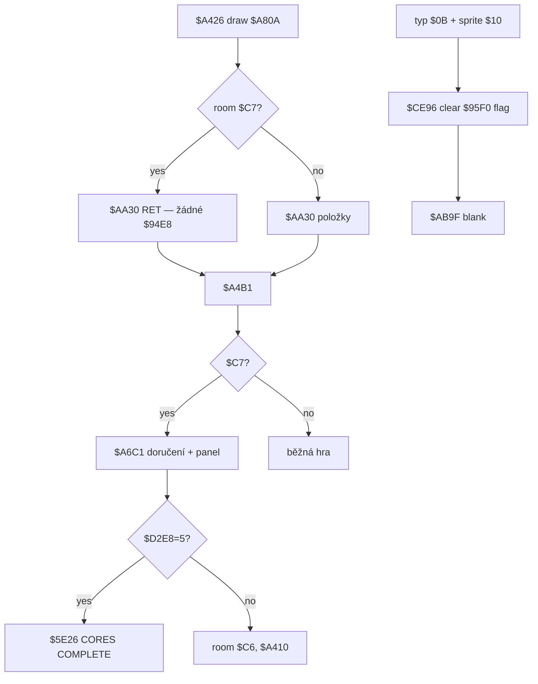

# Jádro (`$C7`), díly, nástroj `$10`, soused `$C6`

Rozbor místnosti jádra, dlaždic `$B0` / typu `$0B`, inventářových jádrových prvků `$D2DE` a nástroje sprite `$10`. Ověřeno disassemblací `out/skoolkit/_skool_src/starquake.skool` a headless sondou `tmp_core_probe.py`.

**Není to** běžný sběr `$D09F` / extra `$CC9A`. **Není to** pad `$0C` ani teleport `$0D`. Vstupní hint `$C74F` je překlep / záměna za **`$9C4F`** (`CP $C7` → `$9F78`).

Dvě oddělené soustavy:

1. **Osm dlaždic `$B0`** v pevných místnostech `$95F0` — nástroj `$10` je jen smaže (flag). Do inventáře ani do `$D2DE` nejdou.
2. **Devět jádrových prvků** v `$D2DE` — běžné položky `$94E8` se sprity ze seznamu; nese je inventář (max 4); při vstupu / smrti v `$C7` je `$A6C1` spotřebuje.

---

## Odvodené konstanty

| veličina | hodnota | adresa |
|---|---|---|
| místnost jádra | `$C7` (199) | `$9C57`, `$AA3B`, `$A4CE` |
| soused jádra | `$C6` (198) | `$9C5C` |
| rozpoznání jádra pro spawn | `$9C4F` → `$9F78` | `$9C57 CP $C7` / `JP Z,$9F78` |
| `$AA30` v jádru | okamžitý `RET` | `$AA3B CP L` / `$AA3E RET Z` |
| dlaždice / typ objektu | nibble `$B0` → typ `$0B` | `$A9BB CP $B0`, `$A9F6` |
| nástroj v inventáři | sprite `$10` | `$CE8C CP $10` |
| tabulka 8 socketů | `$95F0`, 8× `(room_lo, flags)` | `$95F0`, init `$643B` |
| pointer na flag aktuálního `$B0` | `$9605` | `$A9D9`, `$CE96`, `$AB93` |
| XY buňky `$B0` při kreslení | `$9602` | `$A9C1`, `$AB9F` |
| seznam 9 požadovaných prvků | `$D2DE`…`$D2E6`, bit 7 = nedoručeno | `$6399` / `$A6D6` |
| zbývá doručit | `$D2E7` (start `$09`) | `$A729`, game over `$6841` |
| páry doručení / spawn v jádru | `$D2E8` (0…5) | `$A7B2`, `$9F92` |
| inventář | 4× `{sprite, attr}` `$D2D2` | `$CE86`, `$A6CA` |
| GRAFIX appear | `corepieces1` `$B148` | `#GRAFIX` |
| GRAFIX live v jádru | `corepieces2` `$B208` | `$9FC0` template `$08,$B2` |
| vítězství | `$D2E8 == $05` → `$5E29` / `$5E26` | `$A7C9 CP $05` |
| odchod z jádra | `$D2C8--` (= `$C6`), Blob `($F0,$27)` | `$A785`, `$A777` |

---

## 1. Reprezentace a nošení jádrových prvků

### Seznam `$D2DE` (9 slotů)

Při startu hry `$6399`…`$63E0` naplní `$D2DE` pěti náhodnými sprity (pool přes `$DAC6`) bez duplicit, prázdné doplní `$89−B` (`$63DB`). Všechny hodnoty mají **bit 7 nastavený** (= ještě v poli / nedoručeno). `$D2E7 ← $09`, `$D2E8 ← $00` (snapshot po initu).

Porovnání při doručení (`$A6DB`): `A = (DE) − $80` vs sprite v inventáři. Doručený slot dostane index `0…8` (`$A723` / `$A724`) — bit 7 tím padne.

Stejné sprity se losují i do položek `$94E8` 0–19 (`$63E2` / `$648A`). Hráč je sbírá běžnou cestou `$D09F` → inventář `$D1CA` (viz [`item-effects.md`](item-effects.md)).

### Kolik najednou

Inventář má **4 sloty** (`$D2D2`…`$D2D9`). Nesený prvek má v `$94E8` Y-marker `2…5` (po `$D16B` Y=`$01` a posunu `$D1E1`). Overflow drop je mimo tento rozbor.

### Smrt

- **Mimo `$C7`:** inventář a `$D2DE` se nemění ([`energy-death.md`](energy-death.md) § 5).
- **V `$C7`:** `$A4CE CP $C7` / `JP Z,$A6C1` — **stejná** větev jako živý vstup. Matching sprity v inventáři se spotřebují. To není wipe; je to doručení.

---

## 2. Co musí nastat, aby díl platil jako doručený; role nástroje `$10`

### Doručení (jediná cesta)

Vstup do místnosti s `$D2C8 == $00C7` (živé i po smrti) jde přes `$A426` → `$A80A` (pozadí) → `$A4B1` → **`$A6C1`**.

Skool má `$A6BD`… špatně zarovnané (barevná tabulka `$06,$07,$07,$06`). Skutečný vstup:

| adresa | bajty / význam |
|---|---|
| `$A6BD` | `DEFB $06,$07,$07,$06` (barvy pro `$A6AD`) |
| `$A6C1` | `CALL $A7D5` |
| `$A6C4` | `CALL $A78D` → `$C352` / `$C4AB` (3×3 panel `$D2DE`) |
| `$A6C7` | `LD B,$02` — inventář se prochází **dvakrát** |
| `$A6CA` | smyčka 4 slotů od `$D2D3`; prázdný attr → přeskoč |
| `$A6D6` | shoda se `$D2DE` |
| `$A6E5` | skóre +1 (`$D41A`), animace, `$A723` zápis indexu, `DEC ($D2E7)` |
| `$A734` | po `DEC`: pokud `$D2E7` sudé → `$A7A9` (`INC ($D2E8)`) |
| `$A794` | vymaže inventární slot; `$C54C`/`$D2A6` najde `$94E8` s Y=`D`; `Y←$0A`, room←`$C7` |
| `$A7C9` | `$D2E8 == $05` → `$5E29` / `$5E26` („THE CORES COMPLETE“) |
| `$A774`… | Blob `($F0,$27)`, `$D2C8--` → `$C6`, `JP $A410` |

Sonda (`tmp_core_probe.py`): inventář sprite = `$D2DE[0]∧$7F`, Y=`$02` → po `$A6C1`: `$D2DE[0]=$00`, `$D2E7=8`, `$D2E8=1`, inventář prázdný, položka `… $0A $C7 …`, místnost `$C6`.

**Nástroj `$10` v této cestě nefiguruje.**

### Nástroj `$10` a dlaždice `$B0`

`$CE82 CP $0B` → hledá sprite `$10` v inventáři (`$CE86`…`$CE8C`). Bez něj `JR $CEAA` (no-op).

S nástrojem (`$CE96`):

1. `($9605)` = flag socketu; `AND $7F == 0` → už sebraný, no-op.
2. jinak `AND $80` / `LD (HL),A` — nechá jen bit místnosti ≥256, **smaže přítomnost**.
3. `CALL $A807` → `$AB9F` (mezery přes buňku `$9602`).
4. zvuk `A=$08`.

Sonda místnost `$BE`: flag `$01→$00`; inventář, `$D2DE`, `$94E8`, `$96FC` beze změny (jen zasazený `$10`). **`$B0` není sběr jádrového prvku.**

---

## 3. Kreslení objektů v `$C7`; co dělá `$9F78`

### Uzavření otázky z [`AA30.md`](../AA30.md)

`$AA30` pro `$C7` končí na `$AA3E RET Z`. Záznamy `$94E8` 20–44 (room `$C7`, často sprite `$FF`) **`$DB24` nikdy nevolají**. Po `$A80A` je `$D2BE=0` a `$96FC` bez předmětů z tabulky (sonda).

Viditelné „díly“ jádra:

| co | jak | adresa |
|---|---|---|
| pozadí místnosti | běžné bloky `$A80A` | `$A46F CALL $A7FC` |
| 3×3 panel prvků | `$C4AB` ze `$D2DE` (ink `$07` / doručené `$02`) | `$A78D` / `$C4B0` |
| pohyblivé `corepieces2` | spawn `$9F78`, počet = `$D2E8` | `$9C57` → `$9F78` |

Doručené `$94E8` s `Y=$0A` v `$C7` zůstávají jako stav (už nejsou „v světě“ jinde), ale **nekreslí se**.

### `$9F78`

Volá se místo běžného spawnu vetřelců, když `$9C4F` vidí `$C7`:

1. `$9C43 ← 4` (všechny sloty, bez padu).
2. `$9FD3` — 4× stub do oblasti slotů (`ptr $DF40` park).
3. `$9FB2` + (`$DAC0 ∧ $06`) — náhodný výběr sady XY.
4. `B = ($D2E8)`; `RET Z` pokud 0.
5. Pro každý: zkopíruj XY, pak 19 B z `$9FC0` (ptr **`$B208`**, stav 1, AI/parametry).

Sonda: `$D2E8=0` → prázdné; `=1…4` → `(80,111)`, `(168,47)`, `(80,47)`, `(168,111)` s ptr `$B208`. Appear-grafika `$B148` je obecný spawn jinde (`$A1B2`); v jádru live sada je `$B208`.

`$9FD3` stub má **Y=0** (ne Y=`$0F`). Engine dřív parkoval Y=`$0F` + state 0 → `$A01B` appear šel na home (0,15) = koule v rohu.

`$A6C1` vždy: `$A7D5` (dummy grafika / skryje Blob) → panel → doručení → `$9C47`/`$9F78` → smyčka `$A757` B=`$C8` → Blob `($F0,$27)`, místnost `$C6`. **I při nule doručení** hráč v `$C7` nezůstane.

Po doručení `$D2E8` roste po sudých zbytcích `$D2E7`, takže při dalším vstupu přibývají strážci.

---

## 4. Místnost `$C6` a `$959C`

`$9C4F` po testu `$C7`:

```
$9C5C CP $C6
$9C5E JR NZ,$9C78
; nastav $9C44/$9C46/$9C40
$9C6E LD HL,$959C / LD B,$54 / nuluj
*$9C78  ; společný swap 21 B × 4: živé sloty ↔ $959C
```

`$959C` je cache 21×4 B předchozí místnosti (viz [`hoverpad.md`](hoverpad.md) / MOVEMENT). Vstup do **`$C6` cache nejprve vynuluje**, pak prohodí — obnovení vetřelců z předchozí místnosti se tím zruší a platní se respawn. Není to tabulka jádrových dílů (ta je `$95F0`).

Odchod z `$A6C1` hráče úmyslně hodí na `$C6` (`DEC ($D2C8)` z `$C7`).

---

## 5. Kolik dílů k vítězství

| počítadlo | význam | cíl |
|---|---|---|
| `$D2E7` | zbývá prvků (start 9) | game over text: `$09 − ($D2E7)` = „CORE ELEMENTS REPLACED“ (`$6841`) |
| `$D2E8` | počet sudých decementací / spawn strážců | **`$05` → vítězství** (`$A7C9`) |

Z 9 doručení je `$D2E7` po každém `DEC` sudé právě pětkrát (8,6,4,2,0) → pět `INC ($D2E8)` → výhra. Všechny **9** prvků ze `$D2DE` jsou potřeba.

Osm socketů `$B0` **ve vítězné větvi `$A7A9` nečte**. End-screen skóre / hi-score je `$5E26` → `$693F` (mimo hlubší rozbor).

---

## 6. Persistence

| stav | kde | životnost |
|---|---|---|
| socket `$B0` přítomen | low 7 bitů flagu ve `$95F0` | init `$643B OR $01`; clear `$CEA1`; bit 7 = room≥256 |
| pointer aktuálního socketu | `$9605` (do flagu), `$9602` (BC buňky) | jen při kreslení místnosti s `$B0`; `$A80A` maže `$9600`… |
| požadované / doručené prvky | `$D2DE`, `$D2E7`, `$D2E8` | celá hra; doručení maže bit 7 / snižuje `$D2E7` |
| nesené v inventáři | `$D2D2` + Y-markery `$94E8` | do doručení / dropu; smrt mimo jádro drží |
| doručený záznam | `$94E8` room=`$C7`, Y=`$0A` | trvale v tabulce; v jádru se nekreslí |
| cache vetřelců | `$959C` | mezi místnostmi; `$C6` ji maže před swapy |

`$9605` je **runtime pointer**, ne bitmapa persistence — persistentní jsou bajty ve `$95F0`.

---

## 7. Tok (zjednodušeně)



---

## 8. Sonda `tmp_core_probe.py`

| test | výsledek |
|---|---|
| boot `$BE` | `$9605=$95F1` flag `$01`; `$96FC` typ `$0B` na (136,71), (128,71) |
| `$CE82` `$0B` bez `$10` | flag beze změny |
| `$CE82` `$0B` s `$10` | flag `$01→$00`; `$D2DE`/`$94E8` beze změny; 1× zvuk |
| boot `$C7` | `$D2BE=0`, žádné objs z `$94E8`, `$9605=0` |
| `$9F78` `$D2E8=0…4` | 0…4× `$B208` na rohových XY |
| `$A6C1` 1 match | `$D2E7 9→8`, `$D2E8 0→1`, inv clear, item→`$C7`/`$0A`, room `$C6` |
| boot `$C6` | `$959C` po zero+swap; běžný spawn |

Emu vs skool: vstup `$A6C1` a barevná tabulka `$A6BD` — **emu+bajty**; skool label přes `$A6C0 LD B,$CD` je špatně zarovnaný. Ostatní nároky sedí se skoolem i sondou.

---

## 9. Konstanty k přenosu do `MOVEMENT.md`

(Needitovat MOVEMENT zde — jen checklist.)

| k přenosu | hodnota | adresa |
|---|---|---|
| jádro room | `$C7`; `$AA30` RET; spawn `$9F78` | `$AA3B`, `$9C57` |
| soused | `$C6` maže `$959C` před swapem | `$9C5C`…`$9C76` |
| typ `$0B` / `$B0` | tool `$10` → clear flag `$95F0` | `$CE82`…`$CEAA` |
| doručení | jen `$A6C1` při room `$C7` | `$A4D1`, `$A6C1` |
| 9 prvků `$D2DE`, výhra `$D2E8=5` | | `$D2DE`, `$A7C9` |
| inventář max 4; smrt v `$C7` = doručení | | `$D2D2`, `$A4CE` |
| `$94E8` v `$C7` se nekreslí | | `$AA3E` |
| strážci v jádru | `$D2E8` × `$B208` | `$9F78` |

---

## 10. Nedořešené

1. **Herní účel osmi `$B0` socketů.** Mechanicky jen persistentní clear + blank. Neovlivní `$D2E8` / `$5E26`. Jestli blokují průchod atributem / jinou větví — NEVÍM (sonda `$D3C1` stubovala erase).
2. **Význam extra bitů** ve flazích `$53` / `$43` (slot 6–7). Čte se jen `∧ $7F ≠ 0` a `∧ $80` (room hi).
3. **Proč `$94E8` 20–44** drží v ROM sprity `$0C`/`$0E`/`$0F`/`$10` a spoustu `$FF`, když `$AA30` v `$C7` nekreslí. Stavové úložiště doručení stačí; dekorace nepotvrzená.
4. **Dvojí průchod inventáře** (`LD B,$02` na `$A6C7`) — dovolí doručit až 2 shody za jeden vstup; hlubší UX NEVÍM.
5. **Hi-score / end `$693F`** po `$5E26` — jen pointer; skórování end mimo rozsah.
6. **Exact pixel blank `$AB9F`** vs kolize po clear `$B0` bez stubu tisku — NEVÍM.
