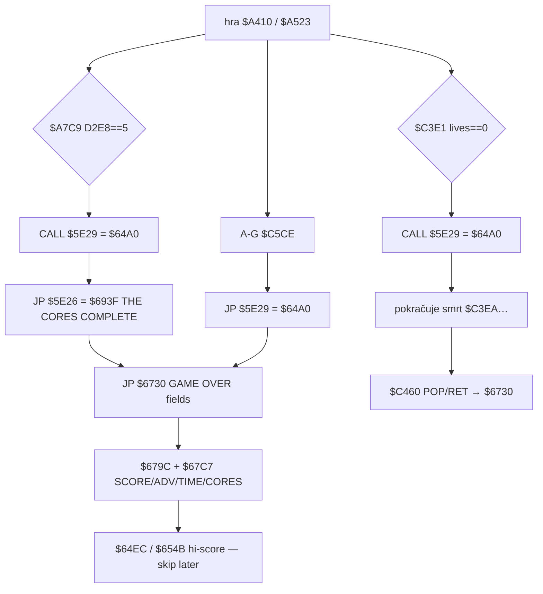

# Skóre a vyhodnocení konce hry

Rozbor `$D413` / `$D422`→`$D521`, vítězství (9 jader → `$D2E8==5`), `$5E29`→`$64A0` a společné výsledkové pole `$6730`/`$67C7` (stejné po výhře i po životě 0). Smyčka 50 Hz; čas z FRAMES `$5C78`.

**Není to** refill/`$D4E9` ani HUD stropy `$D425` (jen jejich vedlejší `CALL $D521`). **Není to** persistace hi-score — tabulka `$64FA` / zápis `$67C7`…`$654B` jen dokumentovat. Zvuk `$D7C0` / melodie `$6600` jen jako větve ke skipu.

Hlavní tvrzení (skool + `tmp_score_probe.py`): výhra i life-out končí na **stejném** `$6730` výsledku. `$64A0` nejdřív přičte +1000 a přepíše spodní tři cifry skóre PRNG; teprve potom (výhra přes `$693F`, smrt/abort přes `RET` na `$6730`) se skládají SCORE / ADVENTURE / TIME / CORES.

---

## Odvodené konstanty

| veličina | hodnota | adresa |
|---|---|---|
| skóre 6 cifer (BCD bajty 0–9) | `$D413`…`$D418` | `g$D413` |
| pracovní přičtení | `$D419`…`$D41E` | `g$D419` |
| update skóre | `JP $D521` | `$D422` |
| HUD + skóre | `CALL $D521` pak lives/E/P/F | `$D425` |
| konec hry vstup | `JP $64A0` | `$5E29` |
| +1000 na konci | `$D41B := 1` | `$64A0` |
| jádra zbývá / hotovo | `$D2E7` / `$D2E8` | init `$6343` `$29,$09` → `$D2E7=9` |
| tabulka 9 ID jader | `$D2DE`…`$D2E6` | `$6351` / `$A6D6` |
| výhra práh | `$D2E8 == 5` | `$A7C9 CP $05` |
| výhra → end | `CALL $5E29` / `JP $5E26` | `$A7CF` / `$A7D2` |
| complete text | `$693F` → `JP $6730` | `$5E26 JP $693F` |
| GAME OVER layout | labely `$6738`, hodnoty `$67C7` | `$6730` |
| adventure | `(visited×50)≫8` | `$679C` / bitmapa `$A390` |
| time | FRAMES `$5C78` / 50 → s; /60 → min | `$67F6`…`$6835`; clear `$647F` |
| cores replaced | `9 − $D2E7` | `$6841`…`$6847` |
| hi-score table | 8 jmen | `$64FA` (neimplementovat zápis) |
| kill body | `$A2E7` z AABB střely | `$A075 CALL $A2E7` |
| first-visit +250 | `$D41D=$19` + `$A801` clear bit `$A390` | `$A47E`…`$A483` |
| core delivery +10000 | `$D41A := 1` | `$A6E5` / `$A6EA` |
| life-out → `$64A0` | `CALL $5E29` | `$C3E7` |
| life-out → `$6730` | `POP HL` / `RET` | `$C460` (stack po `CALL $A410`) |
| abort A–G | `POP HL` / `JP $5E29` | `$C5CE` → `$64A0 RET` → `$6730` |

---

## Stavový stroj konce



`$672D CALL $A410` nechá na stacku návrat `$6730`. Respawn (`$C471 POP` / `JP $A410`) i smrt s životy sejme jen vnitřní rámec (`CALL $C350` / `CALL $A01B`), `$6730` zůstane. Abort (`$C5CE POP`) sejme návrat do smyčky, `$64A0 RET` padne na `$6730`.

---

## 1. Victory condition — 9 dílů, počítadlo 5

Init: `$D2E7 = 9` (`$6343` offset `$29`), `$D2E8 = 0` (není v párech; RAM po clear / snapshot 0). Devět ID v `$D2DE`.

Doručení v jádru `$A6C1`…`$A7CF`:

1. Inventář `$D2D3` vs tabulka `$D2DE` (`$A6DB`…); shoda → `$D41A=1`, `CALL $D422` (**+10000**).
2. `$A72C DEC ($D2E7)`.
3. Když `$D2E7` po DEC je **sudé** (`$A734 SUB $02` smyčka → `$A73A JP Z,$A7A9`): animace, `$A7B2 INC ($D2E8)`.
4. `$A7C9 CP $05` / `JP NZ,$A743`; při rovnosti `CALL $5E29` pak `JP $5E26`.

Sudé kroky z 9→8…→0 dají **5** inkrementů `$D2E8`. Výhra = všech **9** core elements replaced; `$D2E8` je jen milník po každé druhé instalaci. Display `9−$D2E7` (`$6845 SUB`) ukáže 0…9.

Po `$64A0`: `$693F` text „THE CORES COMPLETE…“, melodie `B=$05` (`$69CE`), `JP $6730`.

---

## 2. Scoring — co přičítá body

Přenos: zapsat cifry do `$D419`…`$D41E`, volat `$D422` (= `$D521`) nebo `$D425` (nejdřív `$D521`). `$D521` sečte work→score, work vynuluje, vytiskne 6 cifer.

| událost | zápis work | body | volání |
|---|---|---|---|
| střela zabije vetřelce | `$D41D := (hi−$AE)×2` | 80…320 (krok 20) | `$A075` → `$A2E7` → `$D422` |
| první vstup do místnosti | `$D41D := $19` | +250 | `$A47E`…`$A483`; bit `$A390` přes `$A801` |
| doručení jádra | `$D41A := 1` | +10000 | `$A6E7` / `$A6EA` |
| konec hry (výhra i prohra) | `$D41B := 1` | +1000 | `$64A0` / `$D425` |

Kill formula (emu): hi `$B2`→+80, `$B3`→+100, … `$BE`→+320. Sběr `$D09F` **`$D419` nenastavuje** (viz [`item-effects.md`](item-effects.md)).

Mapování work cifer: `$D419` = 100000 … `$D41E` = 1. Score stejně od `$D413`.

### Adventure score

`$679C`: projde 512 místností (`$D2C8` 0…511), `$A804`/`$ABF0` na bitmapě `$A390`. Bit0 **clear** = už ohodnocená návštěva → `INC DE`. `HL = DE × 50` (`$30A9`), návrat `HL = H`, `A = H` — tj. `(visited×50)≫8` ≈ procenta (512×50/256 = 100). Volá se z `$64A0` i z `$6730` před `$67C7`.

First-visit: `$A472` bit **set** → +250 a `$A801` s `C=0` bit maže (sonda).

### Time taken

Nová hra: `$647F` maže `$5C78`… (FRAMES). Konec: `$67F6` bere 24bit FRAMES, dělí 50 → sekundy, 60 → minuty; tisk `MM.SS` (`$65BB`, tečka, leading `0` u SS&lt;10). Bez IRQ ve headless emu FRAMES neroste.

---

## 3. Složení end screen (výhra = life-out)

Společná cesta `$6730` → labely `$6738` → `$679C` → `$67C7`.

| pole | zdroj | tisk | AT (y,x) z control kódů |
|---|---|---|---|
| nadpis | `"GAME  OVER"` | `$6738` | (3,11) |
| label SCORE | text | `$6738` | (6,10) |
| **SCORE hodnota** | `$D413`…`$D418` po `$64A0` | `$67D7`…`$67E7` | kurzor po `$67D0` → (6,16) |
| label ADVENTURE SCORE | text | `$6738` | (9,7) |
| **ADVENTURE hodnota** | A/HL z `$679C` | `$67CA CALL $65BB` | (9,23) ink 3 z konce `$6738` |
| label TIME TAKEN | text | `$6738` | (12,8) |
| **TIME hodnota** | FRAMES→MM.SS | `$67F6`…`$6835` | (12,20) pak `.` + SS |
| labels CORE ELEMENTS / REPLACED | text | `$6738`/`$6779` | (15,5) / (17,7) |
| **CORES hodnota** | `9 − $D2E7` | `$6841`…`$6854` | (19,10) |

Před `$6730` vždy proběhne `$64A0` (výhra, `$C3E7`, abort). Stejná čísla polí; výhra navíc vloží `$693F` před `$6730`.

### Exact field layout pro implementéry

```text
EndResult {
  scoreDigits[6]     // $D413..$D418 after $64A0 (+1000 + low-digit scramble)
  adventure          // u8 = (visitedRooms * 50) >> 8   // $679C → $654A
  timeMinutes        // FRAMES / 50 / 60
  timeSeconds        // (FRAMES / 50) % 60   // display MM.SS
  coresReplaced      // 9 - $D2E7            // 0..9
  victory            // bool: came via $A7CF / $693F (optional for UI)
}
```

Hi-score: `$67C7` po zobrazění porovná `$67EA` s tabulkou (`$64EC`), případně „ENCODE YOUR INITIALS“ a zápis do `$64FA`. **Later: nezapisovat / nepersistovat.**

---

## 4. `$64A0` krok za krokem

| krok | adresa | co |
|---|---|---|
| 1 | `$64A0` | `A=1` → `$D41B` (+1000 work) |
| 2 | `$64A5` | `CALL $D425` (přičte +1000, překreslí HUD) |
| 3 | `$64A8` | `CALL $679C` (A = adventure high byte; vedlejší: `$D2C8` projede 0…511) |
| 4 | `$64AB` | zkopíruje `$D413`…`$D415` do `$DAC0`; `$DAC0+3..5 := A` (seed PRNG) |
| 5 | `$64BC` | `$DB19 := $0303`; 30× `$DAC6` |
| 6 | `$64C9` | 2×: `$DAC6`, `$D416`/`$D417` := `$DAC0 % 10` |
| 7 | `$64DE` | `$D418 := ($DAC1 ∧ 1) ? 5 : 0` |
| 8 | `$64E8` | `CALL $D425` (jen tisk; work=0) |
| 9 | `$64EB` | `RET` |

Sonda snapshot `002950` → po `$64A0` `003985` ( +1000 → `003950`, scramble spodních tří na 9,8,5).

### Co později přeskočit

| věc | kde | poznámka |
|---|---|---|
| beeper / theme | `$D7C0`, `$6600` v `$693F`/`$67C7` | presentation |
| banner / UDG | `$6615`, `$D3C1`, `$C352` | presentation |
| hi-score compare/write/UI | `$64EC`, `$6862`…`$654B` | **no persistence** |
| intro `$666D` | před hrou | nepatří do end |
| scramble spodních cifer | `$64C9`…`$64E7` | autentické; engine může zjednodušit na +1000 |
| full `$679C` scan | 512× bit test | nebo běžící `visitedCount` z first-visit |

Ponechat: +1000, adventure%, time, cores, skóre z kill/visit/core.

---

## 5. Linky na `$D422` (jen adresy)

| site | kontext |
|---|---|
| `$A2F2` | kill `$A2E7` (volá `$A075` po AABB střely) |
| `$A483` | first-visit místnosti +250 |
| `$A6EA` | doručení jádra +10000 |
| `$D425` → `$D521` | HUD cesty (přičte work, pokud nenulový) vč. `$64A5`/`$64E8` |

Přímé `CALL $D422`: `$A2F2`, `$A483`, `$A6EA`. `$D422` samotné je `JP $D521`.

---

## (b) Nevyřešené

1. **Přesný ink/kurzor `$D3C1`** při tisku adventure před `"/"` — layout AT z DEFM sedí; pixel-perfect cursor po `$679C` side-effects neověřen.
2. **`$A390` init** — snapshot už má mix bitů; nová hra clear/fill všech 64 B v `$6351` není (na rozdíl od `$A350` `$FF`). Kdo plní `$A390` při startu — NEVÍM (skool-only mezera; first-visit logika ověřena).
3. **Abort uprostřed `$64A0`** po změně `$D2C8` — adventure po abortu běží, ale room id zůstane 512 po scanu (jako po `$679C`); další hra stejně jde přes `$6351`.
4. **Hi-score sort `$6914`** — jen dokumentováno, ne reverse do hloubky.

---

## (c) Poznámky pro TS engine (bez kódu)

Teď `world.gameOver` + string „GAME OVER“ **nestačí**. Stejný `EndResult` pro výhru i lives=0: po +1000 (a volitelně scramble) spočítat adventure / time / `9−coresLeft`. Výhra: nejdřív voluntary victory banner, pak stejná pole.

Nesbíhat `$D425` (HUD+cap) se zápisem bodů — body jdou přes work cifry + `$D422`/`$D521`.

---

## Emu-verified vs skool-only

| tvrzení | evid |
|---|---|
| `$D422` +80/+250/+10000/+1000 a BCD carry | **emu** `tmp_score_probe.py` |
| `$64A0` +1000 a scramble `D416..D418`, ones∈{0,5} | **emu** (002950→003985) |
| `$679C` HL/A z visited×50≫8 | **emu** + bit math; shoda HL=0 při 3 visited |
| kill formula (hi−$AE)×2 tens | **skool** `$A2EC` + aritmetika (emu table) |
| victory `$D2E8==5` / 9 parts | **skool** `$A7C9` / `$6343` `$D2E7=9`; snapshot counters |
| `$6730` návrat po lives=0 | **emu** dříve [`energy-death.md`](energy-death.md); skool stack |
| TIME z FRAMES/50 | **skool** `$67F6`; emu bez IRQ |
| end labels AT | **skool** `$6738` DEFM |
| hi-score `$64FA` | **skool** only (no implement) |

---

## MOVEMENT.md merge bullets (nevkládat sem do MOVEMENT.md)

- **Konec hry:** `$5E29`→`$64A0` (+1000, scramble low digits, `$679C`) společné pro výhru (`$A7CF`), lives=0 (`$C3E7`+`$C461`→`$6730`) a abort A–G (`$C5CE`).
- **Výhra:** 9× core (`$D2E7` 9→0); `$D2E8` ++ při sudém zbytku; `$D2E8==5` → `$5E29` pak `$693F`→`$6730`.
- **Skóre:** kill `$A2E7`/`$D422` 80…320; first-visit +250 (`$A390`); core +10000; end +1000. Work `$D419`, score `$D413`.
- **EndResult:** SCORE (`$D413` po `$64A0`), ADVENTURE `(visited×50)≫8`, TIME FRAMES→MM.SS, CORES `9−$D2E7`. Hi-score `$64FA` nezapisovat.
- Nahraď bullet „18. Plný `$64A0`…“ odkazem na [`notes/endgame-score.md`](endgame-score.md).
