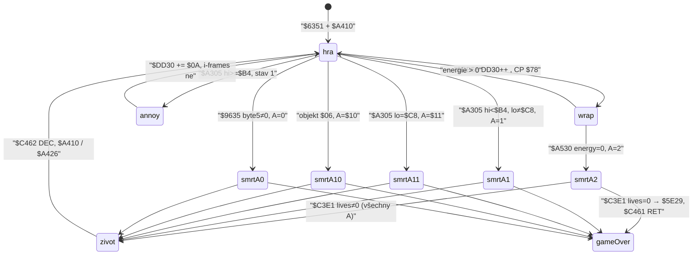

# Energie, smrt, životy

Rozbor `$D2CD` / `$D4E9` (úbytek), `$CB58` (perioda), `$A305` (kontakt), `$C350`/`$C35E` (smrt) a `$D2CC` (životy). Smyčka 50 Hz. Souřadnice stejné jako v [`hoverpad.md`](hoverpad.md): `$DD1D` X, `$DD1E` Y odspodu.

**Není to** teleport / terén `$D2C4` (jen vazba: `A ≥ $10` při smrti nastaví `$D2C4 = 1` a `$A4FA` obnoví XY). **Není to** jádro `$C7` do hloubky — jen jestli respawn maže nesené díly. Zvuk `$D7C0` a animace jen tam, kde mění stav.

Hlavní smyčka (`$A523`): `$C544` (kreslení `$D9C8`, ovládání `$C5BD`, východ `$C8F4` nebo `$CB58` úbytek + objekty) → `A ≥ $64` → `$A530` (nula energie) → tabulka `$9635` → `$A01B` vetřelci. `$C8F4` při východu `RET` s `A = $00` a **`$CB58` nespustí**.

---

## Odvodené konstanty

| veličina | hodnota | adresa |
|---|---|---|
| životy (nová hra) | 4 | `$6343` offset `$0E` → `$D2CC`; `$6351` |
| energie (nová hra) | `$FF` pak strop `$7F` | `$6343` offset `$0F`; `$D425 CP $7F` |
| plošinky (nová hra) | `$32` | `$6343` offset `$10` → `$D2CE` |
| palba (nová hra) | `$FF` pak strop `$7F` | `$6343` offset `$11` → `$D2CF` |
| snapshot `$D2CD`/`$CE`/`$CF` | `$17` / `$30` / `$7E` | `g$D2CD` — **rozehraná hra**, ne init |
| `$DD30` nová hra | 0 | `$6452` nula `$C0` B od `$DD18` |
| snapshot `$DD30` | `$51` | `g$DD30` |
| strop statů (ne životy) | `$7F` | `$D469` / `$D46D` (energie, plošinky, palba) |
| `$D41F` | `JP $D4E9` | `$D41F` |
| index `$D4E9` | 0 energie, 1 plošinky, 2 palba | `$D4EC HL=$D2CD` |
| periodický wrap | `$DD30` INC, `CP $78` | `$CB58`–`$CB5D` |
| úbytek při wrapu | `A=0`, `C=$04` (energie −4, min 0) | `$CB63` / `$D4F5 SUB C` / `$D4F8 XOR A` |
| obtěžující bump | `$DD30 += $0A` (8bit, bez wrap testu) | `$A345` |
| hitbox Blob–vetřelec | \|dx\| `< $0E`, \|dy\| `< $0B` | `$A316` / `$A321` |
| smrtící / obtěžující | hi bajt grafiky `< $B4` / `≥ $B4` | `$A327 CP $B4` |
| jen stav 1 | `CP $01` / `CALL Z $A305` | `$A08F` |
| 4 podkroky / slot | `$A043 LD A,$04` → `$A19D JP NZ,$A048` | `$A01B` |
| i-frames / latch | **nejsou** | `$A345 RET` hned; další podkrok znovu |
| `$C350` | `JR $C35E` | `$C350` |
| práh `$D2C4` | `A ≥ $10` → `$D2C4 = 1` | `$C363 CP $10` / `$C367 INC (HL)` |
| typ smrti | `A ∧ $07` do `$C4A9` | `$C368` |
| flash (typ 2) | `CP $02` | `$C36D` |
| dummy grafika | `$DF40`, X `∧ $F8` (typ ≠ 1) | `$C3D3` / `$C3DC` |
| game over (životy 0) | `CALL $5E29` (`JP $64A0`) | `$C3E7` |
| DEC života | `$C462 DEC (HL)` na `$D2CC` | `$C459`–`$C462` |
| energie po smrti | `$FF` pak `$D425` → `$7F` | `$C464 DEC A` / `$A45C` |
| plošinky po smrti | `(HL) ∨ $08` (bit 3, **ne** max 8) | `$C466`–`$C46A` |
| palba / inventář / `$D2DE` / `$DD30` | beze změny | `$C35E` je nezapisuje |
| grafika po respawnu | `$E074` (`blobwr1`) | `$C46B` |
| `$9C43` během smrti | 4 | `$C3C8` |
| návrat do hry | `POP HL` / `JP $A410` (`JR $A426`) | `$C471` |
| start XY / místnost | `$88,$3F` / místnost 8 | `$6468` / `$6343` offset `$0A` |
| abort A–G | `POP HL` / `JP $5E29` | `$C5CE` (není `$C350`) |

---

## Stavový stroj



Tick bez východu: `$C544` → `$CB58` (drain) → `$A526 A ≥ $64` → `$A530` (nula) → `$9635` → `$A01B` (kontakt). Okamžitá smrt z `$A305` je **až po** testu nuly.

---

## 1. Úbytek energie

`$D41F JP $D4E9`: `A` = index od `$D2CD`, `C` = úbytek, podtečení → 0 (`$D4F5` / `$D4F8`). Samo o sobě **nezabíjí**.

`$CB58` (jen když `$C8F4` nejde ven z místnosti):

1. `$DD30++`
2. `CP $78` — pod prahem nic
3. jinak `$DD30 = 0`, `CALL $D41F` s `A=0 C=$04` → energie −4

Sonda: `$DD30=$77`, energie `$17` → po `$CB58` `$DD30=0`, energie `$13`. `$DD30=$50` → `$51`, energie beze změny. `$D4E9` z 3 − 4 → 0.

Obtěžující vetřelec **nesnižuje `$D2CD`**. `$A345` jen `$DD30 += $0A` a `RET`. Wrap kontroluje až **příští** `$CB58` (další tick bez východu). `$DD30` je 8bit: `$F6+$0A` přeteče na `$00` a wrap `$78` se oddálí.

Průběžně, ne jednorázově: `$A305` je uvnitř 4 podkroků (`$A048`…`$A19D`). Každý podkrok ve stavu 1 při AABB znovu přičte `$0A`. Čtyři volání `$A345` z `$10`: `$38`. Latch / i-frames **nejsou** (sonda + skool).

Smrtící sada (`hi < $B4`) na `$D2CD` sahá taky ne — `JP $C350`.

---

## 2. Vstup do `$C350` / `$C35E`: registr A

`$C350 JR $C35E`. `$C35E` nejdřív `$D2C4 := 0`, pak `CP $10` (NC → `$D2C4 := 1`), `A := A ∧ $07` do `$C4A9`.

Čtyři callery (všechny ověřené skoolem; A u `$A305`/`$A530` i v emu):

| A | `$C4A9` | `$D2C4` | zdroj | adresa |
|---|---|---|---|---|
| `$02` | 2 | 0 | nula energie | `$A535 LD A,$02` / `$A537 CALL Z` |
| `$01` | 1 | 0 | vetřelec, lo ≠ `$C8` | `$A33B LD A,$01` / `$A342 JP` |
| `$11` | 1 | 1 | vetřelec, lo = `$C8` | `$A33F LD A,$11` |
| `$10` | 0 | 1 | objekt typ `$06` | `$CE7D LD A,$10` / `$CE7F JP` |
| `$00` | 0 | 0 | `$9635` byte5 ≠ 0 | `$A568 XOR A` / `$A56A CALL NZ` |

`LD A,$02` **nemění** Z po `CP $00`, proto `CALL Z` u nuly platí. Sonda: PC=`$A530`, energie 0 → `$C350` s `A=2`; energie 1 → `$A53A`, smrt ne.

Typ 2 (energie): flash inkoustu XOR `$05` (`$C37E`), dummy `$DF40`. Typ 1 (vetřelec): `$A32F` zkopíruje grafiku vetřelce na Blob, dummy se přeskočí (`$C3D0 DEC A / JR Z`). Typ 0: dummy + X `∧ $F8`. Pak `$A426` zarovná X `∧ $F8` a Y `(Y+1) ∧ $F8 − 1` u **všech** smrtí; při `$D2C4 = 1` to přepíše obnovou `$D2DC`.

Jiná `A` do `$C350` z těchto čtyř cest nechodí. `$C352`–`$C35B` jsou **jiné** skoky (`$C4AB` / `$C4E5` / `$C506` / `$C52D`), ne smrt.

---

## 3. Způsoby smrti

### 3.1 Nula energie — `$A530`

Po ticku s `$CB58`. `A ≥ $64` (typicky `$D2B9`: `XOR A` / `DEC A` → `$FF`). Energie 0 → `$C350` s `A=2` **v tomtéž** průchodu `$A523`, před `$9635` i `$A01B`. `$C350` se nevrací (`POP HL` / `JP $A410`).

Východ z místnosti (`$C94A A=$00`) `$CB58` přeskočí a jde na `$A426` — nula se tesuje až v dalším ticku, pokud znovu nezměníš místnost.

### 3.2 Kontakt `$A305`

AABB proti Blob `$DD1D`/`$DD1E` (sedadlo, i na padu). Stav ≠ 1 přeskočí (`$A08F`). Hi `< $B4` → smrt (`A=1` nebo `$11` když lo=`$C8`). Hi `≥ $B4` → `$DD30 += $0A`.

`lo = $C8` je sada `badalien1` `$B2C8` (`GRAFIX $B208+$C0`). Umírající hvězdy `$BEC8` jsou stav 2, `$A305` se nevolá.

Mimo AABB (`dx=$20`): `RET`, `$DD30` beze změny.

### 3.3 Objekt `$06` — `$CE77`

High nibble `$60` v `$9740` → `$A963 JP Z,$A9F6` → typ `$06` v `$96FC`. AABB objektů `$01`–`$0B` je \|d\| `< $0F` (`$CBBB`), ne hitbox vetřelce. `A=$10` → `$D2C4=1` (návrat na poslední vchod).

Tři podbloky s nibble `$60`: 27, 46, 82. Rozmístění v místnostech je terén (jiný rozbor).

### 3.4 Tabulka `$9635` (nibble `$70`)

`$A968` plní 8bajtové záznamy, byte5 start 0 (`$A986`). `$A66C` timer `$FF` → `XOR $01` na byte5. `$A56A`: byte5 ≠ 0 → `$C350` s `A=0`. Podbloky 7 a 40. Detaily dlaždice patří k terénu.

---

## 4. Životy

Init `$6351` z `$6343`: `$D2CC = 4`. Žádný jiný `LD ($D2CC)`. Růst jen přes extra `$CC9A` (viz § 7). `$D425` životy **neřeže** na `$7F` (smyčka `$D463 B=$03` od `$D2CF`).

Pořadí v `$C35E`:

1. `$C3E1`: lives == 0 → `CALL $5E29` (`JP $64A0`). Animace **pokračuje** (stub `$5E29=RET` spadl na `$C3EA`).
2. `$C459`: lives == 0 → `POP HL` / `RET` = `$C461`. S `SP` nastaveným jako po `CALL $A410` to vrací na `$6730` (`GAME OVER`).
3. jinak `DEC ($D2CC)`, energie `$FF`, plošinky `∨ $08`, `JP $A410`.

Sonda:

| lives před | první test | po `$C462` | výsledek |
|---|---|---|---|
| 4 | ≠ 0 | 3 | respawn |
| 1 | ≠ 0 | 0 | respawn, na panelu 0 |
| 0 | `CALL $5E29` | DEC není | `$C461 RET` / game over |

Start 4, pět smrtí do `$6730`. Čtvrtá nechá counter 0 a ještě jednu hru.

Abort A–G (`$C5CC JR NZ` mine) je `JP $5E29` **mimo** `$C350`.

---

## 5. Co se obnoví / neobnoví

Po `$C462` a `$A410`/`$A426` (sonda místnost `$0F`, značky v `$D2D2`/`$D2DE`):

| položka | po smrti | adresa |
|---|---|---|
| místnost `$D2C8` | stejná | `$C35E` nemění |
| XY, `$D2C4=0` | místo smrti, zarovnané `$A426` | `$A4FF JR NZ,$A50D` |
| XY, `$D2C4=1` (`A ≥ $10`) | `$D2DC` (pozice při **posledním** `$A4B1`) | `$A501` |
| `$DD22`, `$D2C4=0` | **nechá** (pad zůstane 2) | `$C35E` neresetuje |
| `$DD22`, `$D2C4=1` | z `$D2C5` (vchod do místnosti) | `$A50A` |
| energie | `$7F` | `$C465` `$FF` + `$D425` |
| plošinky `$D2CE` | `∨ $08` (7→`$0F`, 0→8, `$30`→`$38`) | `$C469 OR (HL)` |
| palba `$D2CF` | beze změny | — |
| inventář `$D2D2` | beze změny | značky A0–A7 držely |
| `$D2DE` (seznam jádra) | beze změny v běžné místnosti | značky 80–88 držely |
| `$DD30` | beze změny | 81 zůstalo 81 |
| vetřelci | `$A520 CALL $9C47` (ne když `$D2C4=3`) | `$A51C` |
| `$9C43` | znovu 3, je-li stanice; pad ptr `$AFC8` | `$9F49` / `$9F57` |
| grafika Blob | `$E074` | `$C46B` |
| inkoust | `$DD21 = 7` | `$A4C2` |
| postavené plošinky | pryč (`$A4B1` nula `$DBBB`) | `$A4B1 LD B,$31` |
| `$DD29` / `$DD2C` | 0 | `$A4BB` |

`$D2C4=1` po `$A= $10/$11` **zůstane 1**, dokud další východ/teleport zapíše `$A52A`. Ve smyčce `$A530` se `$D2C4` nečte.

Místnost `$C7`: `$A4CE CP $C7` / `JP Z,$A6C1` — **stejná** větev jako vstup do jádra zaživa (může spotřebovat díly z inventáře). To není „wipe při smrti“. Mimo `$C7` nesené díly respawn nemaže.

### Smrt na padu (`$DD22 = 2`)

`$DD22` se na nulu neklade (`$C3B6` jen přeskočí kopii `$DD9D`→`$DDBD`). `$9C43 := 4` během animace.

- `$D2C4 = 0` (energie, běžný vetřelec, `$9635`): po `$A410` `$DD22` pořád 2, `$9F57` položí slot 4 na Blob (sonda: Blob `(136,63)`, pad `(136,55)`, ptr `$AFC8`, `$9C43=3`).
- `$D2C4 = 1` a `$D2C5 = 0` (vchod pěšky, smrt `A=$11`/`$10`): `$DD22 := 0`, pad zpět na stanici `$D2CA`.

Headless `$C350` s NOP `$C453` a RET `$D9C8`/`$D7C0` doběhl na `$A523`. Dříve `$A5C1` byl busy-wait zvuku z `$D9C8` → `$A418`.

---

## 6. Nová hra vs snapshot

`$62D0 JP $6351` (po volbě řízení). `$6351` 45 B od `$D2BE` na nulu, pak páry `$6343`:

| offset od `$D2BE` | cíl | hodnota |
|---|---|---|
| `$0A` | `$D2C8` | `$08` (místnost 8) |
| `$0E` | `$D2CC` | `$04` |
| `$0F` | `$D2CD` | `$FF` |
| `$10` | `$D2CE` | `$32` |
| `$11` | `$D2CF` | `$FF` |

První `$D425` (`$A45C` skrz `$666D CALL $A410`) řeže energii i palbu na `$7F`. Plošinky `$32` (`< $7F`) zůstanou. `$6452` maže tabulku entit → `$DD30 = 0`. `$6468` XY `$88,$3F`, `$DD22 = 0`.

`START_*` v enginu (`$17/$30/$7E/$51`) jsou **snapshot** `g$D2CD` / `g$DD30`, ne nová hra.

---

## 7. Extra `$17` (životy)

`$CC9A CP $17` / `CALL Z,$CCCC` **před** `SUB $11` a tabulkou `$CCBC`. `$CCCC` je překryv (`21 CC D2…`), ne `$00,$00` z tabulky.

`$CCCC` (bajty snapshotu):

```
LD HL,$D2CC / XOR A / CP (HL)
JR NZ,$CCD6
LD A,$18 / RET          ; lives == 0
$CCD6: B=3, A=$FF, tři INC HL (energie, plošinky, palba)
  (HL) < $FF → přeskoč
  jinak E := 2×(3−B), A := (HL)
LD A,E / ADD A,$12 / RET
```

Sonda:

- lives = 0 → `A=$18` → `SUB $11` = `$07` → `$CCBC+$0E` = `$00,$01` → **životy +1** (`0→1`).
- lives ≠ 0 a žádný stat `$FF` (běžná hra po `$D425`) → `$CCCC` **E nezapíše**, `A = E+$12`. Izolovaný CALL po bootu (E=0) se choval jako extra `$12` (energie `$17+$60=$77`).
- tabulkový pár `$00,$00` u `$17` se z `$CCCC` **nedá** dostat (`E+$12` z last-match je `$12/$14/$16`; lives 0 dává `$18`).

In-game E při lives ≠ 0 **NEVÍM** (zbytek z ticku; `$D4E9` při wrapu v tomtéž `$CB58` dává `E=0`). Životy jinde nerostou.

---

## (a) Konstanty pro pozdější `constants.ts`

```
START_LIVES              = 4        // $6343 / $D2CC
NEW_GAME_ENERGY          = 0x7F     // $FF pak $D425
NEW_GAME_PLATFORMS       = 0x32     // $6343
NEW_GAME_FIREPOWER       = 0x7F
NEW_GAME_ROOM            = 8
NEW_GAME_XY              = (0x88, 0x3F)
SNAPSHOT_ENERGY          = 0x17     // g$D2CD, ne init
SNAPSHOT_DRAIN           = 0x51     // g$DD30, ne init
STAT_CAP                 = 0x7F     // $D469; ne životy
ENERGY_INDEX             = 0        // $D4E9 A
ENERGY_DRAIN_WRAP        = 0x78     // $CB5D
ENERGY_DRAIN_STEP        = 4        // $CB63 C
ANNOY_DRAIN_BUMP         = 0x0A     // $A349
HIT_DX                   = 0x0E     // $A316
HIT_DY                   = 0x0B     // $A321
KILL_GRAPHIC_HI          = 0xB4     // $A327
GRAPHIC_LO_C8            = 0xC8     // $A339 → A=$11
DEATH_A_TILE             = 0        // $A568
DEATH_A_LETHAL           = 1        // $A33B
DEATH_A_ENERGY           = 2        // $A535
DEATH_A_OBJ06            = 0x10     // $CE7D
DEATH_A_LETHAL_C8        = 0x11     // $A33F
DEATH_RESTORE_MIN_A      = 0x10     // $C363 → D2C4=1
RESPAWN_ENERGY           = 0x7F     // $C465 + $D425
PLAT_OR_ON_DEATH         = 0x08     // $C466 OR, ne max
DUMMY_PTR                = 0xDF40   // $C3D3
RESPAWN_PTR              = 0xE074   // $C46B
OBJ_TYPE_KILL            = 0x06     // $CE77
ATTR_NIBBLE_KILL         = 0x60     // $A963
```

`$D2CC`, `$D2CD`, `$D2CE`, `$D2CF`, `$DD30`, `$D2C4`, `$D2C5`, `$D2DC` jsou RAM.

---

## (b) Nevyřešené

1. **Extra `$17` při lives ≠ 0.** Mechanismus `A=E+$12` je z ROM; in-game E po `$CB8A` není krokované v celém ticku. Neimplementovat jako „životy +0“.
2. **Plný `$64A0`.** `$5E29 JP $64A0`; `$64EB RET`. Stub `RET` na `$5E29` dopadl na `$C3EA` a `$C461`. `$679C` (512 místností) v emu neběžel.
3. **Smrt v `$C7`.** `$A6C1` je vstup do jádra, ne wipe. Kolik dílů se při překreslení položí — mimo rozsah.
4. **`$A= $11` mimo `badalien1`.** Každá sada s lo=`$C8` by se chovala stejně; v `ENEMY_SETS` je to `$B2C8`.
5. **Čtyři `$0A` za tick u živého spawnu.** Skool (4× `$A305`) + izolovaná `$A345`; kompletní `$A01B` slot proti Blobovi v této sondě nebyl (engine test `0x0a*4` to už tvrdí).

---

## (c) Poznámky pro TS engine (bez kódu)

Teď `energy=0` **není** `$C350`. ROM: nula → smrt `A=2` (flash, dummy, DEC života, energie `$7F`, plošinky `∨ $08`). Smrtící sada nenuluje energii — rovnou `$C350` s `A=1`/`$11`.

Obtěžující typ jen zrychlí `$DD30`, ne −N z `$D2CD`. Bez i-frames; až 4× `$0A` na slot a tick.

`$17/$30/$7E` jsou snapshot. Nová hra je `$7F/$32/$7F`, 4 životy, místnost 8.

Respawn drží inventář, palbu, `$DD30`, `$DD22` (kromě `$D2C4=1`). Pad po smrti s `A < $10` zůstane.
