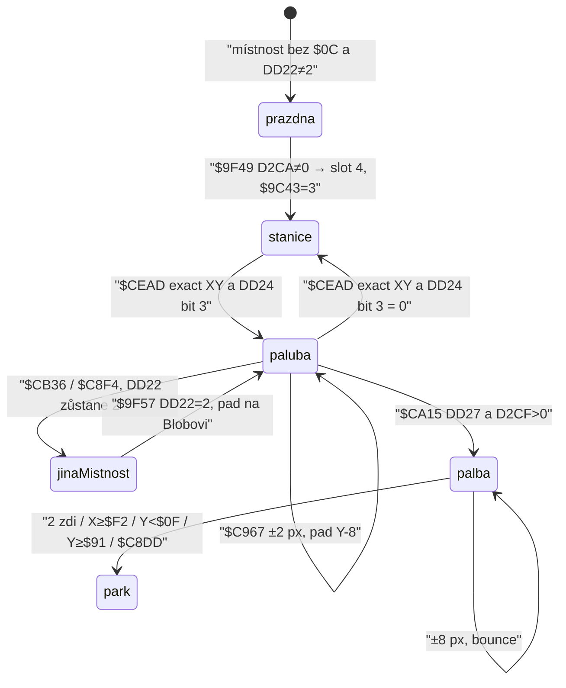

# Vznášedlo (létající plošinka / hoverpad)

Rozbor rutiny `$C967` (let), `$CEAD` (nástup / výstup), `$CA15` (palba) a spawnu `$9F49`. Smyčka je 50 Hz (`HALT` `$D9C8` / `$A5DC`). Souřadnice: `$DD1D` X zleva, `$DD1E` Y **odspodu**; kreslení na `$BF − Y`; playY = `143 − gameY`.

**Není to** stavba plošinek `$C79F` (zásoba `$D2CE`) ani tile-jetpack `$C761` (`$DD22 = 1` z dlaždice `$64` v `$C717`). Jetpack-up `$C76D ADD A,$02` patří **jen** větvi `$DD22 = 1`. Vznášedlo je `$DD22 = 2` a větev `$C967`.

## Odvodené konstanty

| veličina | hodnota | adresa |
|---|---|---|
| GRAFIX padu | `$AFC8` (snímek 0, 4× `$30` v sadě) | `$9F67` / `$C959` |
| GRAFIX palby | `$B088`, `$B0B8`, `$B0E8`, `$B118` | tabulka `$CB2B` |
| inkoust padu | 7 | `$9F6D LD ($DDA1),A` / `$C95F` |
| slot tabulky `$DD18` | 4 (`$DD98`, XY `$DD9D`) | `$9F64` |
| střela | slot 5 (`$DDB8`, XY `$DDBD`) | `$CA5F LD IX,$DDB8` |
| počet slotů `$A01B` při padu | 3 (slot 4 se jako vetřelec nechodí) | `$9F72 LD A,$03` → `$9C43` |
| příznak paluby | `$DD22 = 2` | `$CEBE` / `$C62D JP Z,$C967` |
| chůze / tile-jetpack | `$DD22 = 0` / `1` | `$6475` / `$C723` |
| typ objektu stanice | `$0C` | `$AA20 CP $0C` / `$CEAD` |
| nibble atributu podbloku | `$C0` (v ROM `$C5` = 197) | `$9740` indexy 33, 34, 35, 55; `$A9F6` |
| shoda na stanici | Blob XY **==** objekt XY (ne AABB) | `$CBAA` / `$C6D6` |
| nástup | bit 3 `$DD24` (Up v posledním nenulovém vstupu) | `$CEB8 BIT 3,(HL)` |
| rychlost letu | 2 px / tick na osu | `$C98D ADD A,$02` / `$C9C1 ADD A,$02` |
| pád `$DD29` | **neplatí** | `$C967` tabulku `$C751` nevolá |
| ofset kresby padu | padY = blobY − 8 | `$C952 SUB $08` / `$9F51 SUB $08` |
| palba krok | 8 px / tick, 1 podkrok | `$CA97 ADD A,$08` / `$CAF0 ADD A,$08` |
| palba bounce | osu `XOR $03` / `XOR $0C`; park při 2 zásazích zdi | `$CA75` / `$CAB1` / `$CAF7 CP $02` |
| palba spotřeba | −1 `$D2CF` (`A=2, C=1`) | `$CA40` → `$D41F` / `$D4E9` |
| start energie / plošinky / palba | `$17`, `$30`, `$7E` | `$D2CD`, `$D2CE`, `$D2CF` — palivo padu **není** |

## Stavový stroj



Hlavní smyčka (`$A523`): `$D9C8` (kreslení) → `$C5BD` (vstup, chůze/let, palba, východy, `$CB8A` objekty) → kontrola energie `$A530` → `$A01B` vetřelci → zpět.

---

## 1. Kde se pad ve světě vzine

Je **obojí**: záznam v seznamu objektů `$96FC` **a** GRAFIX ve slotu 4.

### Stanice (objekt `$0C`)

`$A80A` nejdřív vynuluje `$D2CA` (`$A83A LD HL,$0000` / `$A83D`). Při kreslení podbloku `$A90F` bere bajt atributu z `$9740+id`. High nibble `$C0` nepatří mezi `$50` / `$70` / `$80` / `$90` / `$B0`, takže `$A9E3 JR $A9F6`. `$A9F6` udělá `RRCA×4 AND $0F` → typ `$0C` a volá `$AA02`.

`$AA02` zapíše do seznamu `$96FC` pixelové `(X, Y, typ)`:

- X = `col ≪ 3` (`$AA0E`)
- Y = `($18 − row) ≪ 3 − 1` (`$AA05`)
- při `CP $0C` uloží `(X, Y)` do `$D2CA` (`$AA24`)

Nízký nibble atributu posune buňku: `AND $03` ke sloupci, `AND $0C` k řádku (`$A92A`–`$A933`). V snapshotu mají podbloky 33, 34, 35, 55 hodnotu 197 (`$C5`): offset (+1, +1). Těchto podbloků používá 16 záznamů `$9840`; místnosti, jejichž 12 bajtů `$7530+id×12` takový blok obsahuje, stanici dostanou.

`$94E8` (sběratelné) typ `$0C` **nedává**. Extra `$01` z `$AAB6` taky ne.

Seznam `$CB8A` (`B=$16` záznamů po 3 bajtech) typ `$0C` dál nese — i kdyby `$D2CA` přepsal poslední stanici v místnosti, nástup běží přes **každý** záznam `$0C`.

### GRAFIX ve slotu 4

Po spawnu vetřelců `$9F49`:

- `$D2CA ≠ 0` → `Y := Y − 8`, `CALL $9F64` (pad na stanici)
- pak `$9F57`: je-li `$DD22 = 2`, přepíše XY na Blobovo s `Y − 8`

`$9F64` vždy:

| zápis | hodnota | adresa |
|---|---|---|
| `$DD9D` | X, Y−8 | `$9F64` |
| `$DD9F` | `$AFC8` | `$9F67` |
| `$DDA1` | 7 | `$9F6D` |
| `$9C43` | 3 | `$9F72` |

Bez stanice a bez paluby `$9C43` zůstane 4 (`$9CDA`). Slot 4 pak není pad.

Místnost jádra `$C7` pad **nespawnuje**: `$9C57 CP $C7` → `$9F78` (čtyři díly jádra, `$9C43 = 4`).

Sonda po `$A80A+$9C47` v místnosti `$0F`: `$D2CA = (72, 87)`, slot 4 `(72, 79)`, ptr `$AFC8`, ink 7, `state = 0`, `$9C43 = 3`, `$DD22 = 0`. `$A01B` osm ticků XY nemění — pad není vetřelec.

---

## 2. Nástup a výstup

Vstup `$C55A` (Kempston, jinak T/Y/U/I/P): bit 0 vpravo, 1 vlevo, 2 dolů, 3 nahoru, 4 palba. Palba se z `$DD23` sundá (`$C5D5 BIT 4` → `$DD27`, pak `AND $0F`). Nenulové `$DD23` se kopíruje do `$DD24` (`$C61B`).

`$CB8A` u typu `$0C` **nepoužije** AABB `$0F`. Větev `$CB9A`–`$CBA8`: AABB mají typy `1..$0B`, `$0E` a `≥ $14`. Typ `$0C` jde na **přesnou** shodu `$CBAA` (Blob X == obj X a Blob Y == obj Y). 1 px vedle nástup nespustí.

`$CC5A` → `$CE77` → `$CEAD CP $0C`:

```
$CEB1 CALL $C8DD          ; park střely + nula $DD2D/$DD2E
$CEB4 LD HL,$DD24
      XOR A
$CEB8 BIT 3,(HL)
$CEBA JR Z,$CEBE          ; bez Up → A=0
$CEBC LD A,$02            ; Up → A=2
$CEBE LD ($DD22),A
$CEC1 JP $D1A6
```

- Nástup: stojíš na pixelu stanice **a** poslední nenulový vstup má bit 3 (Up). `$DD22 := 2`.
- Výstup: totéž XY **a** bit 3 `$DD24` je 0 (poslední nenulový vstup je vlevo / vpravo / dolů, případně diagonála bez Up). `$DD22 := 0`.
- Puštění všech kláves `$DD24` **nemaže** (`$C617 JR Z,$C625`). Když poslední klávesa byla Up, na stanici zůstaneš palubě. Výstup vyžaduje stisk směru bez Up, ne pouhé uvolnění.

Up na stanici se v chůzi maže dřív: `$C6D6` při XY == `$D2CA` udělá `RES 3,($DD23)` a `JP $C85A` (přeskočí pád). `$DD24` už nese původní Up, takže `$CEAD` na konci téhož ticku nastoupí. Sběr předmětů (`$CB6B CP $08`) na pixelu stanice neprojde.

`$C8DD` při nástupu/výstupu vždy zaparkuje střelu. Výstřel BLOBa ve stejném ticku (Up+Fire, ještě `$DD22 = 0` → `$C85A`) se vzápětí zruší, palebná síla už odešla.

---

## 3. Řízení na palubě

`$C625 LD A,($DD22)` / `DEC A` / `JP Z,$C761` (tile-jetpack) / `DEC A` / `JP Z,$C967` (vznášedlo).

`$C967` (IX je Blob `$DD18` z `$C5BD`):

1. `$D2F4` na Blobovi, pak dočasně `Y − 8` a znovu `$D2F4` (tělo padu). `OR` obou masek.
2. `allowed = input XOR (input AND walls)` = vstup bez zablokovaných směrů (`$C983`–`$C985`).
3. Bit 3 → `Y += 2`, bit 2 → `Y −= 2` (`$C98D` / `$C993`).
4. `$C94D` zkopíruje pad pod Blob (Y−8, ptr `$AFC8`, ink 7).
5. Totéž `$D2F0` na Blobovi i `Y − 8`. Bit 0 → `X += 2`, bit 1 → `X −= 2` (`$C9C1` / `$C9C7`).
6. Animace `$DD28`; po 3 tickách `$C9D3 CP $03` se mění `$DD26` (0…4) a pointer z `$CA0B`.
7. `JR $CA15` palba.

| veličina | hodnota | adresa |
|---|---|---|
| vpravo / vlevo | ±2 px | `$C9C1` / `$C9C7` |
| nahoru / dolů | ±2 px (Y odspodu: nahoru = +) | `$C98D` / `$C993` |
| úhlopříčka | obě osy v jednom ticku | `$C967` pak horizontála |
| hover bez kláves | XY beze změny, pád ne | sonda: 2 ticky `(132,84)` drží |
| strop / podlaha | bit 3 / bit 2 `$D2F4`, `attr < $40` | `$D397 SET 3` / `$D3BB SET 2` |
| stěny | bit 0 vpravo, bit 1 vlevo `$D2F0` | `$D36E SET 0` / `$D349 SET 1` |
| kdy sonda h/v | `X ∧ 7 = 0` / `(Y+1) ∧ 7 = 0` | `$D327` / `$D373` |
| maska | zeď, když **kterýkoli** z dvojice Blob / pad (Y−8) | `$C97D OR C` / `$C9B1 OR C` |

`$D2F0` / `$D2F4` jsou tytéž sondy jako u chůze. Prázdná výplň `$47` je průchozí; `$07` / `$03` ne.

`$DD26` vpravo `DEC` (pod 0 → 0), vlevo `INC` strop 4 (`$C9E6` / `$C9F0`). Tabulka `$CA0B`:

| `$DD26` | ptr | sada |
|---|---|---|
| 0 | `$E074` | `blobwr1` |
| 1 | `$E674` | `blobxr` |
| 2 | `$E734` | `blobxs` |
| 3 | `$E7F4` | `blobsl` |
| 4 | `$E374` | `blobwl1` |

Chůze `$C5BD` se na palubě nevolá. Stavba plošinky `$C79F` taky ne.

---

## 4. Cestování mezi místnostmi

Pad **není** vázaný na jednu místnost. `$DD22` východ `$C8F4` neresetuje.

Na palubě `$CB36` (konec `$CA15`):

| podmínka | Y po přechodu | Δ místnost | adresa |
|---|---|---|---|
| Y `< $16` | `$8F` | +16 | `$CB3F` / `$CB43` |
| Y `≥ $90` | `$17` | −16 | `$CB4B` / `$CB50` |
| jinak | `$C8F4` (vodorovné prahy stejné jako chůze) | ±1 | `$CB4D JP C,$C8F4` |

Chůze používá Y `< $0E` → `$8F` a Y `≥ $90` → `$0F` (`$C921` / `$C92C`). Na padu je dolní práh výš o 8 px (tělo padu) a vstup shora je `$17` místo `$0F`.

`$C947 CALL $C8DD` parkuje **střelu**, ne pad. `$A513` uloží `$DD22` do `$D2C5`. Při `$D2C4 = 0` (běžný východ, `$C94A LD A,$00`) se XY/`$DD22` z `$D2DC` **neobnovují** (`$A4FD CP $01`) — paluba zůstane. `$A520 CALL $9C47` → `$9F57` položí slot 4 na Blobovo XY, `$9C43 = 3`, i když nová místnost `$0C` nemá (`$D2CA = 0`).

Sonda: z místnosti `$0F` s Y=`$14` na palubě vznikne Y=`$8F`, místnost `$1F`, `$DD22 = 2`. V místnosti 0 bez stanice po `$9C47` s `$DD22 = 2`: slot 4 na Blobovi, ptr `$AFC8`, `$9C43 = 3`.

Návrat do stanice: `$A80A` znovu naplní `$D2CA`; `$9F49` nejdřív položí pad na stanici, `$9F57` ho při palubě přepíše na Blob. Druhý GRAFIX pad v místnosti není — jen jedna slot 4. Objekt `$0C` jako stanice zůstává a při přesné shodě umí vysadit.

---

## 5. Energie / palivo

Vlastní nádrž pad **nemá**.

| veličina | vztah k padu | adresa |
|---|---|---|
| energie `$D2CD` | let neubere; `$CB58` pořád −4 při wrap `$78` | `$CB63` |
| plošinky `$D2CE` | stavba `$C79F`, na palubě se nevolá | `$C7AF` |
| palba `$D2CF` | společná s BLOBem; `$CA15` i `$C85A` berou 1 | `$CA40` / `$C884` |
| strop | `$7F` po `$D425` / extra `$D469` | `$D469 CP $7F` |
| refill palby | extra `$15` +`$20`, `$16` +`$3C` | `$CCBC` |

`$D41F` (`JP $D4E9`): `A` = index od `$D2CD` (0 energie, 1 plošinky, 2 palba), `C` = úbytek. Palba padu volá `A=2, C=1` — **ne** `$D2CE`.

---

## 6. Palba `$CA15`

Jen na palubě (konec `$C967`). Slot **5**, stejný jako Blobova střela `$C85A`. Současně letí jedna (`$DD2D ≠ 0` přeskočí spawn).

### Spawn

| podmínka | adresa |
|---|---|
| `$DD2D = 0` | `$CA15` |
| `$DD27 ≠ 0` (Fire) | `$CA1C` |
| `$D2CF ≠ 0` | `$CA24` |
| ne `$A41D ≠ 0` a `$A41F = $F7` | `$CA2C` (zámek zvuku, stejný jako `$C85A`) |

Pak `$A41B = 5` (zvuk), `$D41F A=2 C=1`, start:

- X = Blob X `∧ $F8` (`$CA4A`)
- Y = `(Blob Y + 1) ∧ $F8 − 1` (`$CA52`)
- `$DD2D := $DD24` (poslední směr **včetně svislé** a úhlopříčky, ne `$DD2B`)

### Let

Jeden krok 8 px za tick (ne 3×2 jako `$C85A`). IX = `$DDB8`.

- Bit 0/1 `$DD2D` a zeď `$D2F0`: při zásahu `XOR $03` (otočit vlevo/vpravo). Když svislá složka chybí, `$DAC0` losuje bit 3 / `XOR $0C` (`$CA7C`).
- Bit 2/3 a `$D2F4`: `XOR $0C`. Bez vodorovné složky los `$DAC1` (`$CAB8`).
- Zásah **obou** os v jednom kroku (`B = 2`): `$DAC0` bit 5 nechá jen vodorovnou, jinak jen svislou (`$CACE`).
- `$DD2E += B`; `CP $02` → park (`$CAF3`). Dva zásahy zdi (i v jednom ticku) střelu ukončí — **bounce, ne pronikání**.
- Bez zdi: X ±8, Y ±8 podle bitů (`$CA97` / `$CA9D` / `$CAEA` / `$CAF0`).

Park (`$CB33 CALL $C8DD`): X=0, Y=`$0F`, ptr `$DF40`, `$DD2A = 0`, `$DD2D/$DD2E = 0`. Také X `≥ $F2`, Y `< $0F`, Y `≥ $91` (`$CB02`–`$CB0D`).

Grafika `$DD2F` modulo 4, slova `$CB2B`: `$B088` → `$B0B8` → `$B0E8` → `$B118` (`hfirepower` snímky 0–3).

Sonda v otevřeném prostoru: spawn z Blob `(132, 84)` → střela `(136, 79)` směr 1, `$D2CF` 126→125, pak +8 na X, po zdi bounce na bit 2 (dolů) a −8 na Y. Na stanici v šachtě (zeď vpravo) první tick otočil na `$0A` (vlevo+nahoru).

### Zásah vetřelce

`$A054` čte `($DDBD)` u **každého** slotu 1…`$9C43`. Palba padu je tentýž XY. AABB `|dx| < $0E`, `|dy| < $0E` (`$A065` / `$A071`). Následek: stav 2, grafika `$BEC8`, ink 7, `$C546` → `$C8DD`. Firepower **nemění** damage. Odolnost 1 zásah (`$A084`).

---

## 7. Kolize

### Terén

Let i palba berou `$D2F0` / `$D2F4` (`CP B` s `B=$40` → blok při `attr < $40`). Engine `solid` z `$D280` (bit 6) je opak; chůze/let berou živou atributovou mřížku.

Na palubě se sondá **dvakrát** (Blob a Y−8). Stačí jedna zeď.

### Vetřelci vs Blob

`$A01B` chodí sloty `$9C43`…1. S padem `$9C43 = 3` → jen 3 nestvůry. Slot 4 v AI **není**. `$A305` (kontakt) je proti Blobovu `$DD1D`/`$DD1E` (sedadlo, ne pad): `|dx| < $0E`, `|dy| < $0B`. High bajt grafiky `< $B4` → `$C350` (smrt). `≥ $B4` → `$DD30 += $0A`. Platí **i na palubě**.

Pad s ptr `$AFC8` (hi `$AF < $B4`) by byl smrtící, kdyby se slot 4 jako nasty zpracoval. `$9F72` to zakáže. `state` po přepisu grafiky zůstává 0, `$A04F OR (IX+$16) JR Z,$A094` by pohyb stejně vynechal.

### Smrt

`$C350` / `$C35E`: `$DD22` se na nulu **neklade**. `$C3B6 CP $02`: na palubě se nekopíruje 5 bajtů `$DD9D` → `$DDBD`. `$C3C8 LD A,$04` / `$9C43`. Animace `$C383 CP $02` XORuje inkoust padu `$DDA1` (`$C389`). Zda po životě zůstaneš na padu, záleží na `$A50A` (obnova `$DD22` z `$D2C5` jen při `$D2C4 = 1`). Úplný průběh `$C35E` (vnitřní `HALT`) v headless běhu do konce nedorazil — viz otevřené otázky.

---

## 8. Vztah XY Blob ↔ pad

Blob je autorita. Pad se kopíruje **z BloBa**, ne naopak.

| režim | vztah | adresa |
|---|---|---|
| stanice, `$DD22 = 0` | pad `(D2CA.X, D2CA.Y − 8)` | `$9F49` |
| paluba | po svislém kroku `pad := (BlobX, BlobY − 8)` | `$C94D` |
| vodorovný krok | až **po** `$C94D` → pad X je o 1 tick pozadu | `$C9BA` po `$C998` |

Sonda vpravo: Blob 128→130, pad X 128; další tick pad X 130, Blob 132. Y je v tomtéž ticku sladěné (−8).

`$C6D6` při chůzi na pixelu `$D2CA` pád přeskočí (sedadlo se chová jako podlaha bez změny atributu). Plošina `$C79F` (`RES 6` na buňce) to není.

---

## 9. Kreslení

`$D9C8 CALL $DF70` XOR 6 GRAFIX slotů od `$DD18` (3 bajty / scanline, posun při `X ∧ 7 ≠ 0`). Pak `$D8B1` (B=6, krok `$20`):

- `X ∨ Y < $10` → přeskočit (`$D8C1 CP $10`)
- jinak inkoust: buňka s bitem 5 (BRIGHT) beze změny (`AND $20`); jinak `AND $F8 / OR ink` (`$D8EC B=$F8`, `$D8EE C=$20`)
- bit 6 (pevnost) se **nemění**

Pad: ptr `$AFC8`, ink 7 ve `$DDA1` (offset +9 slotu 4). Parkovaná střela `$DF40` na `(0, $0F)` padá pod `$10` a nekreslí se. Engine má kreslit `stampGrafix`, ne clash `$D8B1`.

Sada `hoverpad` má v ROM 4 snímky po `$30`. Hra do `$DD9F` zapisuje **vždy** `$AFC8` (snímek 0). Snímky 1–3 žádná z rutiny `$9F64` / `$C94D` neindexuje.

---

## 10. Co pad **není** (jen vyloučení)

| věc | proč ne pad | adresa |
|---|---|---|
| stavba plošinek | Down samotné, `$D2CE`, XOR `$DC55` | `$C79F` |
| tile-jetpack | `$DD22 = 1`, dlaždice `$64`, jen `$C76D` nahoru | `$C717` / `$C761` |
| jádro místnost `$C7` | `$9F78`, 4× core pieces, `$9C43 = 4` | `$9C57` |
| bezpečnostní dveře | typ `$00` v `$96FC` | `$CBDC` |
| teleport | typ `$0D` | `$CEC4` |
| výtah / vodorovný přechod | typ `$0E` / `$0F` | `$CB8A` AABB |
| zvuk inventáře `$0C` | `$D7C0`, ne typ objektu | `$D1CA` |
| palba BLOBa | `$C85A`, 3× ±2 px, `$DD2A`, grafika `$E8B4`/`$E974` | `$C85A` |

---

## (a) Konstanty pro pozdější `constants.ts`

Všechny hodnoty výše; minimální sada:

```
HOVERPAD_PTR            = 0xAFC8   // $9F67
HOVERPAD_INK            = 7        // $9F6D
HOVERPAD_SLOT           = 4        // $DD98
HOVERPAD_Y_BIAS         = 8        // $C952
HOVERPAD_FLY_PX         = 2        // $C98D / $C9C1
HOVERPAD_TYPE           = 0x0C     // $AA20 / $CEAD
HOVERPAD_ATTR_NIBBLE    = 0xC0     // $A9F6
DD22_WALK               = 0        // $6475
DD22_TILE_JET           = 1        // $C723
DD22_PAD                = 2        // $CEBC
NASTY_COUNT_WITH_PAD    = 3        // $9F72
PAD_SHOT_PX             = 8        // $CA97
PAD_SHOT_BOUNCE_MAX     = 2        // $CAF7
PAD_SHOT_PTRS           = [0xB088, 0xB0B8, 0xB0E8, 0xB118]  // $CB2B
PAD_SHOT_Y_LO           = 0x0F     // $CB07
PAD_SHOT_Y_HI           = 0x91     // $CB0B
PAD_EXIT_DOWN_Y         = 0x16     // $CB3F
PAD_ENTER_UP_Y          = 0x17     // $CB50
SEATED_PTRS             = [0xE074, 0xE674, 0xE734, 0xE7F4, 0xE374]  // $CA0B
```

`$D2CA`, `$DD22`, `$DD24`, `$DD2D`, `$DD2E`, `$DD2F`, `$9C43` jsou RAM, ne konstanty.

## (b) Nevyřešené

1. **Po smrti na palubě.** `$C3B6` `$DD22` neresetuje; `$9C43 := 4`. `$A50A` obnoví `$DD22` jen při `$D2C4 = 1`. Headless `$C350` skončil v `$A5C1` (animace / `HALT`). Neověřeno, jestli extra život nechá palubu.
2. **Snímky padu 1–3** (`$AFC8+$30…`). Zápis ptr je vždy `$AFC8`. Žádný caller v `$C94D` / `$9F64` je neindexuje — pravděpodobně mrtvá data, ne fakt.
3. **Přesný počet stanic v 512 místnostech.** 4 podbloky s `$C5`, 16 bloků, 117 kandidátů z `$7530`. Každý kandidát po `$A80A` má v sondě `$0C` (ověřeno `$0F`, `$10`, `$19`); kompletní sčítání 512 místností nebylo.
4. **Rozložení bounce** svislé/vodorovné z `$DAC0`/`$DAC1` (bity 0 a 5) — logika citovaná, statistika ne.
5. **Dvě `$0C` v jedné místnosti.** `$D2CA` přepíše poslední; seznam `$96FC` může nést víc a `$CEAD` sedí na kterékoli přesné shodě. V sondovaných místnostech byla stanice jedna.

## (c) Poznámky pro TS engine (bez kódu)

Současný engine pad **nemá**: `entities.ts` chodí 4 nasty sloty, `projectiles.ts` jen `$C85A`, `physics.ts` jen chůzi, `items.ts` typ `$0C` přeskakuje.

Soubory k sáhnutí později: `game/src/constants.ts`, `physics.ts` (`$DD22`, `$C967`, `$C6D6`), `projectiles.ts` (větev `$CA15` když paluba), `entities.ts` (slot 4 jako kreslený pad, `nastyCount = 3`, **ne** AI), `items.ts` / object walk (`exact` match, bit 3 `$DD24`), `types.ts` (příznak paluby, `$D2CA`, `$DD2D`), kreslení už `stampGrafix` (6 slotů, skip `x|y < $10`).

Pořadí ticku držet u `$A523`: kreslení → ovládání BLOBa (let/ palba/ východ/ `$CB8A` nástup) → energie → `$A01B`. Nástup je **až po** pohybu téhož ticku. Palba na palubě nesmí jít přes `$C85A`. `$C8DD` maže oba směry (`$DD2A` i `$DD2D`). Při `$DD22 = 2` kopírovat pad z BloBa s Y−8 **mezi** svislým a vodorovným krokem. Vetřelci dál trefují sedadlo `$A305`. Neimplentovat `$C76D` jako let padu.
