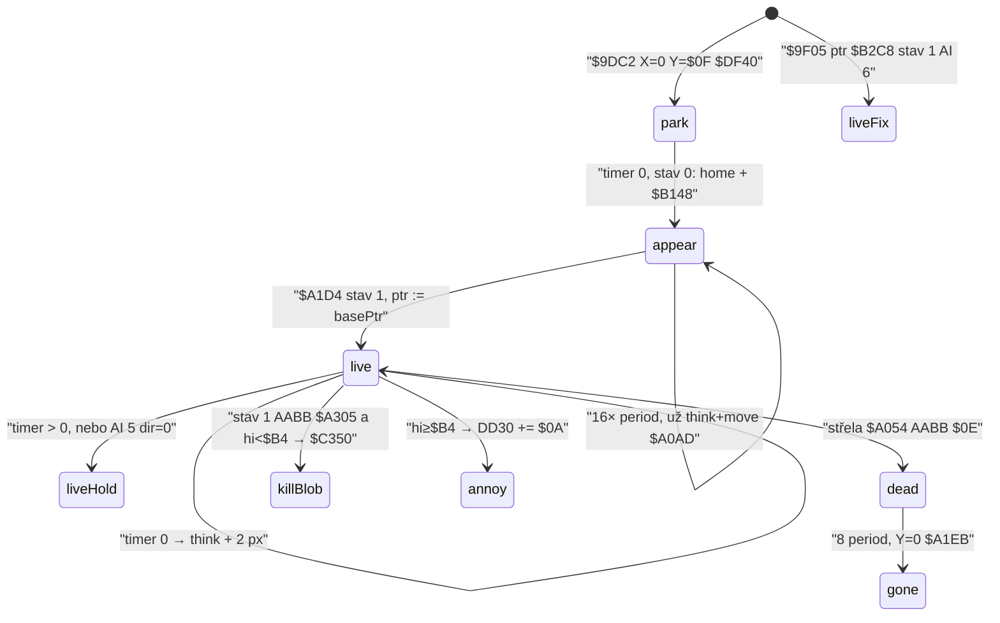

# Smrtící vetřelci (`badalien*` / hi grafiky `< $B4`)

Rozbor klasifikace `$A327`, pohybu `$A01B` a kontaktu `$A305` → `$C350`. Smyčka je 50 Hz (`HALT` `$D9C8` / `$A5DC`). Souřadnice: `$DD1D` X zleva, `$DD1E` Y **odspodu**; playY = `143 − gameY`. `$DF70` XOR-kreslí 6 GRAFIX slotů od `$DD18`; pohyb chodí sloty `$9C43`…1 (`$A026`).

**Není to** smrt BLOBa `$C35E` (vnitřní `HALT`, životy `$D2CC`) ani terénní zabíjení `$C544`. Tady: jak se smrtící sada pozná, jak se hýbe (přesun + prodleva), zeď, a co přesně volá `$C350`.

Pozorování z emulátoru: smrtící **nepřelétají místnost plynule**. Krátký 2px krok střídá stání. Část té prodlevy mají **všichni** vetřelci (`IX+$13`/`+$14`). Extra dlouhé stání je AI 5 (`badalien2`) a delší perioda u `$9F05`.

## Odvodené konstanty

| veličina | hodnota | adresa |
|---|---|---|
| GRAFIX základ | `$B208` + n×`$C0` | `$9DF9 LD DE,$B208` |
| `badalien1` | `$B2C8` (n=1, hi `$B2`) | `#GRAFIX` / `$9F27` |
| `badalien2` | `$B388` (n=2, hi `$B3`) | `#GRAFIX` |
| `alien1` (první obtěžující) | `$B448` (n=3, hi `$B4`) | `#GRAFIX` |
| práh smrtící / obtěžující | hi bajt **živého** ptr `< $B4` / `≥ $B4` | `$A327 CP $B4` |
| smrtící následek | `POP HL / JP $C350` | `$A341` |
| A do `$C350` | `$01` (lo ≠ `$C8`) / `$11` (lo = `$C8`) | `$A338`–`$A33F` |
| obtěžující následek | `$DD30 += $0A` | `$A345` |
| hitbox vs Blob | \|dx\| < `$0E`, \|dy\| < `$0B` | `$A316` / `$A321` |
| kontakt jen stav 1 | `CP $01 / CALL Z,$A305` | `$A08C` |
| podkroky za `$A01B` | 4 | `$A043 LD A,$04` |
| krok px | 2 (default) | `$9E90` / `$A2A5` |
| perioda náhodného spawnu | 4…8 | `$9E30 SUB $05` / `$9E34 ADD A,$09` |
| AI `kind==2` | `IX+$19 := $05` | `$9E66 CP $02` / `$9E6B` |
| pevný spawn `$80` | ptr `$B2C8`, stav 1, AI 6, dir 1 | `$9F27` / `$9F3F` / `$9F42` |
| hrany | X `<3` / `≥$EE`, Y `<$12` / `≥$8D` | `$A0E4`–`$A15D` |
| terén | `$D2F0` / `$D2F4`, `attr < $40` | `$A0FD` / `$A16F` |
| AI 6 bez svislé sondy | `CP $06 / JR Z,$A182` | `$A168` |
| park před objevením | X=0 Y=`$0F` ptr `$DF40` | `$9E83` |
| objevení | 16 period-ticků `$B148` | `$A1B2` / `$A1CF CP $10` |
| pad mimo AI | `$9C43 := 3` | `$9F72` |

---

## Stavový stroj jednoho slotu



Hlavní smyčka (`$A523`): `$D9C8` (kreslení) → `$C5BD` (Blob) → energie `$A530` → `$A01B` vetřelci → zpět.

---

## 1. Jak se pozná smrtící vs obtěžující

**Jen živý pointer, ne AI a ne samostatný flag.**

`$A305` po zásahu AABB:

```
$A324 LD A,(IX+$08)    ; hi bajt živého ptr (IX+$07/+08)
$A327 CP $B4
$A329 JR NC,$A345      ; ≥ $B4 → obtěžující
; < $B4 → smrt
$A338 LD A,L           ; lo bajt ptr
$A339 CP $C8
$A33B LD A,$01
$A33D JR NZ,$A341
$A33F LD A,$11         ; lo == $C8 (sada $B2C8)
$A341 POP HL
$A342 JP $C350
```

| sada | ptr | hi | lo | kontakt | A před `$C350` |
|---|---|---|---|---|---|
| `badalien1` / `$9F05` | `$B2C8` | `$B2` | `$C8` | smrt | `$11` |
| `badalien2` | `$B388` | `$B3` | `$88` | smrt | `$01` |
| `corepieces2` | `$B208` | `$B2` | `$08` | smrt (kdyby žil) | `$01` |
| `alien1`… | `$B448`+ | `≥$B4` | — | `$DD30 += $0A` | — |
| appear `$B148` | `$B148` | `$B1` | `$48` | **ne** (stav 0) | — |
| pad `$AFC8` | `$AFC8` | `$AF` | `$C8` | **ne** (`$9C43=3`) | — |

`ENEMY_SETS` v `constants.ts` sedí s `$B208 + n×$C0`. Index 1–2 jsou smrtící sady, 3+ obtěžující. Lethální je **hi živého ptr**, ne jméno sady v `basePtr`: `$9F05` nechá `basePtr` z náhodného spawnu (`alien9` atd.) a přepíše jen `$DD3F`/`+$08` na `$B2C8`.

AI **neurčuje** smrt. `kind==2` sice nutí AI 5 (`$9E66`), ale `$9F05` kreslí totéž `$B2C8` s AI 6. Sonda 512 místností: každý `badalien2` (base `$B388`) měl `IX+$19 = 5`; každý živý `$B2C8` z `$9620` měl AI 6.

`$C350` je `JR $C35E`. A se tam hned spotřebuje (`$C363 CP $10` → `$D2C4 += 1` když A `≥ $10`; `$C368 AND $07` → `$C4A9`). `$11` tedy nastaví `$D2C4 = 1`, `$01` ne. Průběh `$C35E` (životy, `HALT`) sem nepatří.

---

## 2. Spawn

### Náhodný `$9C47` → `$9DC2`

Čtyři sloty `$DD38`…`$DD98` (`$9FEF` `B=4..1`, `RRCA×3` na `$DD18`). Jádro `$C7` jde jinam (`$9C57`).

Typ C:

- `$9DBA ∧ $1F = 0` → C = `$9DBE ∧ $1F` (`$9DDA`)
- jinak C z `$DAC1`: `SUB $0F` do carry, `ADD A,$11` (`$9DE6`) — stejný Z80 trik jako perioda, výsledek typicky 2…16

Ptr = `C × $C0 + $B208` (`$9DF3` / `$9DF9`). C=2 → `$B388` `badalien2`.

AI (`$9E58`): nibble `$9DC1`, `SUB $05` do carry, `ADD A,$05` → 0…4. Pak **`$9E66 LD A,C / CP $02 / LD (IX+$19),$05`**. Engine `if (kind === 2) e.ai = 5` tohle má.

Perioda (`$9E27`): nibble `$9DC0`, `SUB $05` **včetně neúspěšného** odečtu, `ADD A,$09` → `(nibble % 5) + 4` = **4…8**. Timer start = celý `$9DBF` (`$9E21`), často desítky až stovky ticků v parku.

Rychlost 2,2 (`$9E90`). Dir rotace `$55` (`$9E73`). Park `$9E83`. Home z `$DAC6` + prázdné 2×2 (`attr ∧ $60 == $40`, `$9EE2`). Po `RRCA` `$DAC0`: sudé → X `SUB $17 ADD $1B`≪3, Y=`$11` nebo `$8D` (`$DAC1` bit 0); liché → Y `(SUB $09 ADD $0F)`≪3−1, X=`$02`/`$EE` (`$DAC1` RLCA). Mimo play-area se 2×2 nebere jako `$47`.

V 512 místnostech po `$A80A+$9C47` se **náhodný** `basePtr = $B2C8` (kind 1) ani `$B208` (kind 0) neobjevil. Smrtící náhoda je skoro vždy kind 2.

### Pevný `$9F05` (nibble `$80` v `$9740`)

`$A991 CP $80` zapíše sloupec/řádek do seznamu `$9620` (počet v `[HL]`). Po náhodném spawnu `$9F05`:

| zápis | hodnota | adresa |
|---|---|---|
| XY | `col≪3`, `($18−row)≪3 − 1` | `$9F18` / `$9F1C` |
| živý ptr | `$B2C8` | `$9F27` / `$9F2B` |
| dir | 1 (vpravo) | `$9F31` |
| perioda | `OR $08` (8…15) | `$9F37` |
| timer, stav | 1, 1 (už live) | `$9F3C` / `$9F3F` |
| AI | 6 | `$9F42` |

Přepisuje sloty od počtu dolů (B=count…1). `basePtr` z `$9DC2` zůstane. Místnost `$FD` (253): `$9620=2`, slot 1–2 už `(168,39)` / `(104,39)`, ptr `$B2C8`, stav 1, AI 6, perioda 15, timer 1.

---

## 3. Pohybový vzorec (emu, ne jen skool)

Každý `$A01B`: jedno `$DAC6`, pak sloty `$9C43`…1, každý **4 podkroky** (`$A043`). Podkrok:

1. střela `$A054` (ne když stav 2, ne když stav∨stTimer = 0)
2. stav 1 → `$A305`
3. `DEC (IX+$14)`; nenula → konec podkroku (`$A094`)
4. timer := perioda; appear / die / **think** / krok 2 px

Mezi expiracemi timeru se XY **nemění**. To mají smrtící i obtěžující.

### 3.1 `badalien2` AI 5, místnost `$34` (52), slot 1

Spawn: base `$B388`, AI 5, perioda 4, timer 2, home `(32,141)`. Park 17 ticků (16× appear `$B148` už s think+move `$A1D1 JP NZ,$A0AD` — od home uhnuli). Pak stav 1, ptr `$B388`.

Blob zůstal na `(36,39)`. Snímky **před** `$A01B` téhož ticku:

| t | xy | Δ | dir | timer | aic | poznámka |
|---|---|---|---|---|---|---|
| 17 | 34,115 | 0 | `$08` | 2 | 7 | live, nahoru |
| 18 | 34,117 | +0,+2 | `$08` | 2 | 6 | 2 px / tick (perioda 4 = 1 exp/tick) |
| 19 | 34,119 | +0,+2 | `$08` | 2 | 5 | |
| 20 | 34,121 | +0,+2 | `$08` | 2 | 4 | |
| 21 | 34,123 | +0,+2 | `$08` | 2 | 3 | |
| 22 | 34,125 | +0,+2 | `$08` | 2 | 2 | |
| 23 | 34,127 | +0,+2 | `$08` | 2 | 1 | poslední krok burstu |
| 24 | 34,127 | 0 | `$00` | 2 | 8 | AI 5: `LD (IX+$0D),$00` `$A285` |
| 32 | 34,127 | 0 | `$00` | 2 | 8 | další think, zase carry → stání |
| 40 | 34,127 | 0 | `$00` | 2 | 8 | totéž |
| 48 | 34,127 | 0 | `$00` | 2 | 8 | totéž |
| 56 | 36,127 | +2,+0 | `$01` | 2 | 8 | think bez carry, náhodný dir `$A2B9` |
| 63 | 50,127 | +2,+0 | `$01` | 2 | 1 | 8 ticků vpravo |
| 64 | 48,125 | −2,−2 | `$06` | 2 | 8 | nový think, AI **zůstalo 5** |

**Čísla:** perioda 4, 4 podkroky → 1 pohyb / tick = **2 px / tick** v burstu. Think každých `aiPeriod` (8) expirací = 8 ticků. `$A285` nejdřív dir=0; `$A28C RRCA / JP C,$A0DE` v tomto běhu 4× za sebou stání (32 ticků), pak 8 ticků jízdy. ROM **nepřepisuje** `IX+$19` (pořád 5).

### 3.2 Obtěžující AI 1, místnost 0, slot 1

`alienb` `$BBC8`, AI 1, perioda 7, hi `$BB ≥ $B4`. Live od t=41, xy `(206,35)`:

| t | xy | Δ | dir | timer | aic |
|---|---|---|---|---|---|
| 41 | 206,35 | 0 | `$02` | 5 | 1 |
| 42 | 206,35 | 0 | `$02` | 1 | 1 |
| 43 | 206,33 | +0,−2 | `$04` | 4 | 2 |
| 44 | 206,31 | +0,−2 | `$04` | 7 | 1 |
| 45 | 206,31 | 0 | `$04` | 3 | 1 |
| 46 | 206,33 | +0,+2 | `$08` | 6 | 2 |
| 48 | 206,35 | +0,+2 | `$08` | 5 | 1 |
| 50 | 208,35 | +2,+0 | `$01` | 4 | 2 |
| 51 | 206,35 | −2,+0 | `$02` | 7 | 1 |

Perioda 7 / 4 podkroky → pohyb cca každé 1–2 ticky, vždy 2 px, **dir nikdy 0**. AI 1 losuje z `$A2B9` (`$A216`) každé `aiPeriod=2`. Staccato je jen timer, ne AI 5.

Stejná metodika, místnost 4 slot 1 (`aliena` AI 1, perioda 8): přesně **MOVE 2 px / HOLD / MOVE / HOLD**. Perioda 8 = 2 ticky na jeden krok. Vedle v téže místnosti slot 4 `badalien2` AI 5 čeká na timer 116 v parku — po live by přidal dir=0 pauzy navíc.

### 3.3 `$9F05` `$B2C8` AI 6, místnost `$FD` (253), slot 1

Už live, perioda 15, timer 1, dir `$01`, Y drží 39:

| t | xy | Δ | dir | timer | aic |
|---|---|---|---|---|---|
| 0 | 168,39 | 0 | `$01` | 1 | 8 |
| 1 | 170,39 | +2,+0 | `$01` | 12 | 7 |
| 2–3 | 170,39 | 0 | `$01` | 8…4 | 7 |
| 4 | 172,39 | +2,+0 | `$01` | 15 | 6 |
| 8 | 174,39 | +2,+0 | `$01` | 14 | 5 |
| 12 | 176,39 | +2,+0 | `$01` | 13 | 4 |
| 16 | 174,39 | −2,+0 | `$02` | 12 | 3 |
| 19 | 172,39 | −2,+0 | `$02` | 15 | 2 |
| 23 | 170,39 | −2,+0 | `$02` | 14 | 1 |

Perioda 15 → 2 px jednou za 3–4 ticky, jen vodorovně. Na X=176 odraz (viz terén).

### Shrnutí čísel

| co | smrtící náhoda (AI 5) | obtěžující (AI 0–4) | `$9F05` (AI 6) |
|---|---|---|---|
| inner steps | 4 / `$A01B` | totéž | totéž |
| px / expirace | 2 | 2 | 2 |
| perioda | 4…8 | 4…8 | `OR $08` → 8…15 |
| staccato timeru | ano | **ano, stejné** | ano, delší HOLD |
| extra prodleva | dir=0 na `aiPeriod` ticků | ne | ne (dir 1/2) |
| svisle | ano (dokud dir má bit 2/3) | ano | **ne** (`$A168` + wipe `$A296`) |

---

## 4. Směr: bounce / RNG / chase

Tabulka AI `$A0B8` (`IX+$19`):

| AI | vstup | chování | adresa |
|---|---|---|---|
| 0 | bounce | doplní vlevo a nahoru, když chybí | `$A1FC` |
| 1 | RNG 4 směry | `$A2AE ∧ 3`, index ×2 do `$A2B9` | `$A216` |
| 2 | RNG 8 | `$A2C1 ∧ 7` | `$A22D` |
| 3 | RNG rychlost 1/2 | `$A236`; 1 px na jedné ose | `$A256` |
| 4 | chase Blob | bit 0/1 z X, bit 2/3 z Y vs `$DD1D` | `$A263` |
| 5 | mix | dir=0; carry → stání; A `< $46` chase jinak AI 3 **jednou** | `$A285` |
| 6 | vodorovně | `AND $03`, jinak 1; svislou sondu přeskočí | `$A296` / `$A168` |

`$A2B9` bajty instrukcí: `$08,$09,$01,$05,$04,$06,$02,$0A` (engine `DIR_TABLE`). Index 3/4 je `$05/$04`, ne `$04/$05` — ověřeno room 52 frame 14 (`$A2C1` index 4 → `$04` dolů).

AI 5 **nesleduje** BloBa v každém kroku. Chase je jen jedna větev thinku. V místnosti 52 po čtyřech stáních přišel dir `$01` (prvek tabulky), ne chase `$09` (Blob byl na `(36,39)`, enemy `(34,127)` by chase dal vpravo+nahoru). `IX+$19` zůstalo 5 — `$A236` se volá `JR`, AI se nepřepíše.

AI 6 `$A2A2 JP C,$A0DE`: `AND $03` carry maže, skok se **nevezme**, spadne do `$A2A5 RET`. To je `RET` z `CALL $A01B` — zbylé podkroky a **nižší** sloty v tom ticku odpadnou. Sonda místnost 253, t=26, IX=`$DD58` (slot 2): slot 3 už krok udělal, slot 1 timer 2→2 (nešel).

---

## 5. Kolize s terénem

Stejné sondy jako chůze: `$D2F0` vodorovně (`$A0FD`), `$D2F4` svisle (`$A16F`). `AND $03` / `AND $0C`, při zásahu `XOR $03` / `XOR $0C` do dir. Zeď = `attr < $40` (`CP $40` uvnitř sond). Hrany `$A0E4` / `$A14F`. AI 6 svislou sondu **nemá**.

Místnost 253, Y=39, sprite top řada 19 (`($BF−Y)≫3`). `$D2F0` při `X ∧ 7 = 0` čte sloupec `X≫3 − 1` a `+2`:

| X | col+2 attr | výsledek |
|---|---|---|
| 168 | sl. 23 = `$47` | průchod, +2 |
| 176 | sl. 24 = `$02` (`< $40`) | bounce, dir `$01`→`$02` |

Neproletěli. `$02` je zeď, `$47` vzduch. Po odrazu X klesá 176→170.

`$64` po vodorovném kroku, jen když `(X ∨ (Y+1)) ∧ 7 = 0` (`$A12C`): přesné `CP $64` na 2×2, skok na `$A199` (přeskočí svislý podkrok). Není specifické pro smrtící.

---

## 6. Kontakt s postavou

Řád `$A08C`: jen **stav 1**. Appear (stav 0, i se `st>0` a ptr `$B148`) `$A305` nevolá. Sonda místnost 52 i 0: overlap ve stavu 0/st=1, ptr `$B148` → `$C350` ne, `$DD30` beze změny.

AABB proti `$DD1D`/`$DD1E` (sedadlo, ne pad): `|dx| < $0E`, `|dy| < $0B`. Měření se **zmrznutým** dir=0 a timerem `$FF` (ať se v tom `$A01B` neposunou):

| Δ | smrt `$B388` | smrt `$B2C8` | obtěž `$BBC8` |
|---|---|---|---|
| 0,0 | `$C350` A=`$01` | `$C350` A=`$11` | ne, `$DD30` +`$28` |
| dx=13 | smrt | smrt | +`$28` |
| dx=14 | ne | ne | `$DD30` beze změny |
| dy=10 | smrt | smrt | +`$28` |
| dy=11 | ne | ne | beze změny |

`+$28` = 4 podkroky × `$0A` (`$A349`). Bez i-frames: `$A305` každý podkrok, dokud stav 1. Smrtící skočí pryč (`POP` + `JP`), takže v jednom `$A01B` jednou; s `RET` místo `$C350` by `$A327` padlo 4× (hi `$B3` / `$B2` / `$BB`).

Energie `$D2CD` se v `$A305` **nečte**. Overlap s `$01` / `$17` / `$7F` pořád `$C350` se stejným A. Okamžitá smrt, ne −N.

Bez zmrazení dir: enemy se v tomtéž ticku posune a AABB „mimo“ (dy=11 u AI 5 nahoru) se po +2 stane zásahem. Prahy výše platí na **aktuální** XY v daném podkroku.

---

## 7. Platí na padu?

Ano na kontakt, ne na slot 4.

`$A305` bere Blob XY, ne pad. Místnost 28 (`$9C43=3`, slot 4 `$AFC8` stanice `(104,79)`): po live slot 1 `badalien2` `(36,65)`, `$DD22=2`, Blob na enemy → `$C350` A=`$01`.

`$A01B` s `$9C43=3` slot 4 nechodí. Místnost `$0F`: osm ticků slot 4 `(72,79)` stav 0, XY stejné. Pad s hi `$AF < $B4` by jinak zabíjel; `$9F72` to zakáže. (Už `hoverpad.md` §7.)

---

## 8. Co smrtící **není**

| věc | vztah | adresa |
|---|---|---|
| AI číslo | kind 2 → 5, `$9F05` → 6; lethální je ptr | `$9E66` / `$A327` |
| úbytek energie | to je `$DD30` / `$CB58` | `$A345` |
| i-frames | žádné | `$A091` každý podkrok |
| průlet zdí | ne, `$D2F0`/`$D2F4` | `$A0FD` |
| slot 4 na padu | mimo `$A01B` | `$9F72` |
| `$C35E` animace | jiný agent | `$C350 JR $C35E` |

---

## (a) Konstanty pro pozdější `constants.ts`

Část už je (`KILL_GRAPHIC_HI`, `HIT_DX`/`HIT_DY`, `NASTY_INNER_STEPS`, `NASTY_SPEED`, `ANNOY_DRAIN_BUMP`, `ENEMY_SETS`, `DIR_TABLE`, `APPEAR_*`). Doplnit / opravit:

```
BADALIEN1_PTR       = 0xB2C8   // $9F27 / n=1
BADALIEN2_PTR       = 0xB388   // n=2
ALIEN1_PTR          = 0xB448   // první hi ≥ $B4
KIND_BADALIEN2      = 2        // $9E67 CP $02
AI_FORCED_KIND2     = 5        // $9E6B
FIXED_NASTY_PTR     = 0xB2C8   // $9F27
FIXED_NASTY_AI      = 6        // $9F42
FIXED_NASTY_DIR     = 1        // $9F31
ATTR_NASTY_HI       = 0x80     // $A991 → $9620
C350_A_DEFAULT      = 0x01     // $A33B lo ≠ $C8
C350_A_B2C8         = 0x11     // $A33F lo == $C8
NASTY_PERIOD_MIN    = 4        // $9E30/$9E34 (ne 9 — extra SUB)
NASTY_PERIOD_MAX    = 8
```

`spawnOne` v `entities.ts`: `modBias(..., 5, 9)` na periodu dává 9…13. Z80 neúspěšný `SUB $05` pořád odečte, `ADD $09` → 4…8. AI nibble stejně `(n % 5)` ne `+5`. Testy `test_enemies.py` berou init z emu (`--enemy-init`), spawnovou odchylku nechytí.

---

## (b) Nevyřešené

1. **`$C35E` po A=`$01` vs `$11`.** `$11` zvedne `$D2C4` (`$C363`). Vliv na palubu / reload je u agenta smrti, ne tady.
2. **Kind 0/1 náhodou.** V 512 místnostech 0 výskytů; větev `$9DBA ∧ $1F = 0` existuje. `corepieces2` jako live by bylo smrtící (hi `$B2`).
3. **Statistika AI 5** (jak často carry / chase / AI 3). Místnost 52: 4× stání, pak tabulkový směr, ne chase. Závisí na `$DAC0` rotovaném slote.
4. **AI 6 `JP C,$A0DE`.** Vypadá jako chyba v ROM (carry po `AND` je 0). Engine by `RET` z `$A01B` neměl napodobovat naslepo — je to pozorované chování, ne nutně záměr.
5. **Animace 4 GRAFIX snímků** u vetřelce. `$A01B` pointer sady neposouvá (stejné jako MOVEMENT.md).

---

## (c) Poznámky pro TS engine (bez kódu)

`entities.ts` AI 0–6 a period/timer **už umí** staccato 2 px / expirace a AI 5 dir=0. Chybí / nesedí:

- **`$9F05`:** nibble `$80` → živý `$B2C8`, stav 1, AI 6, `period |= 8`. Bez toho místnosti jako `$FD` nemají smrtící grafiku.
- **AI 5 `e.ai = 3`:** ROM AI 3 jen spustí, `IX+$19` nechá 5. Permanentní přepnutí je spor.
- **AI 5 `CP $46`:** ROM bere A po `$A2AE` + `RRCA`, ne surový `dac0`.
- **AI 6 fall-through `$A2A5 RET`:** abort zbytku `$A01B` (nižší sloty). Engine všechny 4 inner × N slotů doběhne.
- **Kontakt:** `world.energy = 0` není `$C350` (A, `$D2C4`, animace). AABB a `hi < $B4` sedí; i-frames správně nejsou.
- **Perioda spawnu 4…8** vs `modBias(..., 9)`.

Soubory později: `constants.ts` (ptr/kind/`$80`), `entities.ts` (`spawnOne` SUB-do-carry, `$9F05`, AI 5 bez zápisu `ai=3`, contact). `tests/test_enemies.py` už porovnává `$9C47+$A01B` v 0 a 1; přidat místnost 52 (AI 5) a `$FD` (`$B2C8`). Nesahat na `$C35E` ani `$C544`.

Pořadí ticku u `$A523`: Blob dřív než `$A01B`. Kontakt trefí sedadlo i na palubě. Slot 4 s `$9C43=3` není nasty.
