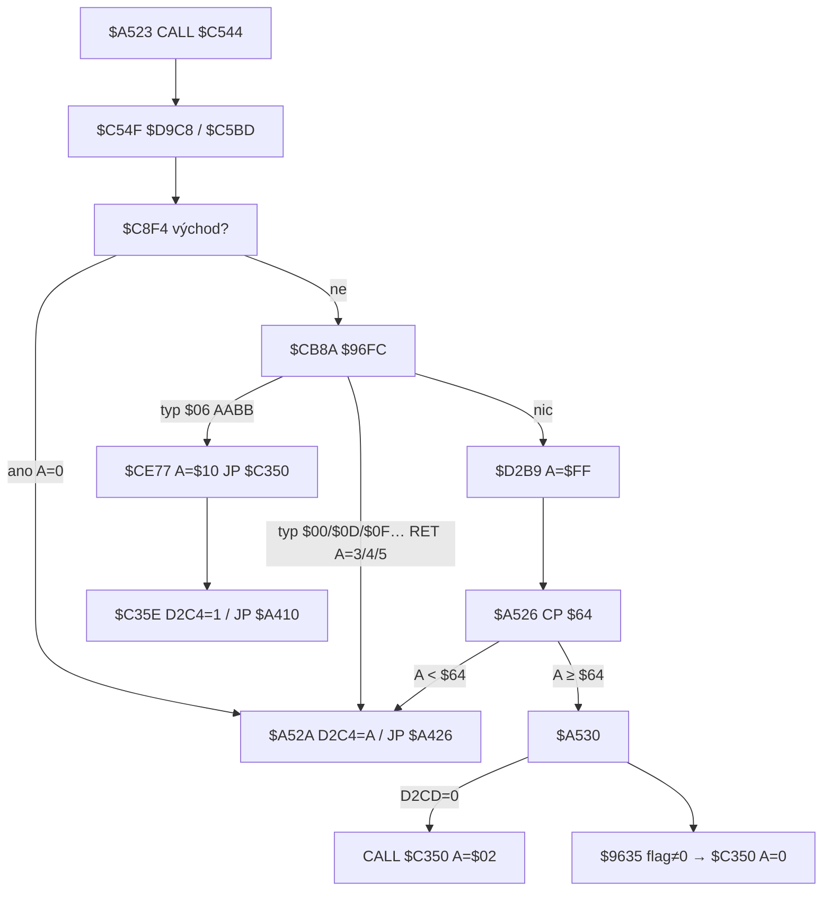

# Smrtící terén (jedovaté rostliny, objekt `$06`)

Útvar v mapě, který zabije BloBa **okamžitě**, bez ohledu na energii `$D2CD`. Není to zeď, není to atribut `$64` (zelené zdvižné pole) a **není to návratová hodnota `$C544`**.

Je to **obojí**: dlaždice s high nibble `$60` v `$9740` **a** záznam typu `$06` v seznamu `$96FC`. Dotyk je AABB walku `$CB8A` (`|ΔX| < $0F`, `|ΔY| < $0F`). Handler `$CE77` dá `A=$10` a `JP $C350`. `$A530` (nula energie) se na této cestě nevolá.

Ověřeno disassemblací `$A90F` / `$CB8A` / `$CE77` / `$A523` a headless krokem v místnostech 49, 50 a 82 (snapshot `reference/src/starquake.z80`). Smyčka 50 Hz. Souřadnice jako v [`MOVEMENT.md`](../MOVEMENT.md): `$DD1D` = X, `$DD1E` = Y odspodu, kreslení `$BF − Y`.

**Práh `$A526 CP $64` a atribut zeleného pole `$C71C CP $64` jsou dvě různá `$64`.** Stejné číslo, jiný význam — viz § 4.

## Odvodené konstanty

| veličina | hodnota | adresa |
|---|---|---|
| high nibble `$9740` | `$60` | `$A963 CP $60` / `$A9F6` |
| typ objektu `$96FC` | `$06` | `$AA1B`, `$CE77 CP $06` |
| podbloky | `$1B` (27), `$2E` (46), `$52` (82) | `$9740+$1B/$2E/$52` |
| raw | `$62`, `$65`, `$65` | col+2 / col+1 row+1 |
| detekce | AABB `\|ΔX\| < $0F` a `\|ΔY\| < $0F` | `$CB9E`–`$CBB6`, `$CBBB` / `$CBCE` |
| vstup | automatický (žádný bit `$DD23`) | `$CBDC` → `$CC5A` |
| `$C350` vstupní A | `$10` | `$CE7D LD A,$10` |
| `$D2C4` po smrti terénem | `1` (`A ≥ $10` → `INC`) | `$C363`–`$C367` |
| `$C350` při nule energie | `A=$02`, `$D2C4=0` | `$A535` / `$C361` |
| práh návratu `$C544` | `CP $64` unsigned (`JR NC` = běžný tick) | `$A526` |
| běžný tick `$C544` | `A=$FF` | `$D2B9 XOR A` / `$D2BC DEC A` |
| overlay `solid` vs chůze | hotspot má bit 6, ale `$D2F0` ho **nebere jako zeď** (`attr ≥ $40`) | `$D280` vs `$D2F0 CP $40` |

---

## 1. Reprezentace v místnosti

Smrtící terén **není** záznam `$94E8` a **není** sprite z `$9088`. Extra `$AA30` dává typ `$01` (`$AB39`), sběratelné `$14+index` (`$AB80`). Typ `$06` vzniká jen z dlaždice.

### Dlaždice

`$A80A` kreslí 12 bloků (`$A8D3`). U každého podbloku `$A90F` čte raw atribut `$9740+id`:

```
$A91E AND $F0
$A922 CP $50 / JP C,$A9E5     ; masky $10–$40
$A927 … low nibble posune C,B
$A963 CP $60 / JP Z,$A9F6     ; ← toto
$A968 CP $70 … $B0            ; jiné tabulky
$A9E3 JR $A9F6                ; $C0/$D0/$E0/$F0 stejně
```

`$A9F6` vezme `raw ≫ 4` = **`$06`** a volá `$AA02`. Low nibble posune hotspot uvnitř podbloku (`$A92A AND $03` sloupec, `$A92F AND $0C` řádek). Do atributové mapy se **`$62` / `$65` nezapisuje** — je to jen značka typu, stejně jako `$D4` u teleportu.

Tři podbloky v celé tabulce `$9740`:

| podblok | raw | hotspot | grafika | inkoustové buňky |
|---|---|---|---|---|
| `$1B` (27) | `$62` | col +2, row +0 | 4×3, `row_attrs` `$40` | pravé dva sloupce (stěnová rostlina) |
| `$2E` (46) | `$65` | col +1, row +1 | 3×3 | 2×2 v `(1,1)…(2,2)` |
| `$52` (82) | `$65` | col +1, row +1 | 3×3 | totéž 2×2 |

Nakreslený atribut je výsledek `$EAD3` z UDG `$40` (paper 2). `($40 ∧ $3F) = 0` → inkoust z `$EA62`: v praxi `$42` / `$44` / `$45` / `$47`. Nikdy `$64` a nikdy raw `$62`.

`$AA02` zapíše do seznamu za pointer `$96FA` (start `$A834 LD HL,$96FC`):

| pole | vzorec | adresa |
|---|---|---|
| X | `sloupec × 8` | `$AA0D RLCA×3` |
| Y | `(24 − řádek) × 8 − 1` | `$AA05 SUB B` / `$AA0B DEC A` |
| typ | A = `$06` | `$AA1B` |

`$AA20 CP $0C` ukládá jen vznášedlo do `$D2CA`. Rostlina samostatný slot nemá.

Bloků s těmito podbloky je 12 (`$9840`):

| blok | podbloky (BR, BL, TR, TL) | který `$06` |
|---|---|---|
| `$2F` (47) | `9, 27, 10, 20` | `$1B` |
| `$30` (48) | `20, 46, 20, 20` | `$2E` |
| `$6C` (108) | `13, 17, 46, 46` | `$2E` ×2 |
| `$AA` (170) | `46, 46, 20, 20` | `$2E` ×2 |
| `$D8`…`$FF` | různé s 82 | `$52` |

71 místností, 141 hotspotů (statický walk `$A8D3`/`$A90F` i live `$A80A`: seznam `$96FC` nese typ `$06` na týchž XY). Jádro `$C7` **žádný** `$60` podblok nemá.

### Objekt `$96FC`

Walk `$CB8A` (`B=$16` trojic). Typ `$06` je v `$01`–`$0B` → **AABB**, ne přesná shoda.

| typy | test | adresa |
|---|---|---|
| `$01`–`$0B`, `$0E`, `≥$14` | `\|ΔX\| < $0F` a `\|ΔY\| < $0F` | `$CBBB CP $0F` / `$CBCE` |
| `$00`, `$0C`, `$0D`, `$0F`–`$13` | X == objekt.X a Y == objekt.Y | `$CBAA` |

`$06` tedy **není** exact XY teleportu / padu. Stačí přiblížit se k hotspotu o méně než 15 px na obou osách. Klávesa se nečte.

---

## 2. Dotyk: jak hra pozná, že Blob trefil rostlinu

Každý tick bez východu `$C8F4` spadne do `$CB58` → `$CB8A`. Pořadí v `$C5BD`: chůze / zdviž `$C761` / pad `$C967` → palba → `$C8F4` → objekty. Nástup na rostlinu je **až po** pohybu téhož ticku.

Po AABB:

```
$CBDC LD A,D          ; typ
$CBDD CP $00
$CBDF JP NZ,$CC5A
$CC5A CP $01
$CC5C JP NZ,$CE77
$CE77 CP $06
$CE79 JR NZ,$CE82
$CE7B POP HL
$CE7C POP HL          ; sundá $CB8F / $CB95
$CE7D LD A,$10
$CE7F JP $C350        ; ne RET do $A523
```

Dva `POP` sundají rámec walku. `RET` z `$C350` se nevrací do `$C544` — `$C35E` končí `JP $A410` (`$C472`) = reload `$A426`.

Headless, místnost 49, hotspot `$D0,$47`, energie `$40`:

| Blob XY | výsledek | adresa zastavení |
|---|---|---|
| exact `$D0,$47` | `$CC5A` A=`$06` → `$CE77` → `$C350` A=`$10` | `$CE77` / `$C350` |
| `ΔX = 14` / `ΔY = 14` | zásah | `$CC5A` |
| `ΔX = 15` / `ΔY = 15` | mimo, `$D2B9` | `$D2B9` |
| energie 0 / `$7F` | stejný zásah, `$D2CD` se nemění | `$CE77` |
| `$DD22 = 1` (zdviž) | zásah | `$CE77` |
| `$DD22 = 2` (pad) | zásah (AABB sedadla, ne pad Y−8) | `$CC5A` |
| chůze z `X = hotspot−15` | po +2 px (`$C645`) `ΔX = 13` → `$CE77` | `$C5BD` → `$CB8A` |

Žádná sonda atributu, žádný inkoustový pixel GRAFIX, žádné `$D2F0`. Je to **AABB hotspotu**, ne 24×16 box BloBa a ne bitmapa rostliny.

---

## 3. `$C544` a práh `$64` — co terén vrací a co ne

```
$A523 CALL $C544
$A526 CP $64
$A528 JR NC,$A530          ; A ≥ $64 → energie / $9635
$A52A LD ($D2C4),A         ; A < $64 → důvod reloadu
$A52D JP $A426
```

`$C544` je `JR $C54F` → `$D9C8` (kresba, vnitřní `HALT` `$A5DC`) → `JP $C5BD`. Návratové A je RET z `$C5BD`, ne z kresby.

| A z `$C544` | kdo nastaví | `$A526` | `$D2C4` | význam |
|---|---|---|---|---|
| `$00` | `$C94A` | `< $64` | 0 | východ z místnosti `$C8F4` |
| `$03` | `$CC55` | `< $64` | 3 | bezpečnostní dveře `$00` / neplatný teleport / Cheops |
| `$04` | `$CFFA` | `< $64` | 4 | platný teleport |
| `$05` | `$D136` | `< $64` | 5 | vodorovný přechod `$0F` |
| `$FF` | `$D2B9 XOR A / DEC A` | `≥ $64` | **beze změny** | běžný tick → `$A530` |
| *(nevrací se)* | `$CE7F JP $C350` s A=`$10` | — | zapisuje `$C35E` | **smrtící terén `$06`** |

Headless s `HALT` `$A5DC` = `RET`: miss v místnosti 49 vrací **A = `$FF`**, `$D2C4` sentinel nedotčený; zásah rostliny **`$C544` neopustí** (`PC=$CE77`, A=`$06`, energie 64).

`$64` v `$A526` je **práh mezi „reload“ a „pokračuj“**, ne ID dlaždice. Žádná větev `$C5BD` `$64` do A neklade. Atribut zeleného pole je **jiné** `$64` v `$C71D` (viz [`attr64.md`](attr64.md)).

`$A530` po běžném ticku:

```
$A530 LD A,($D2CD)
$A533 CP $00
$A535 LD A,$02
$A537 CALL Z,$C350     ; jen nula energie
$A53A LD HL,$9635      ; nibble $70, ne $06
```

Na hotspotu `$06` s energií `> 0` `$A530` **nezabije** (zastavení `$A576`). S energií 0 volá `$C350` s **A=`$02`** — to je smrt vyčerpáním, ne terén. Rostlina jde výhradně přes `$CB8A`.

---

## 4. `$D2C4` při terénu vs energii vs východu

`$C35E` (Kill Blob) na vstupu:

```
$C35E LD HL,$D2C4
$C361 LD (HL),$00
$C363 CP $10
$C365 JR C,$C368
$C367 INC (HL)          ; D2C4 := 1  právě když A ≥ $10
$C368 AND $07
$C36A LD ($C4A9),A
$C36D CP $02            ; A∧7 = 2 → animace energie ($C371)
```

| spoušť | A do `$C350` | `$D2C4` | `$C4A9` | animace `$C371` |
|---|---|---|---|---|
| terén `$06` | `$10` (`$CE7D`) | **1** | 0 | ne |
| nula energie | `$02` (`$A535`) | **0** | 2 | ano |
| východ `$C8F4` | `$00` z `$C544` | **0** přes `$A52A` | — | `$C350` se nevolá |
| puls `$70` (`$A56A`) | `0` (`XOR A`) | **0** | 0 | ne |

`$A4FA CP $01`: při `$D2C4 = 1` se obnoví XY z `$D2DC` a `$DD22` z `$D2C5` (checkpoint posledního `$A4B1`). Terén tedy po smrti vrací na vstup do místnosti; nula energie tento restore **nemá**. Průběh životů / respawnu je mimo rozsah (`$C35E` dál `$C462 DEC ($D2CC)`, `JP $A410`).

`$A52A` se při terénu **neprovádí** — `$C544` se nevrátí.

---

## 5. Energie, pad, zdviž

Energie **nerozhoduje**. `$CE77` `$D2CD` nečte. Headless: zásah při 0, `$17`, `$40`, `$7F` — vždy `A=$10`, energie beze změny.

Platí **na padu i ve zdviži**: `$CB8A` běží po `$C967` (`$CB36`) i po `$C761` (`$C85A` → `$C8F4`). AABB je Blobovo `$DD1D`/`$DD1E` (sedadlo), ne pad Y−8. Místnost 82: `$DD22=1`, energie `$7F` → `$CE77` A=`$06`.

`$C71C` (pole `$64`) rostlinu nespouští a naopak `$06` zdviž neresetuje.

---

## 6. Kolize chůze vs overlay `solid`

Hotspot v místnosti 49: attr `$42` (bit 6, paper 2).

| rutina | pravidlo | hotspot `$42`/`$44`/`$47` |
|---|---|---|
| `$D2F0` / `$D2F4` chůze | zeď když `attr < $40` | **není zeď** — Blob do AABB vejde |
| `$D280` overlay / export `solid` | bit 6 a ≠ `$64` | **solid = 1** |
| `$C7DF` stavba | bit 6, výjimka `$64` | stavba na buňce s bitem 6 končí |

To je tentýž rozpor jako v `MOVEMENT.md`: chůze ≠ overlay. Rostlina musí zůstat **průchozí** pro `$D2F0`, jinak AABB nespustí. Stem pod rostlinou (attr `$02`, bit 6 = 0) zeď **je**.

`$D2F0` na hotspotu 49 vrátil `A=1` (bit 0 = stěna origin+2 vpravo, `$03`/`$02` stěny), ne proto, že by `$42` byla zeď.

---

## 7. Příklady místností

| místnost | soubor | objekt `$06` | buňka (play col, row) | attr hotspotu | grafika |
|---|---|---|---|---|---|
| **49** (`$0031`) | `out/rooms/room_49.png` | X=`$D0` Y=`$47` | (26, 9) | `$42` | stěnová, podblok 27, blok 47 |
| **50** (`$0032`) | `out/rooms/room_50.png` | X=`$88` Y=`$6F` | (17, 4) | `$44` | 2×2, podblok 46, blok 48 |
| **82** (`$0052`) | `out/rooms/room_82.png` | X=`$D0` Y=`$47` | (26, 9) | `$47` (EA62) | totéž 27; v místnosti je i `$64` zdviž a `$0C` pad `(136, 39)` |

AMAHA 506 má `$06` v `$96FC` před `$0C` a `$0D` (viz [`teleports.md`](teleports.md)) — stejný typ, jiná místnost.

Vzhled: paper 2 (červená), inkoust z `$EA62`. `$1B` je červená rostlina na stěně; `$2E`/`$52` je 2×2 „hvězda“ / květ (v 50 zelený inkoust `$44`).

---

## 8. Co to **není**

| věc | proč ne terén `$06` | adresa |
|---|---|---|
| atribut `$64` / `$DD22=1` | zdviž, `$C71C`; práh `$A526` je náhoda stejného čísla | [`attr64.md`](attr64.md) |
| vetřelec `hi < $B4` | `$A342 JP $C350` s A=`$01`/`$11`, ne `$10` | `$A305` |
| nula energie | `$A537` A=`$02` | `$A530` |
| bezpečnostní dveře typ `$00` | exact XY + Left\|Right, A=`$03` reload | `$CBDC` / `$CC55` |
| nibble `$80` | dveře, podblok `$30` raw `$85` | `$A991` |
| nibble `$B0` / typ `$0B` | jádrové díly, inventář `$10` | `$CE82` |
| nibble `$E0` / typ `$0E` | stroj na plošinky | `$D09F CP $0E` |
| nibble `$F0` / typ `$0F` | vodorovný přechod, A=`$05` | `$D136` |
| jádro `$C7` | žádný podblok `$60`; `$AA30` RET | `$AA3B`, scan 512 |
| nibble `$70` / tabulka `$9635` | **není** `$96FC`; zabíjí jen když byte 5 ≠ 0, A=`$00` přes `$A56A` | § 9 |

---

## 9. Nibble `$70` — jiný hazard, ať se nesplete

`$A968 CP $70` **nevolá** `$AA02`. Zapisuje 8 B záznam do `$9635` (pointer `$9632`, start `$A822`): sloupec, řádek, perioda `($DAC0 ∧ $0C)+8`, flag 0. Podbloky `$07` raw `$71`, `$28` raw `$75`. 127 místností. V `$96FC` typ `$06` **není** (místnost 13: `$96FC` prázdný, `$9635 = $19,$0F,…,flag 0`).

`$A530` po energii: AABB proti `$9635` (`|ΔX| < $0E`, Y v `[comp−$16, comp]`, `comp = ($1A−row)<<3 − 2`). `XOR A / CP (HL) / CALL NZ,$C350` — zabije, až když je flag (byte 5) nenulový. Headless místnost 13, flag 0: `$A576`; flag 1, energie `$17` i `$7F`: `$C350` A=`$00`. `$CB8A` na týchž XY `$D2B9` (žádný objekt).

`$A66C` (z `$D9C8` přes `$A415`) flag periodicky XORuje a kreslí `$DB88`. To **není** statický terén `$06`. Engine `$06` z `$70` neskládat. Jiskra: [`pulse-spark.md`](pulse-spark.md).

---



---

## Nevyřešené

1. Pixel-přesný vzhled 2×2 vs AABB 15 px — engine stačí hotspot z `$AA02` + `$0F`. Bitmapa rostliny AABB neřeže.
2. `$70` perioda / které snímky `$DB88` jsou smrtící vizuálně. Pro `$06` není potřeba.
3. Plný `$C35E` (vnitřní `HALT` `$C453`, životy) — jiný rozbor. Tady jen A a `$D2C4`.
4. Overlay `solid=1` u hotspotu vs `$D2F0` průchozí: export **nemente**; chůze musí brát `$D2F0`.

## (a) Konstanty pro pozdější `constants.ts`

```
KILL_TYPE            = 0x06      // $96FC
KILL_ATTR_HI         = 0x60      // $9740
KILL_AABB            = 0x0F      // |dx|,|dy|  (stejné jako předměty $CBBB)
C350_KILL_TERRAIN    = 0x10      // $CE7D
C350_ENERGY          = 0x02      // $A535 — ne terén
C544_RELOAD_LT       = 0x64      // práh $A526, NE atribut zdviže
C544_TICK            = 0xFF      // $D2B9
C544_EXIT            = 0x00      // $C94A
C544_CODE_FAIL       = 0x03      // $CC55
C544_TELEPORT        = 0x04      // $CFFA
C544_HORIZ           = 0x05      // $D136
D2C4_KILL_RESTORE    = 0x01      // $C35E když A ≥ $10
ATTR_LIFT            = 0x64      // $C71C — jiné $64
```

Hotspot XY se **neukládá** do tabulky; počítá se z `$9740` + mřížky bloků jako u `$0C`/`$0D` (`rooms.json` + `blocks.json` + `block_attrs.json` raw).
