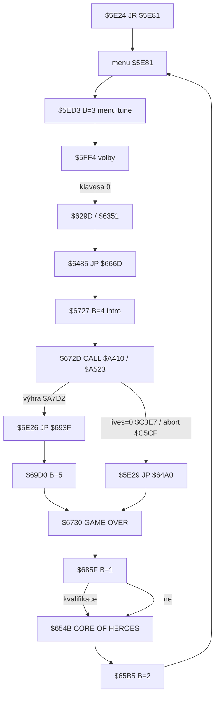

# Melodie `$6600` / `$D9DE`

Rozbor **theme tunes**: vstup `$6600` (identifikátor v `B`), tabulka pointerů od `$65F4`, přehrávač `$D9DE` (DI, port `$FE`, busy-wait). Disassembly `reference/src/starquake.skool` + bajty snapshotu; call sites i binární sken `CD 00 66`. Žádná implementace enginu.

**Není to** herní beeper `$D7C0` (SFX dveří / jádra / smrti / teleportu — jiná tabulka `$D839`, bez `DI`). **Není to** 50 Hz `HALT` v `$A5DC`. **Není to** MP3 smyčka (`music/game-loop.mp3`) — ta je rozšíření proti Spectru a s `$6600` se **nesmí míchat**.

Hlavní tvrzení: **pět** melodií, identifikátory `B=1..5`. Všech pět `CALL $6600` je title / menu / intro / GAME OVER / výherní end-screen. **Žádný** call z ticku `$A523`, reloadu `$A426`, smrti `$C35E`, dveří `$CBDC` ani teleportu `$CED1`. `$D9DE` je **plně blokující** (včetně `DI`).

---

## Odvodené konstanty

| veličina | hodnota | adresa |
|---|---|---|
| vstup přehrání | `CALL $6600`, id v **`B`** | `c$6600` |
| báze pointerů | `LD HL,$65F4` + 2× `INC HL` / `DJNZ` | `$6600`–`$6605` |
| tabulka 5 pointerů | `$65F6`…`$65FE` (5× `DEFW`) | `b$65F6` |
| id 1 | `$69DC`, tempo `$82`, 42 not, 44 B | `$65F6` / `b$69DC` |
| id 2 | `$6A08`, tempo `$46`, 42 not, 44 B | `$65F8` / `b$6A08` |
| id 3 | `$6A34`, tempo `$64`, 43 not, 45 B | `$65FA` / `b$6A34` |
| id 4 | `$6A61`, tempo `$46`, 35 not, 37 B | `$65FC` / `b$6A61` |
| id 5 | `$74FE`, tempo `$8C`, 47 not, 49 B | `$65FE` / `b$74FE` |
| čekání na uvolnění klávesy | `CALL $D5C8` dokud `A=0` | `$660A`–`$660F` |
| přehrávač | `JP $D9DE` (tail, ne `CALL`) | `$6612` |
| `DI` | první instrukce přehrávače | `$D9DE F3` |
| self-mod tempo | `LD ($DA03),HL` → `LD DE,(tune)` | `$D9DF` / `$DA01` |
| konec dat | bajt `$00` | `$D9E6 CP $00` → `$DA35` |
| index noty | `A ∧ $1F` → slovo v `$DA70` | `$D9EB` / `w$DA70` |
| periody | 31 slov `$015D`…`$0032` | `$DA70`…`$DAAD` |
| reproduktor | `OUT ($FE),A`, latch `$DA6F`, `ADD A,$10` / `AND $30` | `$DA1D`–`$DA26` |
| skip klávesou | `IN` od `$FEFE`, `RLC B` | `$DA19` / `$DA2B` |
| `EI` / `RET` | po konci nebo klávese | `$DA35`–`$DA37` |
| 50 Hz tick | `HALT` `$A5DC` z `$D9C8` → `$A418` | `$D9C8` / `$A5DC` |
| herní smyčka | `$A523` → `$C544` → `$C54F CALL $D9C8` | `$A523` / `$C54F` |
| SFX (ne melodie) | `$D7C0`, tabulka `$D839` | `c$D7C0` |

---

## 1. Kdo volá `$6600`

Identifikátor je **`B`** (`$6600` komentář skoolu; `LD B,$nn` těsně před každým `CALL`). `B=1` čte první `DEFW` na `$65F6` — id jsou 1-based.

Binární sken RAM: přesně **pět** `CD 00 66`, žádný `JP $6600`, žádný `CALL $D9DE`. Jediný `JP $D9DE` je `$6612`.

| CALL | `B` | id | data | kontext | co následuje |
|---|---|---|---|---|---|
| `$5ED3` | `$03` (`$5ED1`) | 3 | `$6A34` | **menu** — po tisku `STARQUAKE` a položek `$5ED9` | `$5ED6 JP $5FF4` (smyčka voleb) |
| `$65B5` | `$02` (`$65B3`) | 2 | `$6A08` | **hi-score tabulka** `CORE OF HEROES` `$654B` | `$65B8 JP $5E81` (zpět do menu) |
| `$6727` | `$04` (`$6725`) | 4 | `$6A61` | **intro** `FLIGHT COMPUTER REPORT` `$666D` (před hrou) | `$672A CALL $5FD0` / `$672D CALL $A410` |
| `$685F` | `$01` (`$685D`) | 1 | `$69DC` | **GAME OVER** pole SCORE/ADV/TIME/CORES v `$67C7` | `$6862` porovnání hi-score `$64EC` |
| `$69D0` | `$05` (`$69CE`) | 5 | `$74FE` | **výhra** `THE CORES COMPLETE` `$693F` | `$69D3 JP $6730` (stejný GAME OVER) |

Žádný jiný `CALL $6600`.

### Odkud tečou call sites (ne z ticku)



- **Menu** `$5E81` je title; `$5E24 JR $5E81`.
- **Intro** `$666D` volá jen `$6485` (konec initu nové hry). Až po melodii jde `$A410`.
- **Výhra:** `$A7C9 CP $05` → `$A7CF CALL $5E29` (`$64A0` +1000) → `$A7D2 JP $5E26` = `$693F`. Melodie **až na end-screen**, ne v `$A523`.
- **GAME OVER:** `$6730` je návrat po `$672D CALL $A410` (lives=0: `$C460 POP/RET`; abort: `$C5CE POP` / `$5E29`). Melodie `$685F` až po tisku polí `$67C7`.
- **Hi-score** `$654B` z `$686B` / `$693C` — tabulka, pak menu.

Oprava skool komentáře u `$660A`: „Wait for a key to be pressed“ je **obráceně**. `$D5C8` vrací `A=0` při žádné (nebo >1) klávese (`$D5E9 DEC D` / `$D5EC XOR A`). `$660F JR NZ,$660A` čeká, **dokud není klávesa dole**, aby zbytek z předchozí obrazovky hned neskipl `$D9DE`.

---

## 2. Tabulka pointerů `$65F4`

`$6600 LD HL,$65F4`. Pak `$6603 INC HL` ×2, `$6605 DJNZ $6603`. Až potom `$6607 LD E,(HL)` / `$6609 LD D,(HL)`.

`$65F4` **není** první pointer. Je to `$FF` z placeholderu čísla `$65F3 DEFM $30,$FF` + `$65F5 RET` (`$C9`). První `DEFW` je `$65F6`.

| `B` | HL po DJNZ | pointer | cíl | tempo | noty | délka vč. `$00` |
|---|---|---|---|---|---|---|
| 1 | `$65F6` | `$69DC` | tune 1 | `$82` | 42 | 44 |
| 2 | `$65F8` | `$6A08` | tune 2 | `$46` | 42 | 44 |
| 3 | `$65FA` | `$6A34` | tune 3 | `$64` | 43 | 45 |
| 4 | `$65FC` | `$6A61` | tune 4 | `$46` | 35 | 37 |
| 5 | `$65FE` | `$74FE` | tune 5 | `$8C` | 47 | 49 |

`B=0` by DJNZ ovinul 256×. `B=6` by četl opcode `$6600` jako pointer `$F421`. Callers dávají jen 1…5.

LE slovo každého cíle mimo tabulku: tune 3 ještě na `$DA03` (default operand self-mod, viz §3). Tune 5 ještě `$F410` — UDG data u `$F405`, **ne** šestý pointer. Zbytek `$6A86` **nemá** žádný LE odkaz.

### Formát dat (z `$D9DE`)

| offset | bajt | význam | adresa parseru |
|---|---|---|---|
| 0 | tempo | 8bit skalár; `$D9DF` zapíše adresu tuny do `$DA03`, `$DA01 LD DE,(tune)` / `$DA05 LD D,H` → `E=tempo` | `$D9DF`, `$DA01` |
| 1…n | nota | bit 0–4 = index periody `$DA70`; bit 5–7 = třída délky | `$D9E3`…`$DA00` |
| n+1 | `$00` | konec → `$DA35` | `$D9E6` |

Délka noty: `HL = (nota ∨ $1F) × tempo` přes ROM `$30A9` (`$DA06`). Třídy:

| bit 7–5 | `nota ∨ $1F` |
|---|---|
| 000 | `$1F` |
| 001 | `$3F` |
| 010 | `$5F` |
| 011 | `$7F` |
| 100 | `$9F` |
| 101 | `$BF` |
| 110 | `$DF` |
| 111 | `$FF` |

**Pauza jako opcode neexistuje.** `$00` ukončí melodii, nespustí ticho. Index 0 (např. `$20` v id 5, `$D9EB AND $1F`) hraje periodu `$015D` (`$DA70`).

Id 5 má za terminátorem druhý `$00` (`$752D`) — mimo parser.

Nepoužitý blok `$6A86`: `$E7,$00` (tempo + hned konec) a `$AF`…`$EF,$EF,$00`. Stejný tvar not, **žádný** pointer z `$65F6` ani jinde. Mrtvá data, ne 6. melodie.

---

## 3. Jak hraje `$D9DE`

Jediný vstup: `$6612 JP $D9DE`. HL = adresa dat. `RET` na `$DA37` se vrací **volajícímu `$6600`**.

### Blokování a `DI`

1. `$D9DE DI` — `F3`. Komentář skoolu: „Disable interrupts - essential for playing sound“.
2. Busy-wait ve `$DA1D`…`$DA5E` (vnitřní `DEC HL` `$DA3B`, ne `HALT`).
3. Konec nebo klávesa → `$DA35 POP HL` / `$DA36 EI` / `$DA37 RET`.

Celá rutina včetně `$660A` (uvolnění klávesy) **běží do `RET`**. Není to na pozadí, není to přerušitelné 50 Hz tickem.

Emu (`tmp_melody_probe.py`): syntetická tona `$01,$01,$00` — `CALL $D9DE` se vrátí (`HALT` za call), `$DA03` patch na buffer, `OUT` na ULA `$FE`. `IN=$FF` (žádná klávesa) 4× `OUT`; `IN=$00` (klávesa) 1× `OUT` a brzký `RET`; tempo+`$00` 0× `OUT`.

### Tón

1. `$D9E2 INC HL` — přeskoč tempo.
2. `$D9E3` další bajt; `$00` → konec.
3. Index `∧ $1F` → slovo periody `$DA70` do `DE` (`$D9F1`…`$D9F7`).
4. Délka × tempo → počet půlvln v `BC` (smyčka `$DA0D` `INC BC` ×4 / `SBC HL,DE`).
5. `$DA1D`: `OUT ($FE),A` z latch `$DA6F`; `$DA22 ADD A,$10` / `$DA24 AND $30` — **bit 4** EAR/speaker (ne bit 5, jak píše skool). Border (bity 0–2) zůstane 0.
6. Prodleva `DEC HL` dokud 0 (`$DA3B`). Pak self-mod `$DA41`: `$DA64` přepíná `DEC HL` (`$2B`) ↔ `INC HL` (`$23`) přes `$4E−x`. Perioda klouže; při `HL==2` (`$DA42`…`$DA4B`) se směr otočí. Není to čistý čtverec stálé výšky.
7. `DEC BC`; dokud ≠0 zpět `$DA1D`; jinak `$DA61 JP $D9E3`.

Tabulka period (klesající = vyšší tón):

```
$DA70: 015D 0149 0136 0124 0112 0102 00F3 00E4
       00D7 00CA 00BE 00B2 00A7 009D 0094 008B
       0082 007A 0072 006B 0064 005E 0058 0052
       004D 0047 0043 003E 003A 0036 0032
```

31 slov (`$DA70`…`$DAAD`). Index `$1F` by četl `$DAAE` řetězec `" LD   DE,MUSNOTES"` → `$4C20`. Aktuální noty id 1–5 mají index 0…19, `$1F` nepoužívají.

Default `$DA01 LD DE,($6A34)` je start id 3; `$D9DF` ho vždy přepíše.

### Skip klávesou

`$DA19 LD BC,$FEFE` (řada Caps–V). Každá půlvlna `$DA2B IN A,(C)` / `$DA2D RLC B` posune port. `CPL` / `AND $1F` / `$DA33 JR Z,$DA38` — stisk v právě čtené řadě → `$DA35` `EI`/`RET`. Přes notu se objeví všechny řady → **libovolná** klávesa melodii utne. Stack v `$DA1D` drží jen pointer dat (`$D9E5 PUSH HL`), `POP` je vyvážený.

---

## 4. Vztah k 50 Hz smyčce

Herní snímek (`docs/MOVEMENT.md`): `$C54F CALL $D9C8` → `$A418 JP $A57B` → **`$A5DC HALT`** → kresba `$DF70` / `$D8B1` / … `$A415`. `HALT` čeká na IM1 (~50 Hz). `FRAMES` `$5C78` zvedá ISR.

`$D9DE` **`HALT` nevolá**. Místo toho `DI` + CPU smyčka. Důsledky:

| jev | co ROM dělá | adresa |
|---|---|---|
| během melodie | přerušení vypnutá | `$D9DE` |
| `FRAMES` | nerostou (ISR neběží) | `$5C78` / IM1 |
| `HALT` `$A5DC` | s `DI` by visel navždy | `$A5DC` |
| reálně | `$6600` se z `$D9C8` / `$A523` **nevolá**, takže tick během tune nestojí — **neběží**, protože caller je mimo hru | §1, §5 |

Po `EI` `$DA36` by tick znovu šel; návrat ale míří do menu / `$A410` / `$6730`, ne doprostřed snímku.

`$D7C0` **`DI` nemá** (`$D7C0 PUSH HL`). Krátké SFX z ticku 50 Hz nerozbijí. To **není** `$6600`.

---

## 5. In-game: je tam nějaká melodie?

Hledáno: `$A426` reload, tick `$A523`, smrt `$C35E`, výhra `$A7CF`, dveře `$CBDC`, teleport `$CED1`, abort `$C5CE`.

| místo | zvuk | `$6600`? |
|---|---|---|
| `$A523` / `$C54F` | žádný tune; `$D9C8` HALT | ne |
| `$A426` reload místnosti | — | ne |
| smrt `$C3AA` / `$C3EC` | `$D7C0` A=`$0F` / `$13` | ne; animace dál `$D9C8` (`$C394`, `$C442`) |
| lives=0 `$C3E7` | `$5E29` skóre; tune až `$685F` na `$6730` | end-screen, ne tick |
| výhra `$A7BF` | `$D7C0` A=`$11` během instalace | ne |
| výhra `$A7D2` | `JP $5E26` → `$69D0` B=5 | **end-screen `$693F`** |
| jádro smyčka `$A75A` | `$D9C8` + `$D7C0` `$14`/`$15` | ne |
| dveře `$CC24` / `$CC35` | `$D7C0` `$08` / `$0A` | ne |
| teleport `$CF88` / `$CFAE` / `$CFF0` | `$D7C0` | ne |
| abort A–G `$C5CE` | `JP $5E29` → `$6730` → `$685F` | end-screen |

**Žádná** melodie `$6600` se nespouští z playable in-game kódu. Id 5 u výhry hraje až po opuštění `$A523`. Id 1 u GAME OVER stejně.

Shoda s [`endgame-score.md`](endgame-score.md): `$6600` v `$693F` / `$67C7` je větev **ke skipu** (presentation).

---

## 6. Doporučení pro engine

**NEZAHRNOUT** `$6600` / `$D9DE` do hratelné hry.

Důvody (adresy, ne vkus):

1. Všech pět call sites je title / menu / intro / hi-score / end-screen (`$5ED3`, `$65B5`, `$6727`, `$685F`, `$69D0`). Zadání tyto obrazovky **neimplementuje**.
2. Žádný identifikátor nehraje v `$A523` / `$A426` / smrti / dveřích / teleportu (§5). Není co „ponechat in-game“.
3. `$D9DE` je blokující + `DI`. V 50 Hz smyčce s `$A5DC HALT` by to zmrazilo tick i `FRAMES`. MP3 smyčka je náhrada pozadí; míchat s beeper tune zakázáno.

`$D7C0` SFX je **jiný** kanál (mimo tento rozbor). Pozadí = jen MP3, bez `$6600`.

---

## Open questions

1. **`$6A86` leftover** — tvar not, nula pointerů. Draft 6. tuny, nebo smetí za id 4? Parser by z `$E7,$00` nic nezahrál. NEVÍM původ; pro engine irelevantní.
2. **Index `$1F`** v `$DA70` padá do `" LD   DE,MUSNOTES"` (`$DAAE`). Žádná z pěti tun ho nepoužívá. Originální assemblerový label tabulky.
3. **Přesné Hz / wall-clock** — T-stavy `$DA3B` + klouzání `$DA41`/`$DA64`. Bez cycle-exact měření jen řád. Pro skip enginu netřeba.
4. **Skool `$660A`** „wait for key pressed“ je invertovaný (§1). Spor jen vůči komentáři, ne vůči opcode.
5. **Výherní id 5 mimo `$693F`** — ROM ji pouští jen na zakázaném end-screenu. Samostatný non-blocking jingle by byla **nová** věc, ne chování `$A7CF`.

---

## Emu-verified vs skool-only

| tvrzení | evid |
|---|---|
| 5× `CALL $6600`, 0× `CALL $D9DE`, `JP $D9DE` jen `$6612` | **emu** sken `starquake.z80` |
| pointery B=1…5 → `$69DC` `$6A08` `$6A34` `$6A61` `$74FE` | **emu** bajty `$65F6` + walk `$6603` |
| tempo / délky / terminátor `$00` | **emu** dump + **skool** `$D9E6` |
| `$D9DE F3` DI, self-mod `$DA03`, `OUT $FE`, skip klávesou, `EI RET` | **skool** + **emu** tiny tune |
| žádný call z `$A523` / `$A426` / `$C35E` / `$CBDC` / `$CED1` | **skool** callers + sken |
| `$A5DC HALT` z `$D9C8` = 50 Hz | **skool** / [`MOVEMENT.md`](../MOVEMENT.md) |
| `$6A86` bez pointeru | **emu** LE search |

---

## Reference v repu

- [`endgame-score.md`](endgame-score.md) — skip `$6600` v `$693F` / `$67C7`
- [`MOVEMENT.md`](../MOVEMENT.md) — `$D9C8` / `$A5DC` 50 Hz
- `tmp_melody_probe.py` — dump tabulky, sken `CALL`, tiny `$D9DE`
