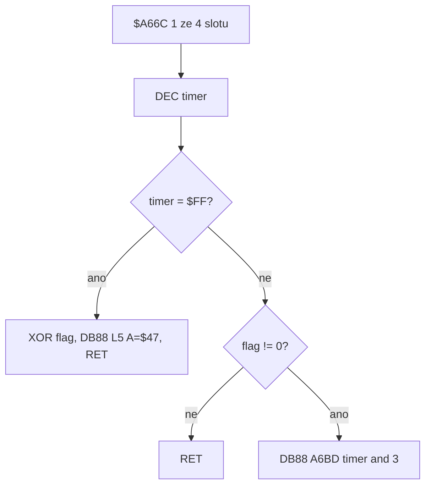

# Puls `$70` / jiskra `$DB88`

Vizuál jiskry mezi sloupky. AABB a timer jsou v [`kill-terrain.md`](kill-terrain.md) § 9 a `tickPulses`. Tady jen **proč** dřív vypadala jako všechny fáze přes sebe.

**Není to** barva (cyan sloupky = správně; žlutá ve Skoolkitu je accessibility overlay) ani pozice (`$9635` col/row, `#13` jeden, `#198` dva).

---

## Kořen

`$DB88` **XORuje** 2 buňky z `$DC55 + L×$10` do display file (`$DB50 XOR (HL)`). Není to blit aktuálního snímku.

`$A66C` navštíví **jeden** ze 4 záznamů `$9635` za tick (`$9634` wrap `$04`). `DEC` timer:

| větev | kdy | `$DB88` |
|---|---|---|
| toggle | timer `$FF` → reload periody, `XOR $01` na flag | L=`$05`, A=`$47`, **RET** (anim ne) |
| anim | flag ≠ 0 | L=`$A6BD[timer∧3]` (`$06,$07,$07,$06`), A=`($DAC0∧3)+$44` |
| ticho | flag = 0 | nic |

Perioda `($DAC0 ∧ $0C)+8` = 8 / 12 / 16 / 20 (násobek 4). Čtyři anim XOR (`L6,L7,L7,L6`) dají identitu, takže před dalším toggle je na obrazovce zase jen L5 a XOR L5 ji sundá.

### `$A66C` / `$DB88`

Engine kreslí místnost z terénu **každý snímek**, takže `xorInk` musí držet totéž, co má Spectrum v display file (persist XOR), a blit je `^=` na čerstvý terén. Buňky pod jiskrou v exportu jsou prázdné.

---

## Špatný model (opraveno 2026-08-28)

Engine **přepisoval** buňky aktuálním L6 nebo L7. To je hustý 2×8 blob všech pixelů jedné vrstvy — vypadá to jako XOR všech fází najednou, i když bit count v buňce byl ~46–48 (jedna vrstva).

Slepá úprava blit (OR, `fill(0)`, replace při změně L, cache-bust) ten model nechala. Testy ho vyžadovaly (`keep a single L7`, `must not leave L6⊕L7`).

Správně: dvě návštěvy L7 se **vyruší**; L6 pak L7 **zůstane** jako L6⊕L7; po periody 8 on→off je `xorInk` zase nula.

---

## Vrstvy `$DC55` (L=5..7)

Stejné bajty jako `PULSE_LAYERS` v `constants.ts`. L=0..3 jsou plošinky (`$C79F`), ne jiskra.

Ověření: `#13` tenký zig-zag **mezi** bílými sloupky; `#198` dva nezávislé pulsy (místnost `$C6`, bez vetřelců).
