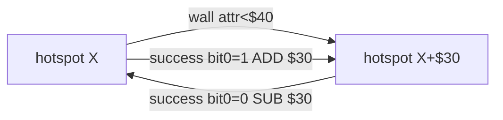
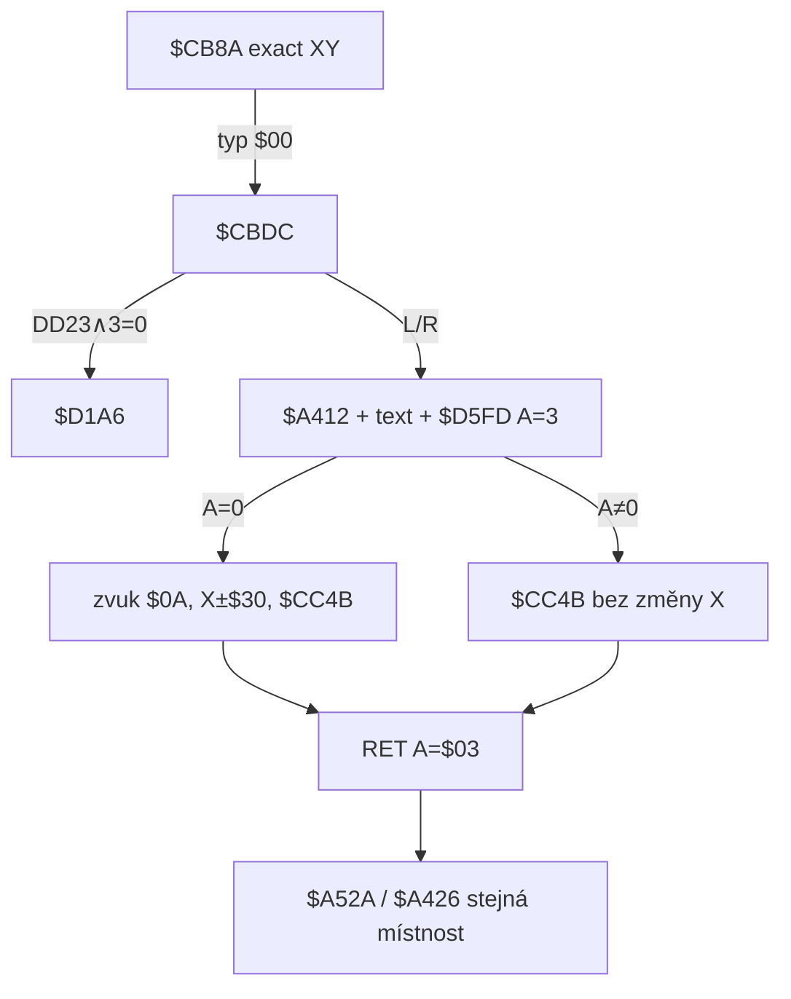

# Security doors a access code

Rozbor objektu typu `$00` v `$96FC`, minihry `$D5FD` / `$D693` a reloadu `A=$03`. Sonda `tmp_security_probe.py` + bajty snapshotu / skool.

**Není to** nibble `$80` v `$9740` (`$A991` → seznam `$9620` = pevný spawn vetřelců, viz [`kill-enemies.md`](kill-enemies.md)). AA30 / starší poznámky, které `$80` nazývají security door, jsou **špatně**. **Není to** horizontální přechod typ `$0F` v `$96FC` (`$D117`). **Není to** teleportí jméno (`$CED1`) ani Cheops výměna (`$CCF1`, jiný `$D5FD` s `A=$02`).

Hlavní tvrzení: dveře jsou **dlaždice raw `$01`–`$0F`** → typ `$00` v `$96FC`; zeď mezi párem hotspotů blokuje chůzí `$D2F0` (`attr < $40`); Left/Right na přesném XY spustí minihru; úspěch posune X o ±`$30` a reloadne **stejnou** místnost s `A=$03`. **Žádný** persistentní příznak „otevřeno“.

---

## Odvodené konstanty

| veličina | hodnota | adresa |
|---|---|---|
| typ v `$96FC` | `$00` | `$CBDD CP $00` |
| raw `$9740` | `$01`–`$0F` (hi nibble 0, ne `$00`) | `$A91E AND $F0` / `$A936 CP $00` → `$A9F6` |
| podbloky dveří | `$25` raw `$04`; `$26` raw `$06` | `$9740+$25` / `+$26` |
| hotspot offset | col `raw∧$03`, row `(raw∧$0C)≫2` | `$A92A` / `$A92F` |
| záznam `$96FC` | 3 B: X, Y, typ | `$AA17`–`$AA1B` |
| detekce | **přesná** shoda X i Y | `$CBAA` (typ `$00` mimo AABB) |
| vstup | `$DD23 ∧ $03 ≠ 0` (Left\|Right) | `$CBE2`–`$CBE7` |
| Up / nic | `JP $D1A6` (žádná minihra) | `$CBE7` |
| overlay text | `"SECURITY  DOOR"` / `"ACCESS  CODE"` | `$CBF3` / `$CC04` |
| minihra | `$D5FD` s `A=$03`, `BC=$110B` | `$CC2A` / `$CC27` / `$CC2C` |
| úspěch | zvuk `$0A`, X ±`$30` dle bit0 `$DD23` | `$CC33`–`$CC48` |
| neúspěch | X beze změny, skok `$CC4B` | `$CC31` |
| Y snap | `(Y+1) ∧ $F8 − 1` | `$CC4B`–`$CC52` |
| důvod reloadu | `A=$03` → `$D2C4` | `$CC55`, `$A52A` |
| seed kódu | `$D2C6` XOR room.lo XOR `BC` | `$D616`–`$D62A` |
| cifra | `(n ∧ $3F) % 5 + 9` → `$09`–`$0D` | `$D633`–`$D639` |
| klíč kódu | sprite `$0F` v `$D2D2` = wildcard všech cifer | `$D693 CP $0F` → `$D6BF` |
| wildcard 1 cifra | sprite `$0E` (spotřebuje bit slotu v C) | `$D6AB CP $0E` |
| shoda inventáře | sprite == cifra | `$D697 CP (HL)` |
| autorizace | liché bajty `$D5F7` == `$07` | `$D732`–`$D736` |
| výsledek OK / fail | `A=0` / `A=1` | `$D760` / `$D788` |
| nibble `$80` | **ne** dveře; `$9620` spawn | `$A991` / `$9F05` |

---

## 1. Reprezentace v místnosti

Security door **je** hotspot v `$96FC` **a** důsledek raw atributu podbloku. Není záznam `$94E8`.

### Dlaždice

`$A90F` po `AND $F0 == 0` (raw `$01`–`$0F`, ne černá `$00`) jde na `$A927` → `$A936 CP $00` → `$A9F6` → `$AA02` s typem **`$00`**.

V celé `$9740` jsou právě dva takové podbloky:

| sub | raw | col+ | row+ |
|---|---|---|---|
| `$25` (37) | `$04` | 0 | 1 |
| `$26` (38) | `$06` | 2 | 1 |

Typicky sedí v bloku **79** jako pár (vlevo `$25`, vpravo `$26`). Místnost **362** má jen jeden hotspot (`$25`).

`$AA02` zapíše:

| pole | vzorec | adresa |
|---|---|---|
| X | `sloupec × 8` | `$AA0D` |
| Y | `(24 − řádek) × 8 − 1` | `$AA05` / `$AA0B` |
| typ | `$00` | `$AA1B` |

Live `$A80A`+`$AA30` dává stejné XY jako statický walk (sonda, 8 místností).

### Objekt `$96FC`

Typ `$00` patří mezi exact-XY typy (`$CB9A`–`$CBAA`): `$00`, `$0C`, `$0D`, `$0F`–`$13`. **Ne** AABB `$0F`.

### Co `$80` není

`$A991 CP $80` zapisuje sloupec/řádek do `$9620` a `$9F05` z toho dělá pevné vetřelce (AI 6). **0** překryv s 8 místnostmi typu `$00` (sonda). Whitelist `$0F`/`$10` v AA30 se vyhýbá `$80` i (náhodou / odděleně) místnostem s typem `$00`.

---

## 2. Co blokuje průchod

1. **Terén `$D2F0`:** zeď když `attr < $40`. Mezi párovými hotspoty je pás `$05` / `$0E` (případně `$03`) — chůzí neprojdeš. Hotspot sám je `$47` = **průchozí** pro BLOBa (bit 6 nastavený; opak overlay `$D280`).
2. **Interakce není kolize.** Bez Left/Right na přesném XY se `$CBDC` hned vrátí přes `$D1A6`. Žádný room-exit (`$C8F4`) dveře neřeší.
3. **Úspěšný kód nemaže zeď.** Jen teleportuje Blob o ±`$30` na druhý hotspot (v páru vzdálenost hotspotů = `$30`).

Příklad místnost 176: hotspoty `(128,63)` a `(176,63)`; sloupce 18–21 = zeď; Right z 128 → 176.

---

## 3. Otevření / minihra

### Tok

Zvuk při vstupu `$08` (`$CC22`). Úspěch ještě `$0A` (`$CC33`).

### Role klíče `$0F`

Inventář `$D2D2` (4× `{sprite, attr}`). Při každé cifře:

- sprite `$0F` → hned `$D6BF` (animace, zápis `$07` na lichý bajt), **bez** nastavení bitu spotřebovaného slotu v C → funguje na **všechny** cifry;
- jinak shoda sprite == cifra, nebo sprite `$0E` (jen **jedna** cifra — bit C slot zablokuje další použití téhož `$0E`).

Sonda room 176, kód `[10,10,12]`:

| inventář | `A` z `$D5FD` | buf po |
|---|---|---|
| prázdný | 1 | `0A 03 0A 03 0C 03` |
| `$0F` | 0 | `0A 07 0A 07 0C 07` |
| `$0E` samotné | 1 | jen 1. cifra `$07` |
| přesné 3 sprity | 0 | všechny `$07` |
| jedna shoda | 1 | jedna `$07` |

### Je kód jiný u každých dveří?

- **Per místnost** (a per `BC` pozice UI), ne per hotspot: oba hotspoty volají `$D5FD` se stejným `BC=$110B`.
- Vzorec (`$D616`): `A = B ⊕ Hi($D2C6) ⊕ Lo($D2C8)` → `$D5F7`; pak XOR `Lo($D2C6)` ⊕ C → `$D5F9`; XOR Hi($D2C6) ⊕ B → `$D5FB`. Hi byte místnosti **nevstupuje** (jen `E`).
- Redukce na `$09`–`$0D`. Po redukci můžou různé místnosti sdílet kód (176 a 210 v tomto snapshotu obě `[10,10,12]`).
- `$D2C6` je freeze z `FRAMES` při startu (`$636F`) — jiný run = jiné kódy.

Cheops (`$CD1A A=$02`, `BC=$0F0D`) počítá **jiný** 2ciferný kód; nesouvisí s dveřmi.

### Jak hráč kód vidí

Během minihry `$D78B` kreslí cifry jako sprity `$9088 + id×$20` (`$D79D`–`$D7AD`). Text „ACCESS CODE“ / „ACCESS AUTHORISED“ / „ACCESS CODE INVALID“. **Není** předem vypsaná tabulka kódů dveří (na rozdíl od teleportích jmen `$D036`). Prakticky: inventář musí už držet potřebné sprity `$09`–`$0D`, nebo klíč `$0F`.

V tomto snapshotu po `initialize_item_table`: sprity `$09`–`$0C` existují; `$0D` jako sběratelný **ne** (0 kusů) — digit `$0D` bez klíče / `$0E` nelze přesně složit.

---

## 4. Persistence po „otevření“

**Žádná.** Úspěch nemění atributy, `$96FC`, ani bitovou mapu místností. `$A80A` při reloadu znovu maže `$9600`–`$973F` a znovu postaví typ `$00`. Sonda: dvojí `run_room_moving` místnosti 176 → stejné dva hotspoty.

Opakovaný průchod = znovu minihra (s `$0F` okamžitá).

---

## 5. Smrt / odchod z místnosti

| jev | chování | adresa |
|---|---|---|
| úspěch/fail dveří | reload **téže** místnosti, `$D2C4=$03` | `$CC55` / `$A52A` |
| `$9C47` vetřelci | při `$D2C4=$03` **přeskočeno** | `$A51C CP $03` / `$A51E JR Z,$A523` |
| spawn na typ `$0D`/`$0F` | jen při `$04` / `$05`, ne `$03` | `$A4D4`–`$A4E3` |
| XY po reloadu | zůstane posunuté (±`$30`) / snappoint Y | před `$CC55` |
| běžný východ `$C8F4` | `A=$00`, dveře neřeší | `$C94A` |
| smrt | žádná větev specifická pro typ `$00` | — |

Držení Left/Right po reloadu na hotspotu spustí minihru znovu (stejný pattern jako teleport `$CEC9`).

---

## 6. Místnosti (snapshot)

8 místností s typem `$00` (statický scan = live):

| místnost | hotspoty (X,Y) |
|---|---|
| 176, 200, 210, 265, 429 | (176,63), (128,63) |
| 187, 352 | (112,63), (64,63) |
| 362 | jen (128,63) |

Kódy při `$D2C6=$7B78`, `BC=$110B`: viz sonda (např. 176 → `[10,10,12]`, 187 → `[11,13,12]`, …).

---

## 7. Konstanty k přenosu do `MOVEMENT.md`

- typ `$00` = security door; exact XY + Left\|Right → `$CBDC` / `$D5FD`; **ne** nibble `$80`
- raw podblok `$04`/`$06` (sub `$25`/`$26`) → `$AA02` typ `$00`
- zeď mezi párem: chůze `$D2F0` `attr < $40`; hotspot `$47` průchozí
- úspěch: X ±`$30` (bit0 `$DD23`), Y snap, `A=$03` reload téže místnosti; dveře zůstanou
- kód: 3× `$09`–`$0D` z `$D2C6` ⊕ room.lo ⊕ `BC=$110B`; sprite `$0F` = full wildcard; `$0E` = 1 cifra
- `$A991`/`$80` → `$9620` spawn, ne dveře

---

## 8. Nedořešené

1. **Místnost 362** — jeden hotspot + typ `$0F` na (168,63). Jestli jde o úmyslné jednokřídlé dveře / broken pair — geometrie zdi je, UX páru ne.
2. **Digit `$0D` bez klíče** v tomto snapshotu nemá sběratelný sprite `$0D`. Jiné `FRAMES` / `$D2C6` můžou kód bez `$0D` dát; solver mimo rozsah.
3. **Pixel-exact stání na hotspotu** při animaci / šířce spritu — engine stačí exact `$DD1D`/`$DD1E`; jemné „tlačení do zdi“ neprobed.
4. **Cheops `$CCF1`** sdílí `$D5FD`, ale `A=2` a jiný `BC` — záměrně jen zmínka.
5. **Zvuk `$D7C0` ID `$08`/`$0A`/`$0F`/`$03`** — jen ID, ne waveform.
)