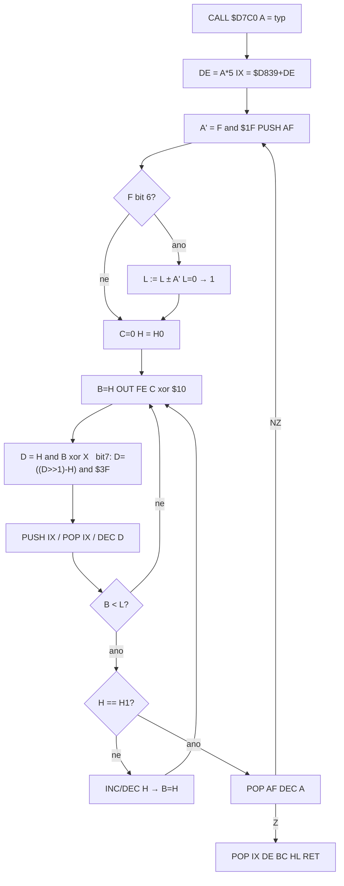

# Zvukové efekty (`$D7C0`)

Krátký beeper: vstup **typ v `A`**, offset `A×5` do tabulky 5bajtových záznamů `$D839`, busy-wait `OUT ($FE)` s XOR bitu 4. Ověřeno `reference/src/starquake.skool` + bajty snapshotu + sonda `tmp_sfx_probe.py` (24 záznamů, 28× `CALL $D7C0`, počet `OUT` emu = simulace).

**Není to** melodie `$D9DE` (`DI`, tabulka not `$DA70`, volá `$6600`). **Není to** HALT-synchronní beeper `$A57B` / fronta `$A41B` (palba, pád, plošinka, oblaka smrti) — jiná tabulka `$A607`. Skool „Used by“ má **13 rutin**; `CALL $D7C0` je **28** (žádný `JP $D7C0`). `$CE82` / `$D09F` / `$CCF1` `$D7C0` **volají** (nejsou trampolína). `$CC5A` samo ne — jen přes `$CC9A` `$CCAA`.

---

## Odvodené konstanty

| veličina | hodnota | adresa |
|---|---|---|
| vstup | typ efektu v **A** | komentář `c$D7C0`; `LD E,A` `$D7C7` |
| offset | `A×5` = `RLCA` `RLCA` `ADD A,E` (8bit) | `$D7C8`–`$D7CB` |
| tabulka | `$D839` | `$D7CC` |
| záznam | 5 B | `$D7D0` `IX` |
| počet záznamů | **24** (index `0`…`$17`) | `$D839`…`$D8B0` (120 B) |
| konec tabulky | další rutina `$D8B1` (`LD B,$06`) | `$D8B1` |
| poslední záznam | `$00×5` (L=0 → **závěs**, žádný CALL) | `$D8AC` |
| port | `OUT ($FE),A` | `$D7FB` `D3 FE` |
| speaker | XOR `$10` (bit 4 EAR) | `$D7FD` |
| MIC / border | bit 3 = 0; bity 0–2 = 0 (černá) | `C` start `$00` `$D7F7` |
| vnější opakování | `F ∧ $1F` (0 ⇒ 256× skrz `DEC`) | `$D7D3` / `$D830` |
| blocking | ano, busy-wait do `RET` | `$D7C0`–`$D838` |
| `DI` / `HALT` v rutině | **ne** | srov. `$D9DE` `F3`, `$A5DC` `76` |
| úschova | `HL` `BC` `DE` `IX` (ne `AF`) | `$D7C0` / `$D833` |
| CPU | 3,5 MHz (48K) | — |

Použité A u callerů: `$00`…`$04`, `$07`…`$15`. **A=`$05` / `$06` / `$16` / `$17`** žádný `CALL` (tabulka ale 5/6/`$16` má platná data; `$17` visí).

---

## 1. Tabulka `$D839`

24×5 B, index = A. Další kód `$D8B1` (skool `c$D8B1`, použit `$D9C8`) — žádný sentinela kromě nuly v indexu `$17`.

`A×5` v 8 bitech: max volané A=`$15` (21×5=105), nepřeteče. A=`$18` by četlo `$D8B1`.

---

## 2. Pět bajtů (`IX+0`…`+4`)

Stejný význam pro všechny typy. Bit 5 se čte **jen** když bit 6.

| off | jméno | použití |
|---|---|---|
| +0 | **H0** | start `H` každého vnějšího kola (`$D7D9`) |
| +1 | **H1** | cíl sweep: `CP (IX+$01)` `$D822`; `H < H1` → `INC H`, jinak `DEC H` |
| +2 | **L** | odečet `B` po každém `OUT` (`$D81B SUB L`); počet `OUT` na jedno `H` |
| +3 | **X** | `D = (H ∧ B) XOR X` `$D800`–`$D805` |
| +4 | **F** | viz níže |

**F:**

| bity | význam | adresa |
|---|---|---|
| 0–4 | počet vnějších kol (`AND $1F`); po každém `DEC A` `$D830` | `$D7D6` |
| 5 | při bitu 6: `L := L − A'` (`SUB E`), jinak `L := L + A'` | `$D7E7` / `$D7ED` / `$D7F0` |
| 6 | modulace L zbývajícím A' (včetně aktuálního kola) | `$D7DF` |
| 7 | `D := ((D ≫ 1) − H) ∧ $3F` | `$D806`–`$D812` |

A' na začátku kola = zbývající počitadlo (první kolo = `F ∧ $1F`). Když po ± vyjde L=`$00`, `$D7F6 INC L` → 1.

Běh jednoho `H`: `B := H`; opakuj `OUT`, delay, dokud `B < L` (carry po `SUB L`); jinak `B := B − L` a další `OUT`. Vždy aspoň jeden `OUT`. Pro L>0:

**počet `OUT` na H = ⌊H / L⌋ + 1**

(včetně závěrečného, kdy už `B < L`). Pak `H` o ±1 k H1. Počet hodnot H = `|H0 − H1| + 1`. H0=H1 → jedno H.

L=0 a bit 6=0: `SUB 0` nenesí carry → **nekonečná smyčka**. Jen index `$17`.

---

## 3. Generování tónu

### Port a bit

`$D7F7 LD C,$00` na začátku každého vnějšího kola. `$D7FA`…`$D7FF`: `OUT ($FE),C` pak `C XOR $10`. Emulátor vidí jen hodnoty **`$00` / `$10`**. Bit 4 = EAR/reproduktor (stejný XOR jako ROM BEEPER). MIC (bit 3) zůstane 0. Border bity 0–2 = 0.

První `OUT` kola je `$00`. Sudý počet `OUT` nechá na `RET` hodnotu `$10` (EAR zapnuto), lichý `$00`.

### Delay

`$D813`: `PUSH IX` / `POP IX` / `DEC D` / `JR NZ` (`DD E5 DD E1 15 20 F9`).

- D>0: D iterací; poslední `JR` 7 T, ostatní 12 T → **45D − 5 T**
- D=`$00`: `DEC` → 255, **256** iterací (11515 T)

### Perioda mezi dvěma `OUT` (continue-cesta, D>0)

Fix mimo delay (XOR, výpočet D, `BIT 7`, `SUB L` bez carry, `JR $D7FA`, další `LD A,C`/`OUT`):

| F bit 7 | T mezi `OUT` | f čtverce při konstantním D |
|---|---|---|
| 0 | **112 + 45D** | `3_500_000 / (2 × (112 + 45D))` Hz |
| 1 | **134 + 45D** | `3_500_000 / (2 × (134 + 45D))` Hz |

D=`$00`: ~11632 T (bit7=0) / ~11654 T (bit7=1).

D **není** konstantní: `B` klesá o L, `D = (H ∧ B) XOR X` (případně transformace bitu 7). Sweep mění H. U 22 použitelných indexů sonda `d_min ≠ d_max` (u `$15` skoro: 16…23). Syntéza = stejná smyčka, ne jeden Hz.

Poslední `OUT` daného H bere `JR C` (`$D81C`) místo `JR $D7FA` — o jednotky T kratší než continue; oproti ~10⁵ T zanedbatelné.

### Blocking a přerušení

Rutina se **nevrací**, dokud nedoběhnou všechna vnější kola. Žádný `HALT`, žádný `DI`/`EI`, žádný zápis do `$A41B`. Není na pozadí.

`$D9DE` má komentář „Disable interrupts - essential for playing sound“ a `EI` až `$DA36`. `$D7C0` to nedělá. V obrazu hry **není** `IM 0/1/2` (`ED 46/56/5E`). 48K po resetu = IM1. Tick hry `HALT` `$A5DC` ⇒ IFF1=1 ve smyčce. Žádný caller `$D7C0` nevolá `DI` těsně předtím. ISR 50 Hz tedy **může** efekt natáhnout (a sáhnout na `$FE`); to sonda netestovala na HW.

---

## 4. Záznamy (A, 5 B, odvozené)

`n` = F∧`$1F`. `n_out` / `~ms` = sonda (součet continue-period; 3,5 MHz). `H kroky` = `|H0−H1|+1`.

| A | adr | H0 H1 L X F | n | b6/5/7 | H kroky | n_out | ~ms |
|---|---|---|---|---|---|---|---|
| `$00` | `$D839` | `3F 30 01 00 81` | 1 | —/—/1 | 16 | 904 | 271 |
| `$01` | `$D83E` | `00 7F FE 00 01` | 1 | —/—/0 | 128 | 128 | 112 |
| `$02` | `$D843` | `C5 C4 03 01 C1` | 1 | +L/—/1 | 2 | 100 | 67 |
| `$03` | `$D848` | `01 7F 7F 01 41` | 1 | +L/—/0 | 127 | 127 | 112 |
| `$04` | `$D84D` | `01 14 FF 01 41` | 1 | +L/—/0 | 20 | 230 | 106 |
| `$05` | `$D852` | `28 22 01 7F FF` | 31 | −L/1/1 | 7 | 476 | 115 |
| `$06` | `$D857` | `32 38 FE 05 C3` | 3 | +L/—/1 | 7 | 763 | 253 |
| `$07` | `$D85C` | `F0 F1 28 01 DE` | 30 | +L/—/1 | 2 | 296 | 151 |
| `$08` | `$D861` | `1E 00 01 01 C3` | 3 | +L/—/1 | 31 | 568 | 381 |
| `$09` | `$D866` | `8C 80 01 7F C3` | 3 | +L/—/1 | 13 | 1914 | 1438 |
| `$0A` | `$D86B` | `00 22 01 7F DF` | 31 | +L/—/1 | 35 | 2461 | 1259 |
| `$0B` | `$D870` | `22 00 28 7F DF` | 31 | +L/—/1 | 35 | 1085 | 568 |
| `$0C` | `$D875` | `20 00 14 00 81` | 1 | —/—/1 | 33 | 46 | 35 |
| `$0D` | `$D87A` | `C8 C9 FE 05 03` | 3 | —/—/0 | 2 | 6 | 16 |
| `$0E` | `$D87F` | `00 0A FE 0F 07` | 7 | —/—/0 | 11 | 77 | 12 |
| `$0F` | `$D884` | `00 03 04 17 FF` | 31 | −L/1/1 | 4 | 139 | 21 |
| `$10` | `$D889` | `1E 00 07 00 41` | 1 | +L/—/0 | 31 | 76 | 29 |
| `$11` | `$D88E` | `14 0A FE 00 6A` | 10 | −L/1/0 | 11 | 110 | 25 |
| `$12` | `$D893` | `40 00 FF 01 81` | 1 | —/—/1 | 65 | 65 | 45 |
| `$13` | `$D898` | `FF FE FF FF C1` | 1 | +L/—/1 | 2 | 511 | 253 |
| `$14` | `$D89D` | `0A 01 FF 00 01` | 1 | —/—/0 | 10 | 10 | 1 |
| `$15` | `$D8A2` | `04 00 FF 14 01` | 1 | —/—/0 | 5 | 5 | 1 |
| `$16` | `$D8A7` | `07 0A FF 00 01` | 1 | —/—/0 | 4 | 4 | 1 |
| `$17` | `$D8AC` | `00 00 00 00 00` | 0 | — | — | hang | — |

Příklad bitu 6: A=`$04`, L0=`$FF`, A'=1 → `$FF+1=$00` → `INC L` → 1 (`$D7F1`–`$D7F6`). A=`$02`, L=`$03+1=$04`.

---

## 5. Volající

Skool „Used by“: `$5FF4`, `$6233`, `$67C7`, `$A01B`, `$A66C`, `$C35E`, `$C5BD`, `$CC14`, `$CC5A`, `$CCF1`, `$CE82`, `$D09F`, `$D5FD` (13). Pulse `$A66C` samo `RET` `$A6A2`/`$A6BC`; `CALL` `$A715`/`$A76E`/`$A7BF` jsou v bloku doručení jádra `$A6C1` (skool má `$A66C` až `$A7D5`). `$CC14` není `c$` — kus dveří po `$CBDC`.

### 5.1 Všechna `CALL $D7C0` (28)

| CALL | A v okamžiku volání | parent (skool) | událost |
|---|---|---|---|
| `$605A` | `$0C` (`$6058`) | `$5FF4` | menu: změna řízení (ne když už je vybrané, `$6054`) |
| `$6295` | `$01` (`$6293`) | `$6233` | define keys: klávesa přijata |
| `$68F8` | `$07` (`$68F6`) | `$67C7` | hi-score: každý ze 3 znaků |
| `$A2FA` | `$12` (`$A2F8`) | `$A01B` / `$A2E7` | střela zabije vetřelce; navíc `$A41C=$0B` (jiný beeper) |
| `$A715` | `$03` (`$A713`) | `$A66C` / `$A6C1` | doručení dílu: XOR flash ×`$19` (`$A702`) |
| `$A76E` | `($DAC0)∧1 + $14` → `$14`/`$15` | `$A66C` / `$A6C1` | po doručení, čekání ×`$C8` (`$A757`) |
| `$A7BF` | `$11` (`$A7BD`) | `$A66C` / `$A6C1` | milník `$D2E8`: vnořené `B=8` × `C=$0A` |
| `$C3AA` | `$0F` (`$C3A8`) | `$C35E` | smrt, **jen** `(A∧7)==2` (`$C36D`): flash ×`$2D` |
| `$C3EC` | `$13` (`$C3EA`) | `$C35E` | **každá** smrt (i po `$5E29` při 0 životech) |
| `$C6FA` | `($C6FF) XOR $01` → `$14`/`$15` | `$C5BD` / `$C6EE` | krok chůze (ne pad/jet) |
| `$CC24` | `$08` (`$CC22`) | `$CC14` / dveře | overlay SECURITY DOOR |
| `$CC35` | `$0A` (`$CC33`) | dveře | minihra OK (`$D5FD` vrátilo 0), před X±`$30` |
| `$CCAA` | 1. B páru `$CCBC` | `$CC5A` → `$CC9A` | extra `$01` (ne Cheops `$19`) |
| `$CD17` | `$0B` (`$CD15`) | `$CCF1` | overlay CHEOPS KEY CODE |
| `$CDDC` | `$10` (`$CDDA`) | `$CCF1` | výměna: animace ×`$23` (`$CDD7`) |
| `$CEA7` | `$08` (`$CEA5`) | `$CE82` | dlaždice `$0B` + nástroj `$10`, flag socketu ≠0 |
| `$CF88` | `$07` (`$CF86`) | `$CED1` | teleport overlay (pád z `$CE82` typ `$0D`) |
| `$CFAE` | `$11` (`$CFAC`) | `$CED1` | každý z 5 znaků kódu |
| `$CFF0` | `$10` (`$CFEE`) | `$CED1` | NOW TELEPORTING ×`$14` |
| `$CFF7` | `$09` (`$CFF5`) | `$CED1` | platný kód, jednou před `RET A=$04` |
| `$D029` | `$0F` (`$D027`) | `$CED1` | CODE NOT RECOGNISED ×`$28` |
| `$D0E0` | `$10` (`$D0DE`) | `$D09F` | stroj `$0E` (po podmínce `$DD29`/`Y`) |
| `$D133` | `$04` (`$D131`) | `$D09F` | typ `$0F`: místnost ±1, pak `A=$05 RET` |
| `$D1CC` | `$0C` (`$D1CA`) | `$D09F` | inventář po smyčce objektů (sběr **nebo** 1. Up) |
| `$D679` | `($DAC1)∧3 + $0C` → `$0C`…`$0F` | `$D5FD` | házení cifry dveří/Cheops |
| `$D70E` | `$03` (`$D70C`) | `$D5FD` | shoda cifry, flash ×`$0A` |
| `$D75B` | `$0F` (`$D759`) | `$D5FD` | ACCESS AUTHORISED ×`$23` |
| `$D783` | `$0F` (`$D781`) | `$D5FD` | ACCESS CODE INVALID ×`$28` |

`$CE82` **nevolá** `$D7C0` u padu `$0C` ani u skoku na `$D09F`. Teleport `$0D` padá do `$CED1`. `$CCF1` volá samo (`$CD17`, `$CDDC`); `$D5FD` z Cheops (`A=$02`) znovu `$D679`/`$D70E`/OK/fail.

### 5.2 Extra `$CCAA` — A z tabulky, ne z typu

`$CC9A`: sprite `S`, `$17` → `$CCCC` (přepíše A), `SUB $11` / `RLCA` / pár `$CCBC`. První B páru = **A do `$D7C0` i offset `$D2CC`**. `$D7C0` obnoví HL → `$CCAD LD E,(HL)` totéž.

| sprite | pár | A zvuk | stat |
|---|---|---|---|
| `$11` | `$01,$20` | `$01` | energie +`$20` |
| `$12` | `$01,$60` | `$01` | energie +`$60` |
| `$13` | `$01,$40` | `$01` | energie +`$40` |
| `$14` | `$02,$32` | `$02` | plošinky +`$32` |
| `$15` | `$03,$20` | `$03` | palba +`$20` |
| `$16` | `$03,$3C` | `$03` | palba +`$3C` |
| `$17` | přes `$CCCC` | `$00`/`$01`/`$02`/`$03` podle návratu `$18`/`$12`/`$14`/`$16` | viz item-effects § 6 |
| `$18` | `$CCCA` `$00,$01` | `$00` | životy +1 (přetečení tabulky) |
| `$19` | — | — | `$CC87 JP Z,$CCF1`, `$CC9A` ne |

### 5.3 Chůze `$C6EE`

`$C6FF` v snapshotu **`$14`** (`INC D`). `$C6F2` XOR `$01` → střídá `$15` a `$14`. Volá `$C66D` (vpravo) / `$C6B4` (vlevo) když `$DD28` dosáhne 3 (`$C64C` / `$C694`) — jeden efekt na 3 snímky kroku. Pad `$DD22=2` / vznášedlo `=1` tuhle větev nemají (`$C629` / `$C62D`).

### 5.4 Smrt: typ vs zvuk

Vstup `$C350`/`$C35E` A je **typ smrti**, ne index `$D839`. `$C3AA A=$0F` jen při `(typ∧7)==2` (nula energie `$A535`). Terén `$CE7D A=$10` a vetřelec `$01`/`$11` flash+`$0F` **přeskočí**. `$C3EC A=$13` vždy.

### 5.5 `$D1CA` bez sběru

`$D1B3`: `$DD31≠0` (1. tick Up). `$D2DB==0` nebo `$D2BE<4` → `$D1CA A=$0C` i když se nic nesbralo (prázdný slot). Plný inventář (`$D2DB≠0` a `$D2BE≥4`) `JP $D2B9` — **bez** `$D7C0`.

---

## 6. Co přes `$D7C0` nejde

| jev | skutečný kanál | adresa |
|---|---|---|
| palba | `$A41B := $05` → `$A57B` / `$A5DE` / `$A607` | `$C87F`, `$CA3B` |
| pád | `$A41B := $06` | `$C733` |
| stavba plošinky | `$A41B := $08` | `$C84F` |
| oblaka smrti | `$A41B := $09` | `$C43A` |
| spawn vetřelce | `$A41C := 1…4` | `$A1CC` |
| kill (navíc) | `$A41C := $0B` | `$A2FF` |
| téma / intro | `$6600` → `$D9DE` | `$5ED1`, `$6727`, … |

`$A57B` taky `OUT ($FE)` (`$A5BE`) s XOR `$10`, ale čeká na změnu FRAMES `$5C78` a končí `HALT` `$A5DC`. Mimo rozsah waveform.

Engine: `game/src/audio/channel.ts` (`tickChannel` každý `tick`, `world.buzz`). Inner delay aproximace 23+35E T / half-wave, 20 ms burst. Palba `$C87B` (A41F=`$F7` blokuje další ránu).

---

## Open questions

1. **Jitter IM1 50 Hz** během `$D7C0` na živém ULA (natážení delay, zápis `$FE` z ISR) — v obraze hry není `DI` u callerů; HW stopa není.
2. **A=`$05` / `$06` / `$16`** mají platný záznam, žádný `CALL`. Jestli je někdy v A smetí z jiné rutiny — v 28 sitech ne; self-mod jen `$C6FF` (`$14`/`$15`).
3. **Přesné Hz** u sweep/XOR D — záměrně jen vzorec periody; konstantní tón u použitých indexů sonda nedává.
)