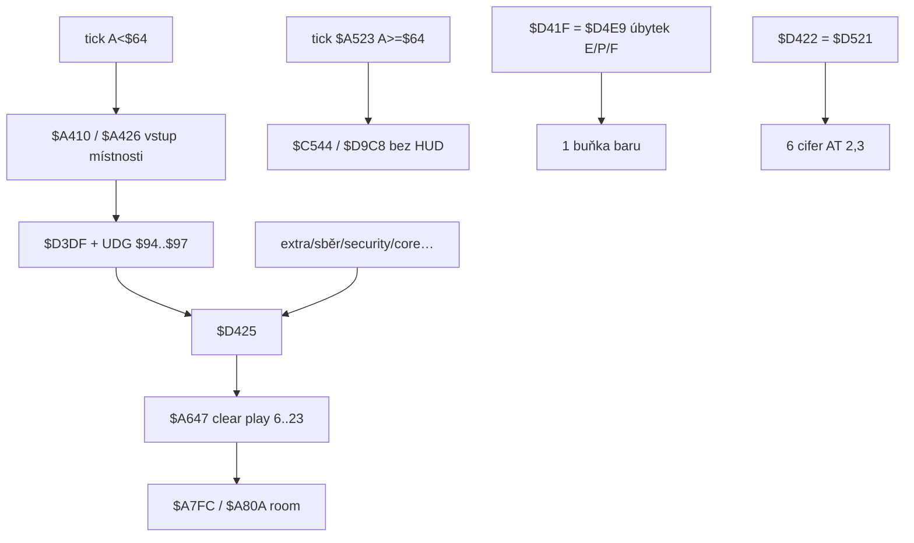

# Rozvržení obrazovky a stavová oblast

Rozbor řádků 0–5 (HUD), playfieldu 6–23, chrome UDG `$91`–`$97` / `$D3DF`, dynamiky `$D425` / `$D463` / `$D4E9` / `$D521`. Smyčka 50 Hz. Ověřeno skool + `tmp_ui_layout_probe.py` (bez ROM: `$EA65` nativně, `$D3C1` minimal AT/INK/BRIGHT + font `$ADD4`).

**Není to** menu/banner `$6615` (řádky 0 a `$16`) — to je intro / game over / hi-score, ne in-game HUD. **Není to** end-screen `$6730`. Engine dnes kreslí jen 256×144 playfield; status je mimo.

## Odvodené konstanty

| veličina | hodnota | adresa |
|---|---|---|
| celá obrazovka | 32×24 buněk | Spectrum ATTR `$5800` |
| status / HUD | řádky **0–5** | `$A426` / `$D3DF` |
| playfield | řádky **6–23** (32×18) | `$A8B5 LD B,$06`; `$A647` od `$58C0` |
| pod playfieldem | **nic** (6+18=24) | — |
| clear playfield | 144 px řádků, ATTR `$47` | `$A647` / `$A65D` |
| chrome (jednou / reload) | UDG `$91`–`$97` přes `$EA65` | `$A43C`…`$A459` |
| dynamický status | skóre, lives, E/P/F, inventář | `$D425` |
| skóre 6 cifer | `$D413`…`$D418` | `g$D413` |
| work skóre | `$D419`…`$D41E` | `g$D419` |
| update skóre | `JP $D521` | `$D422` |
| životy | `$D2CC` (bez stropu `$7F`) | `$D428` |
| energie / plošinky / palba | `$D2CD` / `$D2CE` / `$D2CF` | strop `$7F` v `$D469` |
| inventář 4× (attr, id) | `$D2D2` | `$D4C2` |
| font (CHARS) | `$ACD4` → glyfy od `$ADD4` | `$5E81` |
| bar glyfy | `$20`…`$28` (1–8 px + plný) | `$ADD4`…`$AE14` |
| tisk řetězců | `$D3C1` → ROM `PRINT_A_2` | `$15F2` |

## Stavový stroj překreslení



Chrome **není** každý frame. Celý rámec + panely se kreslí při `$A426` (start, respawn `$C472`→`$A410`, reload místnosti `$A52D`). Uvnitř místnosti se mění jen dynamika (`$D425` / `$D4E9` / `$D422`).

---

## 1. Mapa obrazovky

| řádky | obsah |
|---|---|
| 0–5 | status chrome + skóre / lives / tři bary / inventář |
| 6–23 | herní plocha 32×18; ATTR clear `$47` (`$A65D`) |
| pod 23 | neexistuje |

Menu bannery `$6615` (UDG `$8A`–`$8F`, ř. 0 a `$16`) se při hře **nepoužívají**. `$A647` status **nesahá** (sonda: ATTR ř. 0 beze změny, ř. 6→`$47`).

### Chrome layout (`$A43C`…`$A459`)

| prvek | UDG | pozice (row,col) | rutina |
|---|---|---|---|
| levý svislý rám | `$91` | (0,1), 6× buněk (maska `E0 80…E0`) | `$D3DF` |
| horní / dolní střed | `$93` ×5 | ř. 0 a 5; sl. 4, 8, 13, 18, 22 | `$D3EA` |
| pravý svislý rám | `$92` | (0,28) | `$D40D` |
| box skóre | `$94` | (0,2) | `$A442` |
| panel 1 (lives / energie) | `$95` | (0,10) | `$A44A` |
| panel 2 (plošinky) | `$96` | (0,18) | `$A450` |
| panel 3 (palba) | `$97` | (0,26) | `$A456` |

Panely nesou dekorativní ikony v bitmapě UDG; čísla/bary se tisknou přes ně / do mezer.

### Dynamické pozice (`$D425` DEFM)

| prvek | AT (y,x) | poznámka |
|---|---|---|
| skóre 6 cifer | (2,3) | `$D550`: BRIGHT 1, INK 7 |
| lives 2 cifry | (3,11) | `$D43C`: INK 6; formát „04“ |
| energie bar | (1,16)… | `$D463` B=1 |
| plošinky bar | (2,16)… | B=2 |
| palba bar | (3,16)… | B=3 (první iterace) |
| inventář blank | (1,21) a (2,21), 8 mezer | `$D4A7` (`$15` = 21) |
| inventář sloty | row 1, col 21/23/25/27 (2×2 `$DB24`) | `$D4BE` |

---

## 2. Statické vs. dynamické

| vrstva | kdy | rutiny |
|---|---|---|
| menu bannery | menu / intro / game over | `$6615` |
| in-game chrome UDG | každý `$A426` (ne frame) | `$D3DF`, `$EA65` `$94`–`$97` |
| skóre + lives + E/P/F + inv | při změně stavu / reloadu | `$D425` |
| jen skóre | kill / first-visit / core | `$D422` → `$D521` |
| 1 buňka baru | úbytek energie/plošinky/palby | `$D41F` → `$D4E9` |

`$D9C8` / herní tick **nevolá** `$D425`.

---

## 3. Kreslení pozadí rozhraní

- **UDG bloky** přes `$EA65` (tabulka `$EB23`, data + ATTR před pointerem).
- Maskování ATTR: ink/paper `$00` → OR `$EA62` (room); `$36` → OR `$EA63`. Status UDG typicky pevné ATTR.
- Text/bary: ROM print + custom font `$ADD4` (CHARS `$ACD4`).

### ATTR po chrome + `$D425` (sonda)

Rám / výplň (zjednodušeně):

| oblast | typické ATTR | význam |
|---|---|---|
| roh / svislý rám `$91`/`$92` | `$46` / `$42` | BRIGHT + ink 6 / 2 |
| vodorovný `$93` | `$42` | BRIGHT ink 2 |
| výplň panelů `$94`–`$97` | `$05`, `$0D`, `$47`, `$43`, `$07` | cyan / bright varianty v UDG |
| skóre cifry | `$47` | BRIGHT + INK 7 (`$D550`) |
| lives | `$46` | INK 6 + BRIGHT z pozadí |
| energie bar buňky | `$42` pak `$44`×3 | blank INK 2 + INK 4, tisk INK 8 |
| plošinky bar | `$47` | blank INK 7 |
| palba bar | `$46` | blank INK 6 |
| playfield clear | `$47` | `$A663` |

Blank před bary (`$D43C`…): AT 1,16 INK 2 `" "` + INK 4 `"   "`; AT 2,16 INK 7 `"    "`; AT 3,16 INK 6 `"    "`; konec INK 8. Samotné bary/tisk pak **INK 8** (transparentní ink → barvy z blanku zůstanou).

---

## 4. `$D463` — energie / plošinky / palba

```
$D463 LD B,$03
$D465 LD HL,$D2CF          ; palba → plošinky → energie (DEC HL)
$D468 LD A,(HL) / CP $7F / JR C,$D46F / LD (HL),$7F   ; ořez
$D46F LD ($D477),A=B       ; patch AT y := B (3,2,1)
      CALL $D3C1  AT y,$10
      n = (val ROL 3) AND $03     ; počet plných '(' = $28
      partial: val==$7F → $28
               else (val ROR 2) AND $07 + $20   ; $20..$27
      DEC HL / DJNZ
```

| vlastnost | hodnota | adresa |
|---|---|---|
| směr plnění | **zleva doprava** od sloupce 16 | `$D476 AT …,$10` |
| max šířka | **4** buňky | 0–3× `(` + 1 partial |
| kvantizace | 2 dolní bity val se na pixel **neprojeví** | `ROR 2` / `ROL 3` |
| strop | zápis `$7F` do `$D2CD`/`CE`/`CF` | `$D46D` |
| lives | **mimo** smyčku | `$D428` |

Mapování (sonda):

| val | buňky (šířka px v glyfu) |
|---|---|
| `$00` | prázdné |
| `$04`…`$1F` | 1. buňka 1–7 px (`$21`…`$27`) |
| `$20` | 1× plný `$28` |
| `$3F` | plný + 7 px |
| `$7E` | 3× plný + 7 px |
| `$7F` / `≥$7F` po ořezu | 4× plný |

Glyfy `$20`…`$28` = vodorovné „segmentové“ čárky ve fontu `$ADDC`…`$AE14`.

### `$D4E9` (úbytek, ne plný HUD)

Index A: 0 energie, 1 plošinky, 2 palba; C = odečet; min 0. Překreslí **jednu** buňku: AT `(index+1, $10 + ((val<<3)&$03))`, znak z bitů 2–4 (+`$03` když val `<$04`), INK 8 / BRIGHT 1 (`$D517`).

---

## 5. Obsah `$D425` / skóre

Pořadí `$D425`:

1. `$D521` — přičti work `$D419`→`$D413` (BCD carry), vynuluj work, tisk 6 cifer AT (2,3)
2. lives `$D2CC` → 2 ASCII na (3,11), INK 6
3. blank bar oblast + INK 8
4. `$D463` tři bary
5. blank inventáře (1–2, 21…) + až 4 položky `$DB24` (grafika `$9088 + id×$20`, attr z bajtu záznamu)

`$D422` = jen krok 1. Životy **nemají** strop `$7F` (viz [`item-effects.md`](item-effects.md)).

---

## 6. Hooky překreslení statusu

| volání | kontext |
|---|---|
| `$A45C CALL $D425` | konec chrome při `$A426` |
| `$A483 CALL $D422` | first-visit +250 |
| `$A2F2 CALL $D422` | kill skóre |
| `$A6EA CALL $D422` | core +10000 |
| `$CCB8 CALL $D425` | extra `$CC9A` |
| `$D1F5 CALL $D425` | po inventáři `$94E8` |
| `$CDF1 CALL $D425` | Cheops / výměna |
| `$D71B CALL $D425` | security minihra |
| `$A740` / `$A7AC CALL $D425` | core delivery UI |
| `$64A5` / `$64E8 CALL $D425` | end `$64A0` |
| `$C84C` / `$C888` / `$CA44` / `$CB65 CALL $D41F` | úbytek → `$D4E9` |

Reload místnosti: `$A523` když `A < $64` → `$A52D JP $A426` (znovu chrome + HUD + room).

---

## Open questions

1. **Přesný pixelový význam ikon uvnitř UDG `$95`/`$96`/`$97`** (co je „životní symbol“ vs. čistá dekorace vedle lives na (3,11)) — bitmapa je v `out/skoolkit/.../block_data_9{5,6,7}.png`; pojmenování ve skool chybí.
2. **Snapshot ATTR ř. 0–3 = samé `$45`** neodpovídá čerstvému `$A426` chrome (sonda `$46`/`$42`/`$05`…). Snapshot obrazovka je zřejmě přepsaná / jiný režim; chování rutin brát ze skool + probe, ne z raw screen snapshotu.
3. **INK 8 přesnost oproti plnému ROM `PRINT`** — sonda emuluje transparentní ink; BRIGHT/PAPER side-effects ROM kanálu neověřeny bajt-po-bajtu.
4. **`$EA62` při kreslení chrome** závisí na `$DAC0`; sonda kreslila se snapshot `DAC0`. Jiná místnost může lehkým OR změnit buňky s ATTR `$00` v UDG (status UDG jich má málo).
