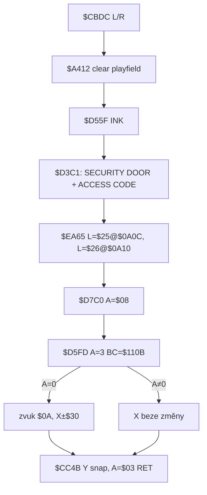

# UI messages + player input (security doors & teleports)

Rozbor **hlášení** a **vstupu** hráče. Disassembly `reference/src/starquake.skool` + bajty `reference/src/starquake.z80`. Žádná implementace enginu.

**Není to** font/`PRINT_A` pixel layout (jen AT + text přes `$D3C1`). **Není to** mechanika zdi / spawnů (viz [`security-doors.md`](security-doors.md), [`teleports.md`](teleports.md)) — tady jen overlay text, input smyčky, buffer, úspěch/fail zprávy a co se děje s playfield/status.

### Oprava hintu

| hint | skutečnost | adresa |
|---|---|---|
| „Zadání kódu (čtení znaků): `$D5FD`“ | **`$D5FD` nečte klávesnici.** Je to minihra dveří/Cheops: vygeneruje N cifer, kreslí sprity, páruje inventář `$D2D2`, vrátí `A=0/1`. | `$D5FD`–`$D78A` |
| čtení znaků teleportu | vlastní smyčka `$CF93` přes skener **`$D5C8`** → buffer **`$D031`** (5 B) | `$CF8E`–`$CFB1` |
| engine „dveře/teleport = `prompt()`“ | **teleport** ano (`main.ts` `readTeleportCode`); **dveře** inventář (`doorKeysAccepted`, bez promptu) | `game/src/main.ts`, `objects.ts` |

`$D3C1`: inline text po `CALL`, konec `$FF`; řídicí znak `$16,row,col` = Spectrum AT (ROM `$15F2`).

---

## Odvodené konstanty

| veličina | hodnota | adresa |
|---|---|---|
| dveře title | `"SECURITY  DOOR"` (2 mezery) AT 8,9 | `$CBF3` |
| dveře subtitle | `"ACCESS  CODE"` (2 mezery) AT 15,10 | `$CC04` |
| dveře OK | `"ACCESS AUTHORISED"` AT 21,7 | `$D744` |
| dveře fail | `"ACCESS CODE INVALID"` AT 21,6 | `$D76A` |
| dveře minihra | `$D5FD` s `A=$03`, `BC=$110B` | `$CC27`–`$CC2C` |
| dveře cifry | **3** × sprite `$09`–`$0D` v `$D5F7/$D5F9/$D5FB` | `$D630 LD B,$03` |
| teleport banner | `"YOU HAVE ENTERED"` / `"TELEPORT"` / `"CODE : "` | `$CEE0` / `$CEF3` / `$CEFE` |
| teleport jméno | 5 B z `$D036` → `$CF3D` (za „CODE : “) | `$CF11`–`$CF3A` |
| teleport výzva | `"ENTER TELEPORTAL"` / `"DESTINATION CODE"` | `$CF49` / `$CF5C` |
| teleport placeholder | `"- - - - -"` AT 19,12, kurzor zpět AT 19,12 | `$CF76` |
| teleport echo | 1 znak + mezera na `$CFA9`, pak `$D3C1` | `$CFA3`–`$CFA6` |
| teleport OK | `"NOW TELEPORTING"` AT 21,9 | `$CFDB` |
| teleport fail | `"CODE NOT RECOGNISED"` AT 21,6 | `$D010` |
| buffer kódu | 5 B `$D031` | `$CF8E`, `$CFBA` |
| délka zadání | **vždy 5** (`B=$05`), bez Enter/escape | `$CF91` |
| keymap | `$D5A0` (40 B, CAPS=`$01` ENTER=`$02` Sym=`$03`) | `$D5C8` |
| clear playfield | `$A412` → `$A647`: 144 řádků bitmapy + attr od `$58C0` (18 řádků od char-row 6) na `$47` | `$A647`–`$A66B` |
| INK helper | `$D55F` → `$10,$07` (ne herní stav) | `$D55F` |

---

## 1. Security doors — hlášení a flow

Vstup: typ `$00`, exact XY, `$DD23 ∧ $03 ≠ 0` → `$CBDC`.



### Text na obrazovce (`$CBF0`)

| adresa | AT (řádek, sloupec) | text (přesný) |
|---|---|---|
| `$CBF3` | 8, 9 | `SECURITY  DOOR` (dvě mezery) |
| `$CC04` | 15, 10 | `ACCESS  CODE` (dvě mezery), `$FF` |

Pak ikony podbloků dveří (`$CC14`–`$CC1F`), ne digit-sprity — ty kreslí až `$D78B` uvnitř `$D5FD`.

### Uvnitř `$D5FD` (A=3)

1. `$D5F6=A` (počet cifer), `$D5F4=BC` (pozice UI).
2. Init 6 B od `$D5F7` na `$03`; krátký `HALT` delay.
3. Seed kódu `$D616`–`$D63B` → 3 hodnoty `$09`–`$0D` na sudých bajtech `$D5F7/$D5F9/$D5FB` (liché = stav; po shodě `$07`).
4. Pro každou cifru: animace „házení“ (`$D64C`), pak match inventáře `$D689`–`$D6B5` (`$0F` wildcard všech, `$0E` jedné, jinak sprite==cifra).
5. Po 3 cifrech: lichý bajt každého páru musí být `$07` (`$D732`).
6. **OK** (`$D73C`): `$D58A` blikání + `$D3C1` `"ACCESS AUTHORISED"` AT 21,7; `XOR A` / `RET` (`A=0`).
7. **Fail** (`$D762`): totéž s `"ACCESS CODE INVALID"` AT 21,6; `LD A,$01` / `RET`.

**Žádné** čtení A–Z / 0–9 z klávesnice. Hráč „zadá“ kód tím, že už má sprity v `$D2D2`.

### Po návratu (`$CC2F`)

| výsledek | chování | adresa |
|---|---|---|
| `A=0` | zvuk `$0A`; bit0 `$DD23` → X `+$30` (Right) / `−$30` (Left) | `$CC33`–`$CC48` |
| `A≠0` | X beze změny → `$CC4B` | `$CC31` |
| obojí | Y = `(Y+1)∧$F8−1`; `A=$03`; 2× `POP`; `RET` → reload `$A426`, `$D2C4=$03`, bez `$9C47` | `$CC4B`–`$CC59`, `$A51C` |

---

## 2. Rutina `$D5FD` — specifikace (ne keyboard input)

Callers: dveře `$CC2C` (`A=3`), Cheops `$CD1F` (`A=2`) — Cheops jen kontext, mimo UI dveří/teleportu.

| parametr | význam | adresa |
|---|---|---|
| `A` | počet cifer N | `$D5FD LD ($D5F6),A` |
| `BC` | start pozice kreslení cifer | `$D600 LD ($D5F4),BC` |
| buffer | `$D5F7`… páry `(digit, flag)`, N párů | `$D604` |
| návrat | `A=0` autorizováno, `A=1` invalid | `$D760` / `$D788` |

| téma | chování |
|---|---|
| kolik „znaků“ | N z A (dveře **3**, ne 5) |
| charset | sprite ID `$09`–`$0D` (ne ASCII) |
| invalid input | není keyboard; fail = inventář nepokrývá cifry → zpráva + `A=1` |
| Enter / Delete / Caps | **nepoužito** |
| echo | `$D78B` kreslí sprity z `$9088+id×$20` přes `$DB24` na BC z `$D5F4`; ne textový echo |
| status | během match `$D71B CALL $D425` (překreslí status) |

---

## 3. Teleport — jméno `$CF11` a eval `$CFB3`

### Overlay (`$CED1`)

1. `$A412` smaže playfield; `$EA60=0`.
2. `$D55F` + `$D3C1`:

| adresa | AT | text |
|---|---|---|
| `$CEE0` | 8, 4 | `YOU HAVE ENTERED` |
| `$CEF3` | 10, 8 | `TELEPORT` |
| `$CEFE` | 12, 6 | `CODE : ` + `$FF` |

3. Ikona `$CF09 BC=$0917`, `L=$24`, `$EA65`.
4. **`$CF11`** lookup jména (viz níže) → print `$CF3D` (5 znaků + `$FF`) — **bez vlastního AT**; kurzor zůstává za `"CODE : "` (DF_CC po předchozím `$D3C1`; `$EA65`/`$D55F` textový kurzor nepřepisují výslovně AT).
5. Další text:

| adresa | AT | text |
|---|---|---|
| `$CF49` | 14, 8 | `ENTER TELEPORTAL` |
| `$CF5C` | 16, 8 | `DESTINATION CODE` |
| `$CF76` | 19, 12 | `- - - - -` pak znovu AT 19,12 |

6. Zvuk `$07` (`$CF86`).

### Odkud jméno (`$CF11`)

| krok | adresa |
|---|---|
| `HL=$D03B` (word místnosti 1. záznamu; jméno = 5 B před ním) | `$CF11` |
| `B=$0F` záznamů | `$CF14` |
| srovnej word s `$D2C8` | `$CF16`–`$CF21` |
| krok `$0006` z high cíle na high dalšího | `$CF23` |
| po shodě `SBC HL,$0006`, `LDIR` 5 B → `$CF3D` | `$CF29`–`$CF35` |

Formát tabulky `$D036`: 15 × (5× ASCII `$41`–`$5A` + little-endian room). Zobrazené jméno = **vlastní** pad aktuální místnosti, ne cíl.

### Zadání 5 znaků (`$CF8E`–`$CFB1`) — to je skutečný keyboard input

`HL=$D031`, `B=$05`. **Žádný Enter, Delete, zkrácení, escape, backspace.**

Každá iterace:

1. `$CF93`: `$D5C8` dokud `A≠0` — čekej **uvolnění**.
2. `$CF9A`: `$D5C8` dokud `A < $0A` — zahodí CAPS `$01`, ENTER `$02`, Sym `$03`, nulu (multi-key).
3. `LD (HL),A` / `INC HL`.
4. `$CFA3 LD ($CFA9),A` — přepíše první bajt inline `"L ",$FF`; `$D3C1` echo **znak + mezera** (kurzor běží z AT 19,12 přes dash placeholders).
5. zvuk `$11`; `DJNZ`.

### `$D5C8` keymap (`$D5A0`)

```
$01 Z X C V | A S D F G | Q W E R T | 1 2 3 4 5
0 9 8 7 6   | P O I U Y | $02 L K J H | SPC $03 M N B
```

- Písmena: uppercase ASCII `$41`–`$5A`.
- Číslice `$30`–`$39` a mezera `$20` **projdou** `CP $0A`, v `$D036` ale nejsou → po 5 znacích fail eval.
- >1 klávesa najednou → `A=0`.
- Kempston se nečte.

### Vyhodnocení `$CFB3`

| krok | adresa |
|---|---|
| `HL=$D036`, `C=$0F` | `$CFB3` |
| každých 5 B vs `$D031` holé `CP (HL)` (bez case-fold) | `$CFB8`–`$CFC4` |
| neshoda: `POP HL`, `ADD HL,$0007`, `DEC C` | `$CFFD` |
| **shoda:** 3× `POP` (návrat do `$A523`); word za jménem → `$D2C8`; smyčka `"NOW TELEPORTING"`; `A=$04` `RET` | `$CFC6`–`$CFFC` |
| **žádný match:** blik `"CODE NOT RECOGNISED"`; `JP $CC4B` → Y snap, `A=$03`, reload téže místnosti | `$D005`–`$D02E` |

Side effects reloadu: viz [`teleports.md`](teleports.md) §8 (plošinky pryč vždy; `$9C47` jen při `$04`).

---

## 4. Společné vs rozdílné (dveře × teleport)

| | dveře `$CBDC` | teleport `$CED1` |
|---|---|---|
| trigger | exact XY + L\|R | exact XY + L\|R |
| clear playfield | `$A412` | `$A412` |
| print | `$D3C1` + `$16` AT | totéž |
| „kód“ | 3 sprite cifry, inventář | 5 ASCII písmen, klávesnice |
| input rutina | **`$D5FD`** (ne `$D5C8`) | **`$D5C8`** ve `$CF93` |
| buffer | `$D5F7`… | `$D031` |
| echo | sprite `$D78B` | text znak+mezera `$CFA9` |
| Enter/Delete | ne | ne |
| OK zpráva | `ACCESS AUTHORISED` | `NOW TELEPORTING` |
| fail zpráva | `ACCESS CODE INVALID` | `CODE NOT RECOGNISED` |
| OK důsledek | X±`$30`, stejná místnost, `A=$03` | změna `$D2C8`, `A=$04`, spawn na cílovém `$0D` |
| fail důsledek | `$CC4B` `A=$03` | `$CC4B` `A=$03` |
| blokuje pohyb | ano (blocking CALL, smyčka neběží) | ano |

Cheops (`$CCF1`) sdílí `$D5FD` s `A=2` a po úspěchu teprve `$D5C8` na klávesy `1`–`5` — **není** teleport input.

---

## 5. Playfield / status během hlášení

| jev | chování | adresa |
|---|---|---|
| clear bitmapy | 144 scanlines playfield (`$DE1E` offsets) → 0 | `$A647` `$B=$90` |
| clear attr | od `$58C0` (= char row 6), `$0240` buněk (18×32) na `$47` | `$A65D`–`$A66B` |
| horní status (řádky 0–5) | **nesmazán** `$A412` | — |
| pohyb / střelba / AI | zastavené — UI je synchronní uvnitř ticku `$CB8A`, dokud `RET` | `$CBDC` / `$CED1` |
| status update | dveře: `$D425` uprostřed `$D5FD`; teleport overlay `$D425` nevolá (až reload `$A426`) | `$D71B` |
| po skončení | vždy `$A426` reload (dveře i teleport fail/OK přes `$D2C4`) → plná místnost znovu | `$A52A` |

Freeze vstupu pohybu = důsledek blocking UI, ne samostatný flag (engine má `teleportLatch` jako náhradu po `prompt`).

---

## 6. Očekávaná délka kódu (vs engine „5 písmen“)

| systém | délka | typ | ROM |
|---|---|---|---|
| **teleport** | **přesně 5** | A–Z (číslice vstupně možné, tabulka ne) | `$CF91 LD B,$05` |
| **dveře** | **přesně 3** | sprite `$09`–`$0D` | `$D630 LD B,$03`, `$CC2A LD A,$03` |
| Cheops (mimo scope) | 2 | totéž `$D5FD` | `$CD1A LD A,$02` |

Engine dnes: teleport `TELEPORT_NAME_LEN = 5` — **sedí**. Dveře **ne** 5písmenný prompt; inventář tří digit-spritů / `$0F` — **sedí** s `$D5FD`, ne s keyboard flow.

---

## Klíčové adresy (quick index)

| adresa | role |
|---|---|
| `$A412` / `$A647` | clear playfield |
| `$CBF3` / `$CC04` | dveře title / subtitle |
| `$CC2C` | `CALL $D5FD` dveře |
| `$CC4B` | společný Y-snap + `A=$03` RET (dveře fail/OK, teleport fail) |
| `$CED1` | teleport overlay start |
| `$CF11` | lookup + copy jména padu |
| `$CF3D` | buffer/tisk 5znakého jména |
| `$CF8E`–`$CFB1` | smyčka 5 znaků |
| `$CFB3` | eval proti `$D036` |
| `$CFDB` / `$D010` | NOW TELEPORTING / CODE NOT RECOGNISED |
| `$D031` | zadaný teleport kód |
| `$D036` | tabulka 15 jmen |
| `$D3C1` | print inline string do `$FF` |
| `$D5A0` / `$D5C8` | keymap / key scan |
| `$D5F7` | buffer cifer dveří |
| `$D5FD` | minihra inventářových cifer |
| `$D744` / `$D76A` | ACCESS AUTHORISED / INVALID |

---

## Open questions / spory

1. **Hint „`$D5FD` = čtení znaků“ je chybný.** Znaky čte `$D5C8` ve `$CF93`. `$D5FD` = inventářová minihra. Dohoda s [`security-doors.md`](security-doors.md); spor jen vůči vstupnímu hintu úkolu.
2. **Délka kódu:** teleport 5 písmen (OK s enginem); dveře 3 cifry-sprity, **ne** 5 písmen. Pokud by někdo čekal jednotný 5znaký prompt na dveře, ROM to nedělá.
3. **Invalid keyboard u teleportu:** CAPS/ENTER/Sym se tiše ignorují (`A<$0A` → znovu čti). Číslice/mezera se **přijmou** do `$D031` a skončí jako neplatný kód po eval — ne okamžitý reject. Delete/backspace **neexistuje**.
4. **Přesná pixel pozice jména za `"CODE : "`** spoléhá na DF_CC po `$D3C1` + nekollizi s `$EA65`; AT bajt u `$CF3D` chybí. Textově ověřeno ve skool; live screenshot cursoru neprobed v tomto rozboru.
5. **Engine vs ROM UI:** overlay text + ikony `$24`/`$25`/`$26` + `$D78B` sprity; teleport 5 znaků v rastru (ne `prompt`). `$D58A` blikání textu a busy-wait `$D7C0` jsou 50 Hz FSM.
6. **`$D55F` / `$D58A` barvy** — jen INK toggle z `$DAC6`; waveform zvuků `$D7C0` mimo rozsah.

---

## Reference v repu

- [`security-doors.md`](security-doors.md) — mechanika dveří / `$D5FD` match
- [`teleports.md`](teleports.md) — tabulka jmen, reload, spawn
- `tmp_security_probe.py`, `tmp_teleport_probe.py` — headless sondy (existující)
- `game/src/objects.ts` — `doorKeysAccepted` / `evaluateTeleport` (stav enginu, ne ROM UI)
