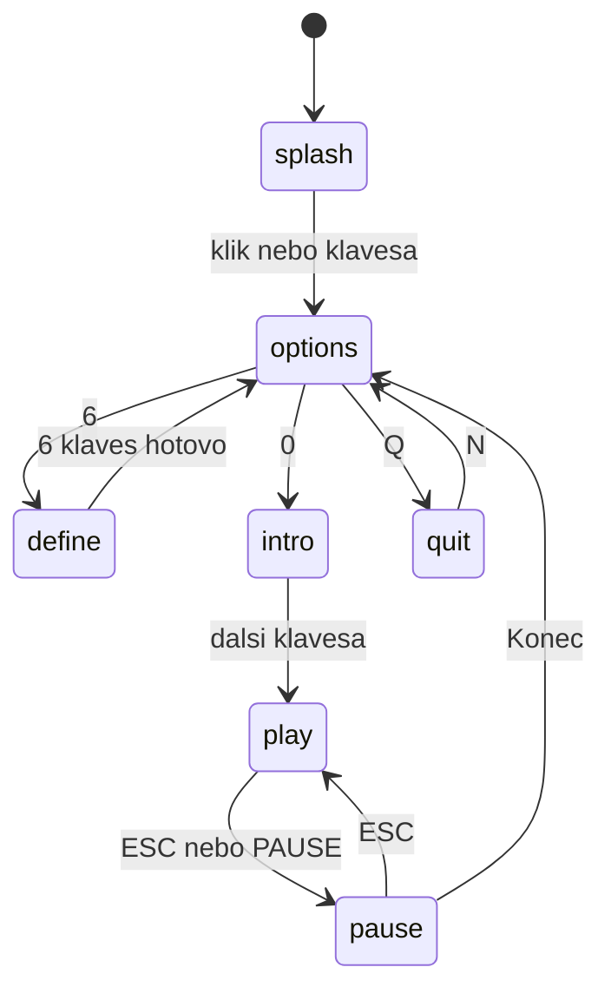

# Splash, redefine keys, ESC pauza, save/load

Datum: 2026-08-29. Engine `game/src`. Vizuál = Spectrum 32×24, font `$ADD4`, rámeček `$6615`.

## Cíl

1. Po loadu **splash**: klik nebo klávesa odemkne audio, teprve pak title.
2. Title volba **6** = redefine keys podle ROM `$6194`.
3. Ve hře **ESC** (a vázaná PAUSE) otevře pauzu se třemi položkami: konec / save / load.
4. Jeden slot v `localStorage`. Žádné IndexedDB.

## Tok obrazovek



- Splash **vždy** (i s `#room`). Gesture → `unlock()` AudioContext, `intro.mp3`, title `options`.
- `#room` po splash **přeskočí** title/intro a skočí do místnosti.
- Konec z pauzy → title `options`, ne splash. Hudba zase intro.
- ESC pauza jen ve hře: ne splash, title, intro, quit, goodbye, end-screen.
- Overlay dveří/teleportu/Cheops pod pauzou **zůstane** v `world.ui`; tick neběží.

## Splash

- Stejný rámeček jako title + `STARQUAKE` + text `CLICK OR PRESS A KEY` (herní font).
- Klik na canvas nebo libovolná klávesa kromě Shift/Ctrl/Alt/AltGraph.
- `MenuUi.phase` začíná `"splash"`. `#room` boot: pořád nejdřív splash, hash se uplatní až po gesture.

## Title (změny proti dnešku)

| klávesa | chování |
|---|---|
| 1 | Kempston — **zašedlé, no-op** (později gamepad). `control` se nemění. |
| 2 | Cursor — výběr. Ve hře šipky + mezera. |
| 3 | Sinclair — výběr. Ve hře WASD + mezera. Text řádku zůstane ROM `3.SINCLAIR ZX2 JOYSTICK`. |
| 4 | Keyboard OPAQM (default `$5E58=$04`). |
| 5 | UDK; řádek ukáže **aktuální** pětici, ne natvrdo `QWERT`. |
| 6 | redefine `$6194` (už ne no-op). |
| 0 / Q | beze změny (intro / quit Y/N). |

## Redefine keys (`$6194`)

Obrazovka: bannery, mřížka 4×10 z `$60E1`:

`1234567890` / `QWERTYUIOP` / `ASDFGHJKL\` / `[ZXCVBNM]*`

Pořadí promptů (`$61AC`…`$6216`): LEFT, RIGHT, DOWN, UP, FIRE, PAUSE. Text `HIT KEY REQUIRED ...`.

Pravidla `$6233`:

- Nejdřív pustit klávesu, pak stisk.
- Přijatá klávesa musí být v mřížce (40 znaků). Šipky/mezera **ne**.
- Duplicita: buňka už má `$90+n` místo ASCII → stisk se ignoruje (smyčka `$623A`).
- Přijatá buňka → značka `$90+n`, SFX `$01`, přkreslení mřížky `$6131`.
- Mozaika `$8C` přes print `$80`–`$8F`, ne `$EA65`.
- Po šesté: `control = 5`, návrat na title. (ROM HALT `$78` skip.)

České QWERTZ: písmena a cifry přes `ev.code` (Digit/Key*), znaky `\[]*` přes `ev.key`.

## Řízení ve hře (`input.ts`)

ESC **vždy** otevírá/zavírá pauzu (ve hře). Navíc 6. klávesa schématu.

| volba | left right down up fire | pause (kromě ESC) |
|---|---|---|
| 1 | nejde vybrat | — |
| 2 | ArrowLeft/Right/Down/Up, Space | `*` (`$5E70`) |
| 3 | W A S D, Space | `*` |
| 4 | O P A Q M | `*` |
| 5 | šestice UDK (default QWERT + `*`) | 6. klávesa |

PageUp/PageDown místnost beze změny. Overlay dveří/Cheops dál `ev.code` Digit, ne herní bind.

Klávesy v `localStorage['starquake-keys']` = `{ control, udk }` (udk: 6 znaků/kódů). Přežijí reload i bez savu. Nová hra z menu je nepřepisuje.

## Pauza

Není `world.ui.kind` (overlay dveří by se ztratil). V `main.ts`: `let pause: PauseUi | null`.

```
pause: { status: "" | "GAME SAVED" | "GAME LOADED" | "NO SAVE" | "SAVE INVALID" } | null
```

Otevření: ESC nebo vázaná PAUSE. Vyčistit držené směry/palbu. **Nevolat `tick`** (ani overlay, ani `world.frames`). BGM dál hraje. `draw()`: když `pause`, celá obrazovka pauzy, ne playfield.

Kresba: `clearScreen` + `$6615` + `STARQUAKE` + položky INK 4:

- `1.END GAME` — `pause = null`, `world.ui = beginMenuUi()` (phase `options`), intro MP3. UDK zůstane. Save v LS zůstane.
- `2.SAVE GAME` — zápis slotu, `GAME SAVED`, pauza zůstane.
- `3.LOAD GAME` — načtení, hláška, pauza zůstane.
- ESC **nebo klik na canvas** — zavřít pauzu, hra pokračuje (včetně zmrazeného overlay). Čísla 1–3 mají přednost před klikem.

Čísla 1–3 okamžitě, bez Y/N. Hit-test buněk není — klik kdekoli na canvas = resume.

## Save / load

Jeden klíč `localStorage['starquake-save']`. IndexedDB ne.

```json
{
  "v": 1,
  "blob": { "...BlobState" },
  "world": { "...World bez Prepared" },
  "itemTable": { "...živý $94E8" },
  "control": 4,
  "udk": ["Q", "W", "E", "R", "T", "*"]
}
```

- `terrain.data` / `terrain.attr`, `pulses[].xorInk`, `collected`, `a350`, `a390` → pole čísel v JSON, zpět `Uint8Array`.
- `world.ui` v snapshotu je overlay pod pauzou (dveře atd.), ne pauza.
- `sfx` / `buzz` při save vyprázdnit.
- `Prepared` (grafika, rooms template) se nenačítá.

Load: obnovit blob, world, `prep.itemTable`, control/udk, chrome. Vadný JSON / `v !== 1` / výjimka LS → `SAVE INVALID`, stav hry **neměnit**. Chybějící klíč → `NO SAVE`.

## Soubory

| soubor | role |
|---|---|
| `game/src/ui/menu.ts` | splash, define, kresba pauzy, feed 6 |
| `game/src/input.ts` | bind 2–5, pause key |
| `game/src/persist.ts` | encode/decode v1 (čistá fce, LS až v main) |
| `game/src/main.ts` | boot splash, ESC, skip tick, klik |
| `game/src/ui/overlay.ts` | `isUiBlocking` / draw splash+pause |
| `game/src/audio/tracks.ts` | intro i pro splash |
| `game/src/constants.ts` | texty splash/pause, mřížka `$60E1` |
| `spec/MOVEMENT.md`, `TODO.md` | define-keys už není skip |

## Testy

Nejdřív padající, pak kód.

- splash: options až po klávese; `#room` až po splash (feed + flag v testu, ne JSDOM).
- `6`: pořadí LEFT…PAUSE, `control=5`, buňka `$90+n`; duplicita/mimo mřížku = stay.
- `input.ts`: 2 šipky, 3 WASD, 4 OPAQM, 5 UDK; ESC i `*` u 4.
- persist: roundtrip blob + collected + itemTable + xorInk; prázdný → null; `v:2` → invalid.
- pauza: feed `1` → menu options; `2`/`3` status string; tick se z testu `main` nevolá — stačí že `feedPauseKey` nešaha na `world.frames`.

## Mimo rozsah

- Kempston / Gamepad API (řádek 1 jen vizuál).
- Více slotů, IndexedDB, resume položka, Y/N u End.
- Melodie `$6600`, hi-score zápis.
- Změna exportu PNG/JSON.
