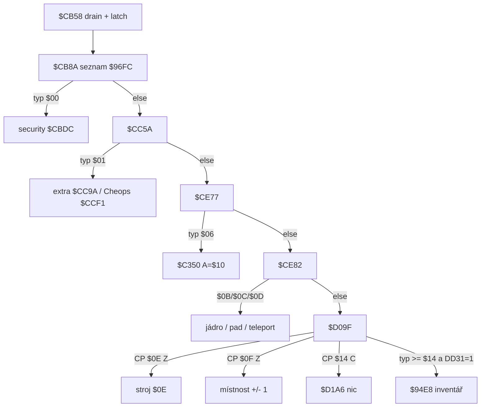

# Interakce s předmětem (`$CE82` / `$D09F`)

Rozbor objektové smyčky `$CB8A` → `$CE82` → `$D09F` a tabulky účinků. Smyčka 50 Hz, souřadnice `$DD1D` X / `$DD1E` Y odspodu (jako [`energy-death.md`](energy-death.md)).

**Není to** extra 2×2 `$AAB6` / `$CC9A` / `$CCBC` — typ `$01` končí v `$CC5A` **před** `$D09F`. **Není to** pad `$0C`, teleport `$0D`, rostlina `$06`, dlaždice `$0B` (`$B0`), security door `$00`: `$D09F` na ně neskáče (viz § 1). Zvuk `$D7C0`, skóre `$D521`, minihra kódu `$D693`, jádro `$C7` a Cheops UI `$CCF1` jen jako adresa větve.

Hlavní tvrzení (sonda `tmp_itemfx_probe.py` + bajty snapshotu): **`$D09F` nemění `$D2CC` / `$D2CD` / `$D2CE` / `$D2CF`**. Sběr `$94E8` jde do inventáře `$D2D2`. Staty přičítá jen extra `$CC9A` (`ADD` + `$D425`). `$D4E9` (přes `$D41F`) v této cestě **není**.

---

## Odvodené konstanty

| veličina | hodnota | adresa |
|---|---|---|
| vstup `$D09F` | `CP $0E` / `JR NZ $D117` | `$D09F` `FE 0E 20 74` |
| typ v `$96FC` u `$94E8` | `$14 + index` | `$AB80 LD A,$41 / SUB D` |
| sprite `$94E8` | byte 3 záznamu, ne typ | `$D16F` / `$CE68` `$9088+id×32` |
| extra typ / sprite | `$01` / `$11+kind` | `$AB37` / `$AB15` |
| AABB | \|dx\| `< $0F`, \|dy\| `< $0F` | `$CBBB` / `$CBCE` |
| exact XY | typy `$00`, `$0C`, `$0D`, `$0F`–`$13` | `$CBAA` |
| sběr jen Up samo, 1. tick | `$DD23==$08`, `$DD31==$01` | `$CB68` / `$D140` |
| `$D16B` hned po sběru | byte1=`$01` | `$D16B` |
| po `$D1E1` (Y=1→2) | byte1=`$02` | sonda |
| XOR smazání | attr `$47` | `$D176` |
| inventář | 4× `{sprite, attr}` `$D2D2` | `$D1CF` LDDR |
| zvuk sběru | `A=$0C` | `$D1CA` |
| `$D41F` | `JP $D4E9` | `$D41F` `C3 E9 D4` |
| `$D4E9` | `A` index od `$D2CD`, `C` úbytek, min 0 | `$D4EC` / `$D4F5` / `$D4F8` |
| `$CC9A` | `ADD A,(HL)` od `$D2CC` + `$D425` | `$CCB6` / `$CCB8` |
| strop E/P/F | `$7F` | `$D469` / `$D46D`, B=`$03` od `$D2CF` |
| životy strop | **není** | `$D425` `$D2CC` neřeže (sonda `$80` drží) |
| `$CCCC` (extra `$17`) | overlay, ne `$00,$00` z `$CCBC` | `$CC9C CALL Z,$CCCC` |

---

## 1. Tři cesty (neslučovat)



| cesta | spoušť | handler | mění staty? |
|---|---|---|---|
| `$94E8` / `$D09F` | typ `$14+index` v `$96FC`, Up 1. tick | `$D13B`–`$D1A3` + `$D1CA` | **ne** (sonda sprite `$1A`/`$00`/`$0F`/`$10`) |
| extra 2×2 | typ `$01`, AABB, **bez** Up | `$CC5A` → `$CC9A` | **ano** `$CCBC` / `$CCCC` |
| Cheops extra `$19` | typ `$01`, sprite `$D2C2==$19` | `$CC87 JP Z,$CCF1` | ne přes `$CC9A` (sonda PC=`$CCF1`) |

`$0C` pad, `$0D` teleport, `$06` rostlina **nejsou** tahle rutina. Pad: `$CEAD` → [`hoverpad.md`](hoverpad.md). Teleport: `$CEC4` → [`teleports.md`](teleports.md). Rostlina: `$CE77` → [`kill-terrain.md`](kill-terrain.md). Dlaždice `$0B`: `$CE82`–`$CEAA` (nástroj sprite `$10` v `$D2D2`, `$9605`, `$A807`) — mimo rozsah. Security `$00`: `$CBDC`.

---

## 2. Tok od ticku k `$D09F`

`$A523 CALL $C544` → `$C54F CALL $D9C8` / `JP $C5BD` (chůze, pad, palba). `$C5BD` končí na `$C8F4`.

`$C8F4`: východ z místnosti → `RET` s `A=$00`, **`$CB58` nespustí**. Jinak `$C92C JP C,$CB58`.

`$CB58`:

1. `$DD30++`, při `$78` `CALL $D41F` `A=0 C=$04` (energie −4). To **není** sběr.
2. Latch Up (`$CB68`):
   - `$DD23==$08` a `$DD32==0` → `$DD31=$01`, `$DD32=$01` (`$CB76`)
   - Up držené (`$DD32≠0`) → `$DD31=0` (`$CB86`)
   - jiná klávesa → oba nula (`$CB7E`)
3. `$CB8A` B=`$16` záznamů po 3 B (X, Y, typ) od `$96FC`.

Hitbox (`$CB9A`):

- typ `< $01` nebo (ne `$01`–`$0B`, ne `≥$14`, ne `$0E`) → **přesná** shoda XY (`$CBAA`)
- jinak AABB `$0F` (`$CBB6`)

Shoda: typ `$00` → dveře; jinak `JP $CC5A`. `$CC5A CP $01` / `JP NZ,$CE77`. `$CE77 CP $06` / `JR NZ,$CE82`. `$CE82` `$0B`/`$0C`/`$0D`, jinak `JP $D09F` (`$CEC6`).

Do `$D09F` tedy A = **typ** z `$96FC` (skool „index“ platí jen u `$14+`, kde typ = `$14+index`).

Po vyčerpání seznamu `$D1B3`: `$DD31≠0` → `$D1CA` (inventář), jinak `$D2B9` (`A=$FF`, `RET` z `$C544`).

---

## 3. Větve `$D09F`

Sprite u `$94E8`: `$AB80 LD A,$41 / SUB D` s D = zbývající počet smyčky (`$AB43 A=$2D` dolů) → typ `$14`…`$40` pro index 0…44. `$D14E SUB $14` / `RLCA×2` / `ADD HL,$94E8`. Grafika = byte 3, `$CE68`.

| A (typ) | sprite / zdroj | podmínka | účinek | zápis / CALL |
|---|---|---|---|---|
| `$0E` | nibble `$E0` → `$A9F6 AND $0F` | `$DD29==$10` a `$DD1E==B` (`$D0A3` / `$D0AB`) jinak `$D1A6` | stroj na plošinky: typ → `$05`, dvě 2×2 do `$DBBB` (`OR $40`, život `$02`), zvuk `$10` | `$D0B3` / `$D0F8`–`$D112` / `$D0E0`; **ne** `$D41F`, `$D2CE` beze změny (sonda) |
| `$0F` | nibble `$F0` | `$DD23 ∧ $03 ≠ 0` (`$D11B`) jinak `$D1A6` | bit0 → `$D2C8++` jinak `--`; zvuk `$04`; `A=$05` RET | `$D12D` / `$D12A` / `$D131` / `$D136` — v enginu (`applyPassage`) |
| `$10`–`$13` | v `$A9F6`/`$AB80` **nevznikají** | `CP $14` C | nic | `$D13B JR C,$D1A6` |
| `$02`–`$05`, `$0A` | nibble `$20`/`$30`/`$40`/`$A0` → `$A9F6` | totéž | nic | `$D13B` |
| `$14`+ | `$94E8` index `A−$14` | `$DD31==$01` jinak `$D1A6` | inventář, byte1=`$01`, XOR `$47`, komprese `$96FC` | `$D140` / `$D16B` / `$D176` / `$D194` |
| jinak po `$CE82` sem nejde | `$00` `$01` `$06` `$0B` `$0C` `$0D` | — | viz § 1 | — |

`$0E` bez `$DD29==$10`: objekt zůstane `$0E` (sonda). S podmínkou: typ `$05`, `$DBBB` = `4F 11 00 02 51 11 00 02` (X=`$80` Y=`$47`: col 15\|`$40` a 17\|`$40`, screen-row 17, life `$02`), zvuk `$10`, `$D2CE` beze změny. `$DB88` jen L=3,2 (ne 0..3). Nibble `$E0` v 163, 177, 212 (2×), 482. `$A80A` znovu sestaví `$0E`. `$D3C1` AT+mezery engine netiskne. Není `$64`.

`$14`+ bez Up / s `$DD31≠1`: byte1 `$94E8` se nemění, inventář ne (sonda „no Up“, „DD31=2“ bez předchozího `$D148`).

Úspěšný sběr (sonda sprite `$1A`, index 0, Up 1. tick přes `$CB58` i `$CB8A`):

- `$D148 INC ($DD31)` → 2
- `$D14C DEC ($D2BE)`
- `$D16B` byte1=`$01`, pak `$D1E1` najde Y=1 a zapíše **`$02`**
- inventář `1A 03 00 …` (attr = top 3 bity byte0, `$D161 AND $07`)
- `$D1CA CALL $D7C0 A=$0C`
- `$D1F5 CALL $D425` (HUD; skóre `$D413` beze změny když `$D419` je nula)
- **`$CC9A` = 0, `$D4E9` = 0**, lives/energie/plošinky/palba stejné
- lives=0 při sběru `$1A` zůstane 0 (sonda)

Stejné pro sprite `$00`, `$0F` (klíč `$D693`), `$10` (nástroj `$CE8C`): jen inventář.

---

## 4. `$D41F` / `$D4E9` vs `$CC9A`

Dvě rutiny **nejsou** dvojče na `$D4xx`. `$D422` je `JP $D521` (skóre), ne přičítání.

| | `$D4E9` (`$D41F`) | `$CC9A` |
|---|---|---|
| směr | `SUB C` | `ADD A,(HL)` |
| báze | `$D2CD` (E/P/F) | `$D2CC` (životy + E/P/F) |
| A | index 0/1/2 | sprite extra; po `$CCCC` může být přepsané |
| C / tabulka | úbytek v C | pár `$CCBC`: E = offset od `$D2CC`, A = přičtení |
| podtečení | 0 (`$D4F8 XOR A`) | — |
| přetečení | — | 8bit wrap, pak `$D425` |
| `$D425` | **nevolá** (vlastní mini bar `$D514`) | `$CCB8 CALL $D425` |
| sběr `$D09F` | **nevolá se** | **nevolá se** |

Sonda `$D41F`: energie `$7E−4=$7A`, plošinky `$30−2=$2E`, palba `$7E−1=$7D`, `$7E−$80` → 0. `$D425` hit 0.

Callery `$D41F` relevantní **mimo** sběr: `$C84C` stavba `A=1 C=2`, `$C888` palba `A=2 C=1`, `$CA44` pad `A=2 C=1`, `$CB65` wrap `A=0 C=4`. Žádný z `$D09F` / `$CC5A`.

Jediný caller `$CC9A`: `$CC94` z extra.

`$CCBC` (15 B, snapshot `01 20 01 60 01 40 02 32 03 20 03 3C 00 00 00`):

| sprite | E | add | cíl | sonda `$17` / `$7E` |
|---|---|---|---|---|
| `$11` | 1 | `$20` | energie | `$17+$20=$37`; `$7E+$20` → `$7F` |
| `$12` | 1 | `$60` | energie | `$17+$60=$77`; `$7E` → `$7F` |
| `$13` | 1 | `$40` | energie | `$17+$40=$57`; `$7E` → `$7F` |
| `$14` | 2 | `$32` | plošinky | `$30+$32=$62` (`< $7F`) |
| `$15` | 3 | `$20` | palba | `$7E+$20` → `$7F` |
| `$16` | 3 | `$3C` | palba | totéž `$7F` |
| `$17` | `$CCCC` | viz § 6 | ne `$00,$00` | — |
| `$18` | tabulka `$CCCA=$00`, další bajt `$CCCB=$01` | lives **+1** | 4→5, `$7F`→`$80`, `$FF`→`0` | přetečení tabulky |
| `$19` | in-game **ne** `$CC9A` | Cheops `$CCF1` | staty beze změny | PC=`$CCF1` |

Extra `$11` přes `$CB8A` (typ `$01`, `$D2C2=$11`): energie `$7E`→`$7F`, `$D09F` hit 0.

---

## 5. Horní / dolní mez

| veličina | strop | dolní mez | kdo řeže |
|---|---|---|---|
| energie `$D2CD` | `$7F` | 0 jen `$D4E9` | `$D46D`; sběr extra wrapne a ořeže |
| plošinky `$D2CE` | `$7F` | 0 jen `$D4E9` | totéž |
| palba `$D2CF` | `$7F` | 0 jen `$D4E9` | totéž |
| životy `$D2CC` | **žádný** | `$CCB6` wrap `$FF+1=0` | `$D425` tiskne, neřeže (sonda lives `$80` po `$D425` zůstane `$80`) |

`$D425`: `CALL $D521`, tisk lives, pak `$D463 LD B,$03 / LD HL,$D2CF` — tři bajty **dozadu** přes palbu, plošinky, energii. `$D2CC` mimo smyčku.

Sběr `$94E8` staty nesnižuje. Jediný ořez na této cestě: `$D1F5 CALL $D425` po inventáři. Sonda energie `$80` + sběr `$1A` → `$7F`, bez `$D4E9`/`$CC9A` (přebytek z jiné rutiny, HUD ho shodí).

---

## 6. Životy

Žádná větev `$D09F` neinkrementuje `$D2CC`. Extra `$17` / `$CCCC` patří **jen** `$CC9A` (`$CC9A CP $17 / CALL Z,$CCCC` **před** `SUB $11`).

Bajty `$CCCC` (snapshot, skool `$CCCB LD BC` je špatný začátek):

```
LD HL,$D2CC / XOR A / CP (HL)
JR NZ,$CCD6          ; $20 $03
LD A,$18 / RET       ; lives == 0
$CCD6: B=3, A=$FF
  INC HL / CP (HL) / JR C,$CCE4
  jinak E := 2×(3−B), A := (HL)
LD A,E / ADD A,$12 / RET
```

Sonda `$CCCC`:

- lives=0 → `A=$18` (pak `$CC9F SUB $11` = `$07` → `$CCBC+$0E` = `$00,$01` → lives 0→1)
- lives≠0, staty `$17/$30/$7E` → `A=$12` (jako extra `$12`, energie +`$60`). Vstupní E (`$00` i `$AA`) se **přepíše** první iterací; leftover E z ticku nerozhoduje
- all `$7F` → `A=$16` (palba +`$3C`, strop `$7F`)
- energie `$FF` → `A=$14` (plošinky +`$32`, energie ořeže `$D425` na `$7F`)

`$17` lives=1 (≠0): lives zůstane 1, energie `$17+$60=$77`.

`$18` (kind 7, `$AB09` rerolluje jen kind 8): lives+1 **bez** cap `$7F`. Engine tabulka extra to nemá.

[`energy-death.md`](energy-death.md) § 7 NEVÍM o in-game E: leftover E `$CCCC` přepíše; výsledek je z porovnání statů, ne ze smetí v E.

---

## 7. Vedlejší účinky sběru `$D09F`

| jev | co | adresa | stav |
|---|---|---|---|
| skóre | `$D425` → `$D521` přičte `$D419` | `$D1F5` / `$D425` | sběr `$D419` **nezapisuje**; sonda `$D413` stejné `00 00 02 09 05 00` |
| zvuk | `A=$0C` | `$D1CA` | jen dokumentovat |
| XOR smazání | `$DB24` attr `$47`, pak `$D97B` | `$D176` / `$D180` | — |
| `$D16B` | byte1=`$01` (řádek < 6 → `$AB68` nekreslí) | `$D16B` | po `$D1E1` Y=1→2 |
| inventář | 4 sloty, nový na začátek (LDDR `$0A` z `$D2D9`→`$D2DB`) | `$D1CF` | `{sprite, attr}` |
| `$D1CA` bez sběru | **1. tick Up** (`$DD31=1`) i bez `$14+` vloží `00 00` dopředu | `$D1B3 CP $00 / JP Z $D2B9` | sonda `$CB58` prázdný seznam: `0C 03 0D 03 0E 03` → `00 00 0C 03 0D 03 0E 03`, zvuk `$0C` |
| overflow | `$D2DB≠0` po posunu → drop zpět `$94E8` / `$A7FE` | `$D1F8` / `$D200` | implementováno; sonda 4 plné + `$1A` → inv `1A 03 0C 03 0D 03 0E 03`, `$D2DA=0F 03` |
| Cheops | extra `$19`, ne `$D09F` | `$CCF1` | implementováno (výměna 1–5) |
| kód `$D693` | sprite `$0F` v inventáři zkrátí minihru | `$D693 CP $0F` | mimo rozsah |
| jádro `$C7` / `$0B` | `$CE82 CP $0B`, nástroj `$10` | `$CE8C` | mimo rozsah |
| security door | typ `$00` | `$CBDC` | mimo rozsah |

`$D1E1`: hledá v `$94E9` Y∈{5,4,3,2,1} a přičte 1 (Y=5 → `$32` přechodně). `$D236` ten záznam přepíše na drop XY (Y=`$32` v tabulce nezůstane).

### Overflow drop `$D1F8` / `$D236`

Po LDDR je pátý pár v `$D2DA`/`$D2DB`. `$D2DB≠0` → `INC ($D2BE)`, sloupec `(X≫3)`, screen-row `($BF−Y)≫3` (`$D20F`). `$D267` 2×2 v `$5800`: bit 6 **a** ne `$64`. Pořadí: col≥1 a A=0 vlevo → col−1; jinak col `< $1D` a A=0 vpravo → col+2; jinak původní col. `$D2A6` D=`$32` najde nejstarší nesený `$94E8`; byte0 `(AND $E0)∨col`, byte1 room-hi∨row, byte2 room.lo, byte3 sprite z `$D2DA`; `$CE68`/`$DB24` attr `$D2DB+$40`; `$A7FE`=`$AA02` typ `$14+index`. Sonda (`tmp_overflow_probe.py`): volné `$47` col−1, stejný screen-row; `$07`/`$64` vlevo → col+2; obě strany zablokované → col BloBa; col=0 přeskočí vlevo; col≥`$1D` přeskočí vpravo.

Engine: unshift s `$94E8` indexem; při 5. slotu pop nejstarší, `collected=0`, přesun `itemsByRoom` do aktuální místnosti. Y-markery 2…5/`$32` se neukládají — nejstarší = poslední inventární slot. 1. Up prázdný `00 00` (`$D1B3`) **ano**. `$D1C2` skip když `$D2DB≠0` a `$D2BE≥4` engine neemuluje — každý pátý sběr dropne.

---

## 8. Konstanty k přenosu do `MOVEMENT.md`

Existující tabulka extra `$11`–`$19` a `EXTRA_EFFECTS` je z `$CC9A`, **ne** z `$D09F`.

**Rozhodnutí orchestrátora (emu `tmp_itemfx_probe.py`):** `$D09F` / `$94E8` staty nemění — refill neslučovat do inventáře. Extra `$CC9A` ano. `$18` je lives +1 (přetečení `$CCBC`, bez stropu `$7F`). `$17` při lives≠0 není no-op — `$CCCC` vrací `$12`/`$14`/`$16`. Engine i `MOVEMENT.md` to tak mají.

| k přenosu | hodnota | adresa |
|---|---|---|
| typ `$94E8` v `$96FC` | `$14+index` | `$AB80` |
| sběr | Up samo, `$DD31=1` | `$D140` |
| účinek `$94E8` | inventář, ne E/P/F/lives | `$D1CA` |
| extra refill | jen typ `$01` / `$CC9A` | `$CC94` |
| strop E/P/F | `$7F` | `$D469` |
| strop lives | není | `$D425` B=3 od `$D2CF` |
| `$0E` | stroj, ne refill `$D2CE` | `$D09F` |
| `$0F` | horizontální přechod | `$D117` |
| 1. Up bez předmětu | vsune prázdný slot | `$D1B3` |
| overflow drop XY | col−1 / col+2 / orig, row `($BF−Y)≫3` | `$D200` / `$D267` |

NEVÍM k přenosu: viz § 9.

---

## 9. Nedořešené

1. **Stroj `$0E`.** Implementováno: max pád + exact Y, dvě krátké plošinky. `$D3C1` flash mezerami ne. Jiné spouště než pád ROM nemá.
2. **`$0F` mapa.** V enginu: 22 místností (11 párů), exact XY + L\|R, room ±1, snap dest `$0F`. `A=$05` = `$D2C4`.
3. **Typy `$10`–`$13` v live `$96FC`.** Větev `$D13B` je no-op. `$AB80` začíná na `$14`, extra je `$01`. Jestli je někdy zapíše jiný kód — NEVÍM.
4. **Drop overflow `$D1CA` / `$D236`.** Implementováno (col−1 / col+2 / orig, Y=`$32` jen mezi `$D1E1` a `$D236`). `$D1B3` prázdný Up `00 00` implementováno. Skip `$D2BE≥4` při `$D2DB≠0` engine ne.
5. **Cheops výměna `$CCF1`–`$CDFB`.** Implementováno: 2ciferný kód BC=`$0F0D`, slot `$CD32`, 4× `$D2DE` bit7 + original, klávesy 1–5, `$A801` po úspěchu. Digit-roll `$D78B` / `$D679` jako u dveří (A=2). Na padu/zdviži `$CB36`/`$C761` RES 3 — Up (a tedy Cheops) ne.
6. **`$D693` / jádro `$C7` / security `$CBDC`.** Jen že `$D09F` tam neskáče.
7. **Skóre při nenulovém `$D419`.** Sběr pracovní cifry nesází; kdyby je nastavil jiný kód ve stejném ticku, `$D1F5` by je přičetl. Za jakých ticků to nastane při sběru — NEVÍM (typicky `$D419` nula).
8. **Engine vs `$18` a 1. Up prázdný slot.** ROM to dělá. Jestli engine extra `$18` ignoruje a prázdný slot z Up nevkládá — rozhodnutí orchestrátora, ne NEVÍM o ROM.
